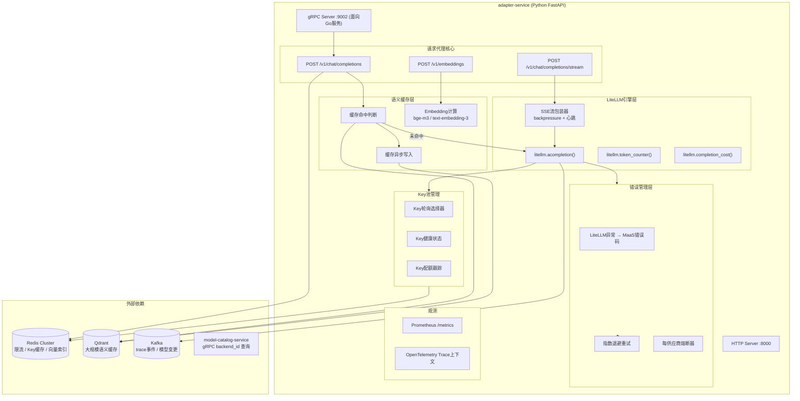
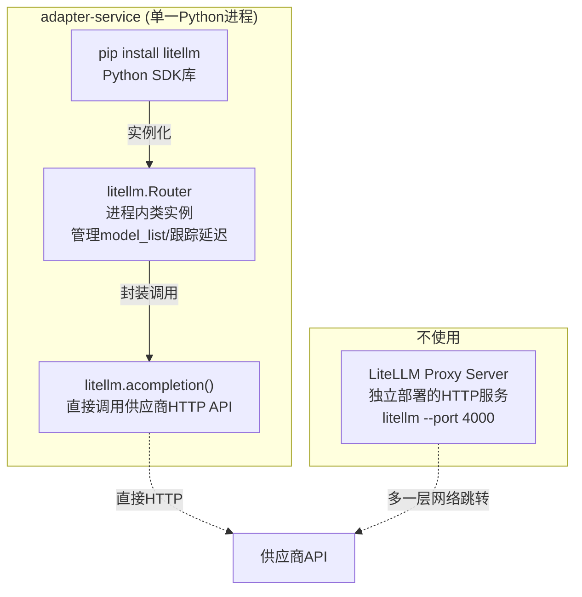

# adapter-service 详细设计文档

**文档版本：** V3.1.0
**更新日期：** 2026年05月25日
**基准PRD：** `产品设计/MaaS-PRD-V2.0/`
**服务名称：** `adapter-service`
**语言/框架：** Python 3.12+ / FastAPI / LiteLLM 1.40+
**变更说明：** V3.1 对齐 PRD V2.0：新增 Prompt Cache（Anthropic/OpenAI/Gemini 上下文缓存）参数透传与 cached_tokens 识别、新增事件驱动语义缓存失效（消费 maas.model.events 触发条件失效）、新增多协议适配明确策略（OpenAI/Anthropic/Gemini/DashScope/Custom）。

---

## 0. 架构决策：为什么用纯Python

| 方案 | 优点 | 缺点 | 结论 |
|------|------|------|------|
| Go主服务+Python Sidecar（V2.1） | Go高并发，Python调用LiteLLM | IPC开销(~2ms/请求)，双语言部署复杂度，两套监控体系，跨语言异常传播困难 | ❌ 不采用 |
| **纯Python FastAPI（V3.0）** | 直接import litellm，零IPC，统一语言栈，流式实现简单 | Python GIL在CPU密集场景受限（adapter是I/O密集，无影响） | ✅ **采用** |

**相邻服务语言边界**：gateway-service / routing-service / billing-service / auth-service / model-catalog-service 等保持 Go 不变（它们负责策略计算、认证鉴权、计费结算等CPU/并发敏感逻辑）。adapter-service 是唯一的 Python 服务，通过 gRPC 与 Go 服务通信。

---

## 1. 服务职责

| 职责域 | 具体能力 |
|--------|---------|
| **协议适配** | 将 MaaS 标准请求转换为 100+ 供应商原生格式（通过 LiteLLM） |
| **SSE 流代理** | 透明代理供应商流式响应，统一 SSE 事件格式，支持 backpressure |
| **语义缓存** | Embedding 相似度缓存（cosine ≥ 0.92），搭配 Redis Vector / Qdrant |
| **Key 池管理** | 供应商 API Key 轮询、故障隔离、自动轮换、配额跟踪 |
| **请求重试** | 指数退避重试（max_retries=3），配合 routing-service Fallback 链 |
| **响应标准化** | 提取 usage 字段、错误码映射、Trace 字段填充 |
| **LiteLLM 配置管理** | 动态加载供应商配置、自定义模型注册、模型别名管理 |

---

## 2. 完整服务架构



---

## 3. 项目目录结构

```
adapter-service/
├── pyproject.toml              # 项目元数据 + 依赖声明
├── requirements.txt            # 锁定版本
├── Dockerfile                  # 多阶段构建
├── healthz.py                  # K8s 探针脚本
│
├── src/
│   ├── __init__.py
│   │
│   ├── main.py                 # FastAPI 应用启动 + 生命周期
│   ├── grpc_server.py          # gRPC 服务端（面向Go服务）
│   ├── config.py               # 配置加载（环境变量/YAML/动态）
│   │
│   ├── proxy/
│   │   ├── __init__.py
│   │   ├── chat.py             # /v1/chat/completions 路由
│   │   ├── chat_stream.py      # /v1/chat/completions (stream) 路由
│   │   ├── embeddings.py       # /v1/embeddings 路由
│   │   └── models.py           # /v1/models 路由（透传LiteLLM模型列表）
│   │
│   ├── litellm_integration/
│   │   ├── __init__.py
│   │   ├── client.py           # LiteLLM 调用封装 + 配置
│   │   ├── config_manager.py   # LiteLLM 参数管理（model_list, router）
│   │   ├── streaming.py        # SSE 流包装器
│   │   ├── tokenizer.py        # Token 计数包装
│   │   └── cost.py             # 成本估算包装
│   │
│   ├── key_pool/
│   │   ├── __init__.py
│   │   ├── pool.py             # Key 池管理器
│   │   ├── selector.py         # 选择策略（轮询/最少使用/健康优先）
│   │   └── health.py           # Key 健康检测
│   │
│   ├── cache/
│   │   ├── __init__.py
│   │   ├── semantic_cache.py   # 语义缓存主逻辑
│   │   ├── vector_store.py     # 向量存储抽象（Redis/Qdrant）
│   │   ├── embedding.py        # Embedding 计算
│   │   └── invalidation.py     # 失效策略（TTL/事件/手动）
│   │
│   ├── error_handling/
│   │   ├── __init__.py
│   │   ├── mapper.py           # LiteLLM异常 → MaaS错误码
│   │   ├── retry.py            # 指数退避重试
│   │   └── circuit_breaker.py  # 逐供应商熔断器
│   │
│   ├── models/
│   │   ├── __init__.py
│   │   ├── request.py          # 请求数据模型（Pydantic）
│   │   ├── response.py         # 响应数据模型
│   │   └── cache.py            # 缓存数据模型
│   │
│   ├── observability/
│   │   ├── __init__.py
│   │   ├── metrics.py          # Prometheus 指标
│   │   ├── tracing.py          # OpenTelemetry 集成
│   │   └── logging.py          # 结构化日志
│   │
│   └── utils/
│       ├── __init__.py
│       ├── backpressure.py     # 背压控制
│       └── health.py           # 健康探针
│
├── tests/
│   ├── conftest.py             # pytest fixtures
│   ├── test_chat.py            # 对话接口测试
│   ├── test_stream.py          # 流式接口测试
│   ├── test_cache.py           # 缓存测试
│   ├── test_key_pool.py        # Key池测试
│   ├── test_retry.py           # 重试测试
│   ├── test_litellm_mock.py    # LiteLLM mock 测试
│   └── fixtures/               # 测试数据
│       ├── vendor_responses/   # 各供应商模拟响应
│       └── cache_vectors/      # 预计算向量
│
└── scripts/
    ├── seed_keys.py            # 初始化Key池脚本
    └── warm_cache.py           # 预热缓存脚本
```

---

## 3.5 LiteLLM 概念说明

在进入详细设计前，先澄清 LiteLLM 的三个相关概念及其在本服务中的用法：



| 概念 | 类型 | 说明 | 本服务是否使用 |
|------|------|------|:---:|
| **`litellm` SDK** | Python 库 | `pip install litellm`，提供 `acompletion()`、`token_counter()` 等函数 | **✅ 使用** |
| **`litellm.Router`** | SDK 中的类（`from litellm import Router`） | 进程内负载均衡器，管理 model_list（配置各供应商的 endpoint/api_key），跟踪每后端的延迟和限流状态 | **❌ 不使用** |
| **LiteLLM Proxy Server** | 独立部署的 HTTP 服务 | `litellm --port 4000` 启动 FastAPI 服务，对外暴露 OpenAI 兼容 API | **❌ 不使用**（多一层网络跳转增加延迟，且与 MaaS Key池/缓存/熔断集成困难） |

**本服务不使用 `litellm.Router`**，原因如下：
1. **routing-service 已做后端选择**：MaaS 的四维评分引擎已经选定了唯一的 `backend_id`，adapter-service 只需执行该决策。若使用 Router 的 `routing_strategy`（如 latency-based），Router 会在进程内重新选择后端，导致 routing-service 的决策被覆盖。
2. **MaaS 已自研核心控制逻辑**：KeyPool、RetryEngine、CircuitBreaker 均为自研，Router 的负载均衡 / 重试 / 限流功能与 MaaS 重叠且不可控。
3. **API 稳定性风险**：Router 的 `update_model_list()`、`disable_model()`、`close()` 等内部 API 在 LiteLLM 快速迭代中可能变动，增加维护成本。
4. **简化调用链路**：直接使用 `litellm.acompletion()`，传入 `model` + `api_key` + `api_base`，调用路径最短，异常传播最清晰。

**LiteLLM 在本服务中的定位**：只做"协议翻译器"——将 OpenAI 兼容请求体按 `model` 参数识别为对应供应商协议，通过 HTTP 发出。不做负载均衡、不做重试、不做限流。

## 4. 核心组件详细设计

### 4.1 LiteLLM 客户端封装 (`src/litellm_integration/client.py`)

这是整个服务的核心，封装所有 LiteLLM 调用。

```python
# src/litellm_integration/client.py
import litellm
from litellm import acompletion, ModelResponse
from litellm.exceptions import (
    RateLimitError,
    Timeout,
    ServiceUnavailableError,
    APIConnectionError,
    InternalServerError,
    AuthenticationError,
    BadRequestError,
    NotFoundError,
    APIError,
)
from typing import Optional
import time
import asyncio

class LiteLLMClient:
    """
    LiteLLM 核心客户端。

    本服务不再使用 litellm.Router。原因：
    1. routing-service 已通过四维评分选定了唯一的 backend_id，adapter-service 只负责执行
    2. KeyPool / RetryEngine / CircuitBreaker 均为自研，Router 的负载均衡/重试功能重复
    3. 直接调用 acompletion() 路径最短，异常传播最清晰

    职责：
    1. 直接调用 litellm.acompletion()，按 backend_id 传入 api_key / api_base
    2. 统一处理 11 种 LiteLLM 异常
    3. 注入 Trace 上下文到请求
    4. 记录供应商延迟到 Prometheus
    """

    def __init__(self, config):
        self.config = config

    async def chat_completion(
        self,
        model: str,             # litellm model name: "openai/gpt-4o"
        messages: list,
        api_key: str,           # 从 KeyPool 取出的当前可用 Key
        api_base: Optional[str] = None,
        stream: bool = False,
        temperature: float = 1.0,
        max_tokens: Optional[int] = None,
        timeout_ms: int = 60000,
        trace_ctx: Optional[dict] = None,
        **kwargs,
    ) -> ModelResponse:
        """
        直接调用 LiteLLM acompletion()。

        LiteLLM 通过 model 字符串识别 100+ 供应商协议：
          - "openai/gpt-4o" → OpenAI 协议
          - "anthropic/claude-3-opus" → Anthropic 协议
          - "azure/gpt-4o" → Azure OpenAI 协议
          - "vertex_ai/claude-3-sonnet" → GCP Vertex AI 协议
          - "deepseek/deepseek-chat" → DeepSeek 协议
          + 通过 custom_llm_provider 支持自定义 OpenAI 兼容协议

        routing-service 调用 adapter 时已指定 backend_id，
        adapter 据此从 KeyPool 取 Key → 调用 acompletion()。
        不经过 Router，不做二次负载均衡。
        """
        request_kwargs = dict(
            model=model,
            messages=messages,
            api_key=api_key,
            api_base=api_base,
            stream=stream,
            temperature=temperature,
            max_tokens=max_tokens,
            timeout=timeout_ms / 1000,
            # LiteLLM metadata：注入 Trace 上下文到请求头
            metadata={
                "trace_id": trace_ctx.get("trace_id") if trace_ctx else None,
                "maas_request_id": trace_ctx.get("request_id") if trace_ctx else None,
                "maas_tenant_id": trace_ctx.get("tenant_id") if trace_ctx else None,
                "maas_zero_retention": trace_ctx.get("zero_retention", False),
                **(trace_ctx or {}),
            },
            **kwargs,
        )

        try:
            start_time = time.monotonic()
            response = await acompletion(**request_kwargs)
            elapsed_ms = (time.monotonic() - start_time) * 1000

            metrics.record_vendor_latency(
                model=model,
                status="success",
                latency_ms=elapsed_ms,
            )
            return response

        except RateLimitError as e:
            metrics.record_vendor_latency(model=model, status="rate_limited")
            await key_pool.on_rate_limit(api_key=api_key)
            raise MaaSError(
                code="upstream_rate_limit",
                http_status=429,
                raw_message=str(e),
                vendor_model=model,
            )

        except Timeout as e:
            metrics.record_vendor_latency(model=model, status="timeout")
            raise MaaSError(
                code="upstream_timeout",
                http_status=504,
                raw_message=str(e),
                vendor_model=model,
            )

        except APIConnectionError as e:
            # DNS 失败 / TCP 连接失败 / SSL 错误 —— 生产环境最常见网络错误
            metrics.record_vendor_latency(model=model, status="connection_error")
            raise MaaSError(
                code="upstream_connection_failed",
                http_status=502,
                raw_message=str(e),
                vendor_model=model,
            )

        except ServiceUnavailableError as e:
            metrics.record_vendor_latency(model=model, status="unavailable")
            raise MaaSError(
                code="upstream_unavailable",
                http_status=503,
                raw_message=str(e),
                vendor_model=model,
            )

        except InternalServerError as e:
            # 供应商返回 5xx
            metrics.record_vendor_latency(model=model, status="upstream_5xx")
            raise MaaSError(
                code="upstream_server_error",
                http_status=502,
                raw_message=str(e),
                vendor_model=model,
            )

        except AuthenticationError as e:
            metrics.record_vendor_latency(model=model, status="auth_error")
            await key_pool.on_key_invalid(api_key=api_key)
            raise MaaSError(
                code="vendor_key_invalid",
                http_status=502,
                raw_message=str(e),
                vendor_model=model,
            )

        except BadRequestError as e:
            metrics.record_vendor_latency(model=model, status="bad_request")
            raise MaaSError(
                code="upstream_bad_request",
                http_status=400,
                raw_message=str(e),
                vendor_model=model,
            )

        except NotFoundError as e:
            metrics.record_vendor_latency(model=model, status="not_found")
            raise MaaSError(
                code="upstream_not_found",
                http_status=502,
                raw_message=str(e),
                vendor_model=model,
            )

        except APIError as e:
            # 兜底 LiteLLM 异常
            metrics.record_vendor_latency(model=model, status="api_error")
            raise MaaSError(
                code="upstream_api_error",
                http_status=502,
                raw_message=str(e),
                vendor_model=model,
            )

        except Exception as e:
            # 兜底 Python 异常（非 LiteLLM 异常）
            metrics.record_vendor_latency(model=model, status="unknown_error")
            logger.exception("Unhandled error for model=%s", model)
            raise MaaSError(
                code="upstream_error",
                http_status=502,
                raw_message=str(e),
                vendor_model=model,
            )
```

### 4.2 SSE 流式实现 (`src/litellm_integration/streaming.py`)

流式响应是核心场景，需要处理 backpressure、心跳、客户端断开。

```python
# src/litellm_integration/streaming.py
from litellm import ModelResponse
from typing import AsyncIterator, Optional
import asyncio
import json
import logging

logger = logging.getLogger(__name__)


class SSEStreamWrapper:
    """
    SSE 流包装器。

    核心职责：
    1. 将 LiteLLM 的 async chunk 迭代器转换为 SSE 格式
    2. 背压控制：利用 FastAPI StreamingResponse 的 yield 阻塞自然实现反压
    3. 心跳：每 heartbeat_interval 秒无数据时发送 SSE 注释行 `: keepalive`
    4. 客户端断开检测：外部调用 cancel() 设置取消事件

    实现说明：
    - 使用 asyncio.wait_for() + stream.__anext__() 直接等待下一个 chunk
    - 超时时发送心跳，收到 chunk 时转换为 SSE data 行
    - 移除了旧版中的 producer/consumer 队列模型，简化控制和异常传播
    """

    def __init__(
        self,
        litellm_stream: AsyncIterator[ModelResponse],
        trace_ctx: Optional[dict] = None,
        heartbeat_interval: float = 15.0,
    ):
        self.stream = litellm_stream
        self.trace_ctx = trace_ctx or {}
        self.heartbeat_interval = heartbeat_interval
        self._cancelled = asyncio.Event()

    async def event_generator(self) -> AsyncIterator[str]:
        """
        SSE 事件生成器（FastAPI StreamingResponse 使用）。

        格式参考 OpenAI SSE 规范：
          data: {"choices":[{"delta":{"content":"Hello"},"index":0}]}\n\n
          data: [DONE]\n\n

        背压机制：
          FastAPI StreamingResponse 消费 yield 的值。
          当客户端消费慢时，yield 阻塞，event_generator 暂停，
          await self.stream.__anext__() 不再被调用，上游 LiteLLM 停止
          从供应商读取——这就是自然的 backpressure。
        """
        try:
            while not self._cancelled.is_set():
                try:
                    # 等待下一个 chunk，超时则发送心跳
                    chunk = await asyncio.wait_for(
                        self.stream.__anext__(),
                        timeout=self.heartbeat_interval,
                    )
                    # 转换为 JSON 并格式化为 SSE data 行
                    if hasattr(chunk, 'model_dump_json'):
                        data = chunk.model_dump_json()
                    else:
                        data = json.dumps(chunk, default=str)
                    yield f"data: {data}\n\n"

                except asyncio.TimeoutError:
                    # heartbeat_interval 内无数据，发送 SSE 注释行保持连接
                    yield ": keepalive\n\n"

                except StopAsyncIteration:
                    # 上游流正常结束
                    break

            # 流结束标记
            yield "data: [DONE]\n\n"

        except Exception as e:
            logger.error("SSE stream error: %s", e, exc_info=True)
            self._cancelled.set()
            # 发送错误事件，客户端从中提取 error 字段
            yield f"data: {json.dumps({'error': str(e), 'code': 'stream_error'})}\n\n"

        finally:
            self._cancelled.set()

    async def cancel(self):
        """取消流（客户端断开时调用）"""
        self._cancelled.set()
```

### 4.3 流式路由 (`src/proxy/chat_stream.py`)

```python
# src/proxy/chat_stream.py
from fastapi import APIRouter, Request, HTTPException
from fastapi.responses import StreamingResponse
from src.litellm_integration.client import LiteLLMClient
from src.litellm_integration.streaming import SSEStreamWrapper
from src.key_pool.pool import KeyPool
from src.cache.semantic_cache import SemanticCache
from src.error_handling.retry import RetryEngine

router = APIRouter()

@router.post("/v1/chat/completions/stream")
async def chat_completion_stream(request: Request, body: ChatRequest):
    """
    流式对话接口。

    完整处理流程：
    1. 解析请求 → 提取 model / messages / parameters
    2. 查询 model-catalog-service → 获取 litellm_model_name + vendor_backend_id
    3. 语义缓存查询（仅 temperature=0 的确定性输出）
       命中 → 直接 SSE 流式返回缓存内容
    4. 从 KeyPool 获取当前可用 Key
    5. 调用 LiteLLM acompletion(stream=True)
    6. 包装为 SSE 流（含 backpressure + 心跳）
    7. 异步写入语义缓存（在流结束时）
    8. 处理供应商错误 → 重试引擎 → fallback
    """

    # Step 1: 解析模型映射
    model_info = await model_catalog.resolve_model(
        logical_model=body.model,
        tenant_id=request.state.tenant_id,
    )
    litellm_model = model_info.litellm_model_id  # e.g. "openai/gpt-4o"

    # Step 2: 语义缓存命中检查
    #   仅 temperature=0、非流式请求可缓存（流式不缓存）
    #   但注意：即使 stream=true，部分场景也查缓存

    # Step 3: 获取 API Key
    api_key = await key_pool.get_key(vendor_backend_id=model_info.backend_id)

    # Step 4: LiteLLM 调用
    litellm_client = LiteLLMClient()
    stream = await litellm_client.chat_completion(
        model=litellm_model,
        messages=body.messages,
        api_key=api_key,
        api_base=model_info.api_base,
        stream=True,
        temperature=body.temperature,
        max_tokens=body.max_tokens,
        timeout_ms=model_info.timeout_ms,
    )

    # Step 5: SSE 包装
    wrapper = SSEStreamWrapper(
        litellm_stream=stream,
        trace_ctx=request.state.trace_ctx,
    )

    # Step 6: 客户端断开检测
    async def client_disconnected():
        while True:
            if await request.is_disconnected():
                await wrapper.cancel()
                break
            await asyncio.sleep(1)

    asyncio.create_task(client_disconnected())

    return StreamingResponse(
        wrapper.event_generator(),
        media_type="text/event-stream",
        headers={
            "Cache-Control": "no-cache",
            "Connection": "keep-alive",
            "X-MaaS-Request-ID": request.state.trace_ctx.get("request_id", ""),
        },
    )
```

### 4.4 Key 池管理 (`src/key_pool/pool.py`)

```python
# src/key_pool/pool.py
import redis.asyncio as redis
import time
import hashlib

class KeyPool:
    """
    供应商 API Key 池管理。

    每个 VendorBackend 关联一个 Key 池（1~N 个 Key），
    支持多种选择策略和故障隔离。

    Redis 数据结构：
      keypool:{backend_id}:keys               — Set，所有 Key ID
      keypool:{backend_id}:key:{key_hash}      — Hash，Key 元数据
      keypool:{backend_id}:quota:{key_hash}    — Sorted Set，配额计数器
      keypool:{backend_id}:health:{key_hash}   — String，健康状态
    """

    def __init__(self, redis_client: redis.Redis):
        self.redis = redis_client
        self._local_cache: dict[str, list[KeyEntry]] = {}
        self._cache_ttl = 30  # 本地缓存 30s

    async def get_key(
        self,
        vendor_backend_id: str,
        strategy: str = "round_robin",
    ) -> str:
        """
        从 Key 池中选择一个可用 Key。

        选择策略：
          round_robin — 轮流使用（默认，负载均衡最佳）
          least_used  — 选择当月使用量最少的 Key
          health_first — 优先使用最近成功率最高的 Key

        过滤条件：
          - status = active
          - 未过有效期
          - 未被标记为 rate_limited（冷却期 60s）
          - 未达到 RPD（日请求上限）
        """
        keys = await self._fetch_keys(vendor_backend_id)
        available = [k for k in keys if await self._is_available(k)]

        if not available:
            raise NoAvailableKeyError(
                f"No available key for backend {vendor_backend_id}"
            )

        if strategy == "round_robin":
            selected = available[self._get_next_index(vendor_backend_id, len(available))]
        elif strategy == "least_used":
            selected = await self._select_least_used(available)
        elif strategy == "health_first":
            selected = await self._select_healthiest(available)
        else:
            selected = available[0]

        # 更新最后使用时间
        await self._touch_key(selected)
        return selected.api_key

    async def on_rate_limit(self, api_key: str):
        """Key 触发供应商 rate limit 时调用，标记冷却期"""
        key_hash = self._hash_key(api_key)
        await self.redis.setex(
            f"keypool:ratelimited:{key_hash}",
            60,  # 冷却 60 秒
            "1",
        )

    async def on_key_invalid(self, api_key: str):
        """Key 认证失败时调用，标记为无效"""
        key_hash = self._hash_key(api_key)
        await self.redis.hset(
            f"keypool:key:{key_hash}",
            "status",
            "invalid",
        )
        # 发布事件到 Kafka
        await kafka_client.publish("maas.keypool.events", {
            "event_type": "key_invalidated",
            "key_hash": key_hash,
            "timestamp": time.time(),
        })
```

### 4.5 语义缓存 (`src/cache/semantic_cache.py`)

```python
# src/cache/semantic_cache.py
import numpy as np
from src.cache.embedding import EmbeddingEngine
from src.cache.vector_store import VectorStore

class SemanticCache:
    """
    语义缓存：基于 Embedding 相似度的请求-响应缓存。

    适用条件：
      - temperature == 0（确定性输出）
      - tools 为空（工具调用结果不可预测）
      - 租户 cache_enabled == true

    核心流程：
      请求进入 → 计算 prompt embedding → 向量相似度查询
        → 命中 (cosine >= 0.92) → 直接返回缓存响应
        → 未命中 → 调用供应商 → 写入缓存
    """

    SIMILARITY_THRESHOLD = 0.92  # cosine 相似度阈值
    DEFAULT_TTL = 4 * 3600       # 默认 4 小时
    HOT_TTL = 24 * 3600          # 高频访问提升至 24h
    HOT_ACCESS_THRESHOLD = 10    # 1h 内 10 次命中视为热数据

    def __init__(self, embedding_engine: EmbeddingEngine, vector_store: VectorStore):
        self.embedding = embedding_engine
        self.store = vector_store

    async def lookup(self, request: CacheLookupRequest) -> Optional[CacheHit]:
        """
        缓存查询。

        cache_key 构成：
          tenant_id + logical_model_id + SHA256(system_prompt) + Embedding(user_message)
        """
        # 1. 检查缓存适用条件
        if not self._is_cacheable(request):
            return None

        # 2. 计算 user_message embedding
        query_vector = await self.embedding.encode(request.user_message)

        # 3. 构建过滤条件（在 Qdrant 中：payload 过滤）
        filter_conditions = {
            "tenant_id": request.tenant_id,
            "logical_model_id": request.logical_model_id,
            "system_prompt_hash": hashlib.sha256(
                request.system_prompt.encode()
            ).hexdigest(),
        }

        # 4. 向量相似度查询
        results = await self.store.search(
            vector=query_vector,
            filter=filter_conditions,
            threshold=self.SIMILARITY_THRESHOLD,
            top_k=1,
        )

        if not results:
            return None

        hit = results[0]
        # 更新访问计数（用于热数据提升）
        await self.store.increment_access_count(hit.id)

        return CacheHit(
            response=hit.response,
            similarity=hit.score,
            cached_at=hit.created_at,
        )

    async def write(self, request: CacheWriteRequest):
        """缓存写入（异步，不阻塞请求响应）"""
        if not self._is_cacheable(request):
            return

        vector = await self.embedding.encode(request.user_message)
        payload = {
            "tenant_id": request.tenant_id,
            "logical_model_id": request.logical_model_id,
            "system_prompt_hash": hashlib.sha256(
                request.system_prompt.encode()
            ).hexdigest(),
            "response": request.response,
            "prompt_tokens": request.usage.prompt_tokens,
            "completion_tokens": request.usage.completion_tokens,
            "created_at": time.time(),
            "access_count": 0,
            "last_access_at": time.time(),
        }

        await self.store.upsert(
            vector=vector,
            payload=payload,
            ttl=self._determine_ttl(request),
        )

    def _determine_ttl(self, request: CacheWriteRequest) -> int:
        """动态决定 TTL"""
        # 高频访问提升 TTL
        if request.access_count and request.access_count > self.HOT_ACCESS_THRESHOLD:
            return self.HOT_TTL
        return self.DEFAULT_TTL

    def _is_cacheable(self, request) -> bool:
        """检查是否可缓存"""
        # temperature=0 的确定性输出才可缓存
        if request.temperature is not None and request.temperature > 0:
            return False
        if request.tools:
            return False
        if not request.cache_enabled:
            return False
        return True
```

### 4.6 Prompt Cache 参数透传

**背景**：Anthropic、OpenAI、Gemini 均支持 Prompt Cache（KV Cache），允许客户端将重复使用的长 System Prompt 或上下文前缀标记为缓存，供应商对缓存命中部分的 Token 给予大幅折扣（通常为标价的 10%）。PRD §06 1.2.3 要求独立识别并记录 `cached_input_tokens`，以 10% 价格计费。

**adapter-service 职责**：不做缓存判断逻辑（该决策由上层做），只负责**参数透传**和**cached_tokens 识别**。

#### 4.6.1 各厂商 cache_control 参数

| 厂商 | 缓存标记方式 | 参数位置 | adapter 处理 |
|------|-------------|---------|-------------|
| **Anthropic** | `"cache_control": {"type": "ephemeral"}` | messages[].content[].cache_control | `litellm.acompletion(extra_body=...)` 透传 |
| **OpenAI** | `"cache_control": {"type": "ephemeral"}` | system message 的 extra 字段 | 通过 `litellm` 的 `extra_body` 或 `openai_extra_headers` 透传 |
| **Gemini** | 自动缓存，无需客户端标记 | — | 仅需识别 `cachedContentTokenCount`，无需透传参数 |

#### 4.6.2 透传实现

```python
# src/litellm_integration/client.py — Prompt Cache 参数透传扩展

class LiteLLMClient:
    
    async def chat_completion(
        self,
        model: str,
        messages: list,
        api_key: str,
        api_base: Optional[str] = None,
        stream: bool = False,
        temperature: float = 1.0,
        max_tokens: Optional[int] = None,
        timeout_ms: int = 60000,
        trace_ctx: Optional[dict] = None,
        cache_control: Optional[dict] = None,   # NEW: Prompt Cache 控制参数
        **kwargs,
    ) -> ModelResponse:
        
        request_kwargs = dict(
            model=model,
            messages=messages,
            api_key=api_key,
            api_base=api_base,
            stream=stream,
            temperature=temperature,
            max_tokens=max_tokens,
            timeout=timeout_ms / 1000,
            metadata={...},
            **kwargs,
        )
        
        # Prompt Cache 参数透传：
        # - Anthropic: 在 messages 中已包含 cache_control 标记，LiteLLM 自动处理
        # - OpenAI: 需通过 extra_headers 注入 "x-openai-cache-control": "ephemeral"
        # - Gemini: 自动缓存，无需额外处理
        if cache_control:
            provider = model.split("/")[0]
            if provider == "openai":
                request_kwargs.setdefault("extra_headers", {})
                request_kwargs["extra_headers"]["x-openai-cache-control"] = "ephemeral"
            # Anthropic: cache_control 已在 messages 中，LiteLLM 自动透传
            # Gemini: 自动缓存，无需参数
        
        response = await acompletion(**request_kwargs)
        return response
```

#### 4.6.3 cached_tokens 识别

LiteLLM 响应中已提取 `usage.cached_input_tokens`（或有厂商特定字段）。adapter 负责统一提取：

```python
# src/litellm_integration/client.py — Usage 提取扩展

def extract_usage(response) -> dict:
    """从 LiteLLM 响应中提取标准化 Usage，识别 cached_tokens"""
    usage = {
        "prompt_tokens": 0,
        "completion_tokens": 0,
        "cached_input_tokens": 0,
        "total_tokens": 0,
        "is_estimated": False,
    }
    
    if hasattr(response, 'usage') and response.usage:
        u = response.usage
        usage["prompt_tokens"] = u.prompt_tokens or 0
        usage["completion_tokens"] = u.completion_tokens or 0
        usage["total_tokens"] = u.total_tokens or 0
        
        # LiteLLM 1.40+ 统一提取 cached_tokens：
        # - Anthropic: usage.cache_read_input_tokens
        # - OpenAI: usage.prompt_tokens_details.cached_tokens
        # - Gemini: usage.cached_content_token_count
        usage["cached_input_tokens"] = getattr(u, 'cache_read_input_tokens', 0) or \
                                        getattr(u, 'cached_content_token_count', 0) or \
                                        (u.prompt_tokens_details.cached_tokens 
                                         if hasattr(u, 'prompt_tokens_details') else 0)
        
        # 流式请求的 usage 可能不完整
        if not usage["total_tokens"] and (usage["prompt_tokens"] or usage["completion_tokens"]):
            usage["total_tokens"] = usage["prompt_tokens"] + usage["completion_tokens"]
            usage["is_estimated"] = True
    
    return usage
```

#### 4.6.4 计费联动

`cached_input_tokens` 通过 gRPC `Usage` message（§11）传回 gateway，最终写入 `billing_ledger.cached_input_tokens`（PRD §06 1.3），以标准 Prompt Token 价格的 10% 独立计价 `cached_unit_price`，账单单独列示为 `cached_token_amount`。

### 4.7 多协议适配策略

**背景**：gateway-service 已支持 OpenAI / Anthropic / Gemini 三套兼容端点的请求标准化（§3.1）。adapter-service 接收到的 StandardRequest 已归一化为 OpenAI 兼容格式，但调用不同供应商时需处理协议差异。

```
请求流向：
  客户端 Anthropic/Gemini格式 → gateway 协议检测 & 标准化 → StandardRequest (OpenAI兼容)
    → adapter litellm.acompletion(model="anthropic/...") → 供应商原生格式
```

**LiteLLM 的角色**：adapter 调用 `litellm.acompletion()` 时，LiteLLM 根据 `model` 前缀自动识别目标供应商协议并进行格式转换。adapter 无需手工做供应商协议映射。

**各协议特殊处理**：

| 协议 | LiteLLM model 前缀 | 特殊参数传递方式 | adapter 额外处理 |
|------|-------------------|-----------------|-----------------|
| **OpenAI** | `openai/` | 标准 kwargs | 无需特殊处理 |
| **Anthropic** | `anthropic/` | `extra_body` 传递 anthropic_version、cache_control | SSE 事件格式转换（Anthropic SSE → OpenAI SSE） |
| **Gemini** | `gemini/` | `extra_body` 传递 safety_settings | 响应格式转换 |
| **Azure OpenAI** | `azure/` | `api_version` kwarg | api_base 拼接 |
| **阿里云 DashScope** | `dashscope/` | `extra_body` 传递 dashscope 特有参数 | — |
| **DeepSeek** | `deepseek/` | 标准 OpenAI 兼容 | 无需特殊处理 |
| **自定义 OpenAI 兼容** | `openai/` + 自定义 api_base | 标准 | 校验 api_base 白名单 |

MVP 阶段：LiteLLM 自动处理协议转换，adapter 仅做参数透传和 cached_tokens 识别。

### 4.8 错误映射 (`src/error_handling/mapper.py`)

```python
# src/error_handling/mapper.py
import litellm
from litellm.exceptions import (
    RateLimitError,
    ServiceUnavailableError,
    Timeout,
    ContextWindowExceededError,
    ContentPolicyViolationError,
    AuthenticationError,
    BadRequestError,
    NotFoundError,
    APIError,
)

class MaaSError(Exception):
    """
    MaaS 标准化错误。

    LiteLLM 已将 100+ 供应商的异常统一为 9 种标准异常类。
    adapter-service 只需将这 9 种映射为 MaaS 标准错误码。
    """

    ERROR_MAP: dict[type[Exception], tuple[str, int]] = {
        RateLimitError:                 ("upstream_rate_limit", 429),
        ServiceUnavailableError:        ("upstream_unavailable", 503),
        Timeout:                        ("upstream_timeout", 504),
        ContextWindowExceededError:     ("context_length_exceeded", 400),
        ContentPolicyViolationError:    ("upstream_content_blocked", 400),
        AuthenticationError:            ("vendor_key_invalid", 502),
        BadRequestError:                ("upstream_bad_request", 400),
        NotFoundError:                  ("upstream_not_found", 502),
        APIError:                       ("upstream_api_error", 502),
    }

    def __init__(
        self,
        code: str,
        http_status: int,
        raw_message: str,
        vendor_model: str,
    ):
        self.code = code
        self.http_status = http_status
        self.raw_message = raw_message
        self.vendor_model = vendor_model
        super().__init__(f"[{code}] {raw_message}")

    def to_http_response(self) -> dict:
        return {
            "error": {
                "code": self.code,
                "message": "上游供应商错误，请稍后重试",
                "vendor_model": self.vendor_model,
                # 不暴露 raw_message 给客户端（避免泄露供应商 API Key 信息）
                "maas_request_id": self.request_id if hasattr(self, "request_id") else "",
            }
        }

    @classmethod
    def from_litellm_exception(cls, exc: Exception, vendor_model: str) -> "MaaSError":
        """将 LiteLLM 异常映射为 MaaSError"""
        for exc_type, (code, http_status) in cls.ERROR_MAP.items():
            if isinstance(exc, exc_type):
                return cls(
                    code=code,
                    http_status=http_status,
                    raw_message=str(exc),
                    vendor_model=vendor_model,
                )
        # 未知异常 → 兜底
        return cls(
            code="upstream_error",
            http_status=502,
            raw_message=str(exc),
            vendor_model=vendor_model,
        )
```

---

## 5. LiteLLM 特定集成细节

### 5.1 供应商模型 ID 映射

LiteLLM 使用 `provider/model` 格式。model-catalog-service 的 `vendor_model_id` 字段直接存储此格式。

由于本服务不再使用 `litellm.Router`，`config_manager` 的职责从 "构建 Router 配置" 简化为 **供应商协议合法性校验 + 后端元数据缓存**。

```python
# src/litellm_integration/config_manager.py
class LiteLLMConfigManager:
    """
    LiteLLM 配置管理器。

    职责（V3.0 简化，不再使用 Router）：
    1. 校验供应商是否被 LiteLLM 支持（provider name 白名单）
    2. 缓存 backend_id → litellm_model / api_base 的映射
    3. 监听模型变更事件 → 清空本地缓存
    """

    # LiteLLM 支持的供应商简称（100+）
    SUPPORTED_PROVIDERS = {
        "openai", "anthropic", "azure", "vertex_ai", "bedrock",
        "dashscope", "zhipuai", "moonshot", "deepseek",
        "gemini", "mistral", "cohere", "together_ai",
        "replicate", "huggingface", "ollama", "vllm",
        "custom_openai",  # 自定义 OpenAI 兼容协议
    }

    def __init__(self, model_catalog_client):
        self.client = model_catalog_client
        self._backend_cache: dict[str, dict] = {}  # backend_id → {model, api_base, ...}
        self._cache_ttl = 300  # 5 分钟

    async def get_backend_info(self, backend_id: str) -> dict:
        """获取单个后端的 LiteLLM 调用所需信息"""
        if backend_id in self._backend_cache:
            return self._backend_cache[backend_id]

        backend = await self.client.get_backend(backend_id)
        provider = backend.litellm_model.split("/")[0]
        if provider not in self.SUPPORTED_PROVIDERS:
            raise UnsupportedProviderError(f"Unsupported provider: {provider}")

        info = {
            "backend_id": backend.backend_id,
            "litellm_model": backend.litellm_model,
            "api_base": backend.api_base,
            "timeout_ms": backend.timeout_ms,
            "capabilities": backend.capabilities,
        }
        self._backend_cache[backend_id] = info
        return info

    async def handle_model_event(self, event: dict):
        """处理 model-catalog-service 发出的模型变更事件"""
        event_type = event.get("event_type")

        if event_type == "model_lifecycle_changed":
            # 模型上下线 → 清空缓存（下次请求时自动重新加载）
            self._backend_cache.clear()
            logger.info("Backend cache cleared due to model lifecycle change")

        elif event_type == "backend_health_changed":
            # 健康评分变更 → 记录日志（路由决策由 routing-service 负责）
            backend_id = event.get("backend_id")
            health = event.get("health_score", 1.0)
            logger.info("Backend %s health changed to %.2f", backend_id, health)

        elif event_type == "provider_price_updated":
            # 价格变更 → 刷新成本计算
            cost_cache.invalidate()
```

### 5.2 废弃说明：不使用 `litellm.Router`

V3.0 不再使用 `litellm.Router`（原因见 §3.5）。以下 Router 相关参数不再适用：

| 废弃参数 | 原用途 | 替代方案 |
|----------|--------|---------|
| `routing_strategy` | 进程内模型选择 | routing-service 四维评分已选定唯一 backend |
| `pre_call_checking` | 调用前 rate limit 检查 | gateway-service 令牌桶限流 |
| `context_length_manager` | 上下文窗口截断 | 不做自动截断；超窗口由供应商返回错误，MaaS 透传 |
| `num_retries` | SDK 内重试 | RetryEngine 自研重试 |
| `redis_host/port` | 跨进程限流共享 | KeyPool 自有 Redis 管理 |

直接使用 `litellm.acompletion()` 调用，手动传入 `model` + `api_key` + `api_base`。

### 5.3 LiteLLM 内置能力直接复用

```python
"""
以下 LiteLLM 内置能力直接使用，无需自研。
"""

# 1. Token 计数（无需调用供应商 API）
from litellm import token_counter
token_count = token_counter(
    model="gpt-4o",
    messages=messages,
)

# 2. 成本估算
from litellm import completion_cost
cost = completion_cost(completion_response=response)
estimated_cost = completion_cost(
    model="gpt-4o",
    prompt_tokens=100,
    completion_tokens=50,
)

# 3. 模型列表查询
from litellm import get_valid_models
supported_models = get_valid_models()  # 返回 LiteLLM 支持的所有模型

# 4. OpenAI SDK 风格调用（所有供应商统一接口）
from litellm import acompletion
response = await acompletion(
    model="anthropic/claude-3-5-sonnet",
    messages=[{"role": "user", "content": "Hello"}],
    api_key="sk-ant-...",
)

# 5. 供应商特有参数转发
response = await acompletion(
    model="vertex_ai/claude-3-sonnet",
    messages=messages,
    # 通过 extra_body 透传供应商特有参数
    extra_body={
        "anthropic_version": "vertex-2023-10-16",
    },
)
```

---

## 6. 缓存失效策略

### 6.1 失效事件源

| 事件源 | 触发条件 | 失效范围 | 延迟要求 |
|--------|---------|---------|---------|
| Kafka `maas.model.events` | provider_model 版本变更或定价变更 | 该 logical_model_id 的全部缓存 | 5s |
| Kafka `maas.auth.events` | 租户 zero_retention / cache_enabled 变更 | 该 tenant_id 全部缓存 | 5s |
| REST API（手动） | POST `/api/v1/cache/invalidate` | tenant_id（必选） + logical_model_id（可选） | 即时 |
| TTL 过期 | 达到 TTL 时间 | 单条缓存 | 自动 |
| LRU 淘汰 | 缓存空间达到水位线 | 低访问频率缓存 | 自动 |

### 6.2 失效执行器

```python
# src/cache/invalidation.py
class CacheInvalidator:
    """
    缓存失效管理器。

    支持三种失效模式：
      immediate: 立即删除匹配的向量
      async: 异步删除（放入队列，不阻塞请求）
      scheduled: 定时扫描过期缓存
    """

    async def invalidate_by_event(self, event: dict):
        """消费 Kafka 事件（异步，不阻塞请求处理）"""
        event_type = event.get("event_type")

        if event_type == "provider_price_updated":
            provider_model_id = event.get("provider_model_id")
            await self._delete_by_filter(
                {"provider_model_id": provider_model_id}
            )

        elif event_type == "model_lifecycle_changed":
            logical_model_id = event.get("logical_model_id")
            await self._delete_by_filter(
                {"logical_model_id": logical_model_id}
            )

        elif event_type == "tenant_settings_changed":
            tenant_id = event.get("tenant_id")
            settings = event.get("settings", {})
            if "cache_enabled" in settings or "zero_retention" in settings:
                await self._delete_by_filter(
                    {"tenant_id": tenant_id}
                )

    async def manual_invalidate(
        self,
        tenant_id: str,
        logical_model_id: Optional[str] = None,
    ):
        """手动失效 API"""
        filter_cond = {"tenant_id": tenant_id}
        if logical_model_id:
            filter_cond["logical_model_id"] = logical_model_id
        await self._delete_by_filter(filter_cond)

    async def _delete_by_filter(self, filter_cond: dict):
        """按条件删除 Qdrant / Redis 中的缓存向量"""
        # Qdrant: payload 过滤删除
        await self.qdrant_client.delete(
            collection_name="semantic_cache",
            points_selector=models.Filter(
                must=[
                    models.FieldCondition(
                        key=k, match=models.MatchValue(value=v)
                    )
                    for k, v in filter_cond.items()
                ]
            ),
        )
        # Redis: SCAN 匹配模式删除
        pattern = f"cache:{filter_cond.get('tenant_id', '*')}:*"
        async for key in self.redis.scan_iter(match=pattern):
            await self.redis.delete(key)

        logger.info(
            "Cache invalidated: filter=%s",
            filter_cond,
        )
```

### 6.3 向量存储选型决策

| 维度 | Redis Vector Search | Qdrant |
|------|-------------------|--------|
| 运维复杂度 | 低（复用现有Redis集群） | 中（独立服务） |
| 查询性能（P99） | < 5ms（<1M向量） | < 3ms（<10M向量） |
| 过滤能力 | 基础（field filter） | 强（复杂 payload 过滤 + geo + nested） |
| 向量索引类型 | FLAT / HNSW | HNSW / IVF / Scalar Quantization |
| 推荐场景 | 公有 SaaS，向量数 < 1000 万 | 私有化/大规模，向量数 > 1000 万 |

---

## 7. 错误重试与熔断

### 7.1 指数退避重试

```python
# src/error_handling/retry.py
class RetryEngine:
    """
    指数退避重试引擎。

    与 routing-service 的 Fallback 链配合：
      - adapter 层面：对同一供应商重试（指数退避，max=3）
      - routing 层面：adapter 全部重试失败后触发 Fallback 链

    超时预算（deadline propagation）：
      - gateway 调用 adapter 时设置总超时（如 15s）
      - adapter 内部重试时，剩余超时递减传递给每次 acall 的 timeout_ms
      - 避免 adapter 内部重试 3 次 × 供应商超时 60s = 180s 拖垮 gateway 超时
      - 每次重试的 timeout_ms = min(供应商 timeout_ms, 剩余超时 / 重试次数)
    """

    def __init__(
        self,
        max_retries: int = 3,
        base_delay: float = 0.5,
        max_delay: float = 10.0,
        jitter: bool = True,
    ):
        self.max_retries = max_retries
        self.base_delay = base_delay
        self.max_delay = max_delay
        self.jitter = jitter

    async def execute_with_retry(
        self,
        func: Callable,
        *args,
        retryable_errors: tuple = (MaaSError,),
        **kwargs,
    ) -> Any:
        """
        带重试的 LiteLLM 调用。

        重试判定：
          - 可重试：upstream_rate_limit / upstream_timeout / upstream_unavailable / upstream_error
          - 不可重试：context_length_exceeded / vendor_key_invalid / upstream_content_blocked
        """
        last_error = None

        for attempt in range(self.max_retries + 1):
            try:
                if attempt > 0:
                    delay = min(
                        self.base_delay * (2 ** (attempt - 1)),
                        self.max_delay,
                    )
                    if self.jitter:
                        delay *= random.uniform(0.5, 1.5)
                    await asyncio.sleep(delay)

                return await func(*args, **kwargs)

            except MaaSError as e:
                if not self._is_retryable(e):
                    raise
                last_error = e
                logger.warning(
                    "Retryable error (attempt %d/%d): %s",
                    attempt + 1, self.max_retries, e.code,
                )

        raise last_error

    def _is_retryable(self, error: MaaSError) -> bool:
        """判断错误是否可重试"""
        non_retryable_codes = {
            "context_length_exceeded",
            "vendor_key_invalid",
            "upstream_content_blocked",
            "upstream_bad_request",
        }
        return error.code not in non_retryable_codes
```

### 7.2 逐供应商熔断器

```python
# src/error_handling/circuit_breaker.py
import time
import asyncio
import logging
from dataclasses import dataclass, field

logger = logging.getLogger(__name__)


@dataclass
class BackendState:
    """每个后端的熔断状态"""
    state: str = "CLOSED"           # CLOSED / OPEN / HALF_OPEN
    records: list[tuple[float, bool]] = field(default_factory=list)
    opened_at: float = 0.0          # 进入 OPEN 状态的时间戳
    half_open_probe_allowed: int = 3  # HALF_OPEN 状态下允许的探测请求数
    half_open_success_count: int = 0
    half_open_total_count: int = 0


class CircuitBreaker:
    """
    逐供应商熔断器。

    完整三状态机：
      CLOSED ──失败率≥阈值──→ OPEN
      OPEN   ──超过recovery_seconds──→ HALF_OPEN (过渡到HALF_OPEN)
      HALF_OPEN ──探测请求成功率≥阈值──→ CLOSED (恢复)
      HALF_OPEN ──探测请求失败──→ OPEN (重新熔断)
    """

    def __init__(
        self,
        failure_threshold: float = 0.5,
        window_seconds: int = 30,
        recovery_seconds: int = 60,
        half_open_probe_count: int = 3,
    ):
        self.failure_threshold = failure_threshold
        self.window_seconds = window_seconds
        self.recovery_seconds = recovery_seconds
        self.half_open_probe_count = half_open_probe_count
        self._backends: dict[str, BackendState] = {}

    def _get_backend(self, backend_id: str) -> BackendState:
        if backend_id not in self._backends:
            self._backends[backend_id] = BackendState()
        return self._backends[backend_id]

    def _check_transition_on_tick(self, backend_id: str):
        """在每次 is_allowed 检查时触发状态转换"""
        b = self._get_backend(backend_id)
        now = time.time()

        # OPEN → HALF_OPEN：超过恢复时间
        if b.state == "OPEN":
            if now - b.opened_at >= self.recovery_seconds:
                b.state = "HALF_OPEN"
                b.half_open_probe_allowed = self.half_open_probe_count
                b.half_open_success_count = 0
                b.half_open_total_count = 0
                logger.info("Circuit half-open for backend %s (recovery expired)", backend_id)

    def record_result(self, backend_id: str, success: bool):
        """记录调用结果"""
        now = time.time()
        b = self._get_backend(backend_id)

        # 滑动窗口：移除过时记录
        b.records = [(t, s) for t, s in b.records if now - t < self.window_seconds]
        b.records.append((now, success))

        # HALF_OPEN 状态下的探测结果
        if b.state == "HALF_OPEN":
            b.half_open_total_count += 1
            if success:
                b.half_open_success_count += 1

            if b.half_open_total_count >= b.half_open_probe_allowed:
                success_rate = b.half_open_success_count / b.half_open_total_count
                if success_rate >= (1 - self.failure_threshold):
                    b.state = "CLOSED"
                    b.records.clear()
                    b.opened_at = 0.0
                    logger.info("Circuit closed for backend %s (probe success rate=%.2f)", backend_id, success_rate)
                else:
                    b.state = "OPEN"
                    b.opened_at = now
                    logger.warning("Circuit re-opened for backend %s (probe success rate=%.2f)", backend_id, success_rate)
            return

        # CLOSED 状态：检查是否需要进入 OPEN
        if b.state == "CLOSED" and len(b.records) >= 10:
            fail_count = sum(1 for _, s in b.records if not s)
            fail_rate = fail_count / len(b.records)

            if fail_rate >= self.failure_threshold:
                b.state = "OPEN"
                b.opened_at = now
                logger.warning("Circuit opened for backend %s (fail_rate=%.2f)", backend_id, fail_rate)
                asyncio.create_task(self._notify_health_change(backend_id, fail_rate))

    def is_allowed(self, backend_id: str) -> bool:
        """检查请求是否允许通过"""
        self._check_transition_on_tick(backend_id)
        b = self._get_backend(backend_id)

        if b.state == "CLOSED":
            return True
        if b.state == "HALF_OPEN":
            # 限制 HALF_OPEN 状态下只允许少量探测请求通过
            return b.half_open_total_count < b.half_open_probe_allowed
        # b.state == "OPEN"
        return False
```

---

## 8. 服务生命周期

### 8.1 启动流程

```
1. 加载配置（环境变量 / YAML / 远程配置中心）
2. 初始化日志系统（JSON 结构化日志）
3. 初始化 Prometheus Metrics（注册指标）
4. 初始化 OpenTelemetry Tracer
5. 连接外部依赖：
   a. Redis Cluster（连接池，最小 10，最大 50）
   b. Qdrant Client（gRPC 连接）
   c. Kafka Consumer（异步消费者，4 分区并行）
   d. gRPC 连接 → model-catalog-service
6. 初始化 LiteLLMConfigManager（加载供应商白名单 + 后端元数据缓存）
7. 初始化 KeyPool（从 Redis 加载 Key 池元数据）
8. 启动 Kafka 消费者协程（模型变更 / 租户配置监听）
9. 注册 FastAPI 路由
10. 启动 Uvicorn HTTP 服务（端口 8000）
11. 启动 gRPC 服务（端口 9002）
12. 健康探针就绪（/healthz → 200 OK）
```

### 8.2 优雅关闭

```python
# src/main.py 中的 shutdown 处理
@asynccontextmanager
async def lifespan(app: FastAPI):
    # 启动
    await initialize()
    yield
    # 关闭
    logger.info("Shutting down adapter-service...")

    # 1. 停止接受新请求
    # 2. 等待进行中的流完成（最多 30s）
    await drain_inflight_requests(timeout=30)

    # 3. 关闭 Kafka Consumer
    await kafka_consumer.stop()

    # 4. 刷新缓存队列（将内存中的待写缓存写入 Qdrant）
    await cache_writer.flush(timeout=10)

    # 5. 关闭外部连接
    await redis_client.close()
    await qdrant_client.close()
    await grpc_channel.close()

    logger.info("adapter-service shutdown complete")
```

---

## 9. 配置结构

```yaml
# config/adapter-service.yaml
service:
  name: adapter-service
  version: "3.0.0"
  http_port: 8000
  grpc_port: 9002
  metrics_port: 9093
  log_level: INFO

litellm:
  backend_cache_ttl: 300       # 后端元数据本地缓存 TTL（秒）
  provider_whitelist_enabled: true
  prompt_cache_enabled: true   # Prompt Cache 参数透传（Anthropic/OpenAI/Gemini）
  cached_token_discount: 0.10  # 缓存命中 Token 折扣率（PRD §06 1.2.3）

key_pool:
  strategy: round_robin
  local_cache_ttl: 30
  rate_limit_cooldown: 60
  key_rotation_enabled: true

semantic_cache:
  enabled: true
  similarity_threshold: 0.92
  default_ttl: 14400      # 4 小时
  hot_ttl: 86400          # 24 小时
  hot_access_threshold: 10
  vector_store: qdrant    # redis / qdrant
  embedding_model: "BAAI/bge-m3"

retry:
  max_retries: 3
  base_delay: 0.5
  max_delay: 10.0
  jitter: true

circuit_breaker:
  failure_threshold: 0.5
  window_seconds: 30
  recovery_seconds: 60
  half_open_probe_count: 3   # HALF_OPEN 状态下允许的探测请求数

model_catalog:
  grpc_address: "model-catalog-service:9030"
  grpc_timeout: 5

redis:
  addresses: ["redis-cluster:6379"]
  pool_min: 10
  pool_max: 50

qdrant:
  url: "qdrant:6333"
  grpc_port: 6334
  collection: "semantic_cache"
  vector_size: 1024  # bge-m3 向量维度

kafka:
  brokers: ["kafka:9092"]
  consumer_group: "adapter-service"
  topics:
    model_events: "maas.model.events"
    auth_events: "maas.auth.events"
  producer_topics:
    trace_events: "maas.api.requests"
```

---

## 10. Prometheus 指标

```python
# src/observability/metrics.py
# 适配器服务暴露的核心指标

# 请求量
adapter_requests_total = Counter(
    "adapter_requests_total",
    "Total requests processed",
    ["vendor", "model", "stream", "status"],
)

# 流式请求持续时间
adapter_stream_duration_seconds = Histogram(
    "adapter_stream_duration_seconds",
    "Stream duration (first chunk to last chunk)",
    ["vendor", "model"],
    buckets=(1, 5, 10, 30, 60, 120, 300, 600),
)

# 供应商调用延迟
adapter_vendor_latency_ms = Histogram(
    "adapter_vendor_latency_ms",
    "Vendor API latency in ms",
    ["vendor", "model", "status"],
    buckets=(50, 100, 200, 500, 1000, 2000, 5000, 10000, 30000),
)

# 语义缓存
adapter_cache_hit_total = Counter(
    "adapter_cache_hit_total",
    "Semantic cache hit count",
    ["tenant_id"],
)
adapter_cache_miss_total = Counter(
    "adapter_cache_miss_total",
    "Semantic cache miss count",
    ["tenant_id"],
)
adapter_cache_size = Gauge(
    "adapter_cache_size",
    "Current cache entry count",
    ["store"],
)

# Key 池
adapter_key_pool_size = Gauge(
    "adapter_key_pool_size",
    "Number of keys in pool",
    ["backend_id", "status"],
)
adapter_key_pool_exhausted_total = Counter(
    "adapter_key_pool_exhausted_total",
    "Times key pool was exhausted",
    ["backend_id"],
)

# 熔断器
adapter_circuit_breaker_state = Gauge(
    "adapter_circuit_breaker_state",
    "Circuit breaker state (0=closed, 1=open, 2=half-open)",
    ["backend_id"],
)
```

---

## 11. gRPC 接口（面向 Go 服务）

```protobuf
// adapter-service 对外暴露的 gRPC 接口
// 供 routing-service / gateway-service 调用

service AdapterService {
    // 调用供应商（同步）
    rpc CallVendorBackend(VendorCallRequest) returns (stream VendorCallResponse);

    // 语义缓存查询
    rpc SemanticCacheLookup(CacheLookupRequest) returns (CacheLookupResponse);

    // 语义缓存写入
    rpc SemanticCacheWrite(CacheWriteRequest) returns (google.protobuf.Empty);

    // 缓存失效
    rpc InvalidateCache(InvalidateRequest) returns (google.protobuf.Empty);

    // 批量获取 Key 池状态
    rpc GetKeyPoolStatus(KeyPoolStatusRequest) returns (KeyPoolStatusResponse);
}

message VendorCallRequest {
    string trace_id         = 1;
    string request_id       = 2;
    string backend_id       = 3;     // model-catalog 中的 vendor_backend_id
    bytes  openai_body      = 4;     // OpenAI 兼容的请求体 JSON
    bool   stream           = 5;
    bool   zero_retention   = 6;
    string tenant_id        = 7;
}

message VendorCallResponse {
    oneof payload {
        bytes  chunk        = 1;     // SSE chunk（流式）
        bytes  full_body    = 2;     // 完整响应（非流式）
    }
    Usage  usage            = 3;     // 仅最后一条携带
    string maas_error_code  = 4;
    string route_explanation = 5;    // 路由解释（透传）
}

message Usage {
    uint32 prompt_tokens       = 1;
    uint32 completion_tokens   = 2;
    uint32 cached_input_tokens = 3;
    uint32 total_tokens        = 4;
    bool   is_estimated        = 5;
}

message CacheLookupRequest {
    string tenant_id         = 1;
    string logical_model_id  = 2;
    string system_prompt     = 3;
    string user_message      = 4;
    float  temperature       = 5;
    bool   stream            = 6;
    bool   cache_enabled     = 7;
}

message CacheLookupResponse {
    bool   hit              = 1;
    bytes  response_body    = 2;
    float  similarity       = 3;
    string cached_at        = 4;
    Usage  usage            = 5;
}
```

---

## 12. 部署规格

```yaml
# adapter-service 部署配置
apiVersion: apps/v1
kind: Deployment
metadata:
  name: adapter-service
spec:
  replicas: 3
  strategy:
    rollingUpdate:
      maxUnavailable: 1
      maxSurge: 1
  selector:
    matchLabels:
      app: adapter-service
  template:
    metadata:
      labels:
        app: adapter-service
      annotations:
        prometheus.io/scrape: "true"
        prometheus.io/port: "9093"
    spec:
      containers:
        - name: adapter
          image: maas/adapter-service:3.0.0
          ports:
            - containerPort: 8000  # HTTP (FastAPI)
            - containerPort: 9002  # gRPC
            - containerPort: 9093  # Metrics
          env:
            - name: CONFIG_PATH
              value: /etc/adapter/config.yaml
            - name: LITELLM_LOG
              value: ERROR
            - name: OTEL_SERVICE_NAME
              value: adapter-service
          resources:
            requests:
              cpu: "1"
              memory: 2Gi
            limits:
              cpu: "4"
              memory: 8Gi
          livenessProbe:
            httpGet:
              path: /healthz
              port: 8000
            initialDelaySeconds: 30
            periodSeconds: 15
          readinessProbe:
            httpGet:
              path: /readyz
              port: 8000
            periodSeconds: 5
          volumeMounts:
            - name: config
              mountPath: /etc/adapter
            - name: model-cache
              mountPath: /root/.cache/huggingface  # bge-m3 模型缓存 (约1.5GB)
      volumes:
        - name: config
          configMap:
            name: adapter-service-config
        - name: model-cache
          persistentVolumeClaim:
            claimName: adapter-model-cache
---
# HPA
apiVersion: autoscaling/v2
kind: HorizontalPodAutoscaler
metadata:
  name: adapter-service
spec:
  scaleTargetRef:
    apiVersion: apps/v1
    kind: Deployment
    name: adapter-service
  minReplicas: 3
  maxReplicas: 20
  metrics:
    - type: Resource
      resource:
        name: cpu
        target:
          type: Utilization
          averageUtilization: 70
    - type: Resource
      resource:
        name: memory
        target:
          type: Utilization
          averageUtilization: 80
    - type: Pods
      pods:
        metric:
          name: adapter_streams_active
        target:
          type: AverageValue
          averageValue: 100
---
# Service
apiVersion: v1
kind: Service
metadata:
  name: adapter-service
spec:
  selector:
    app: adapter-service
  ports:
    - name: http
      port: 8000
      targetPort: 8000
    - name: grpc
      port: 9002
      targetPort: 9002
    - name: metrics
      port: 9093
      targetPort: 9093
```

---

## 13. 语言边界总结

| 服务 | 语言 | 选型理由 |
|------|------|---------|
| gateway-service | Go | 高并发连接管理（HTTP/SSE/WS），中间件链低延迟 |
| routing-service | Go | 策略评分计算（CPU密集型），gRPC 高性能 |
| model-catalog-service | Go | 数据库CRUD密集型，缓存管理 |
| **adapter-service** | **Python** | **LiteLLM 是Python原生，协议翻译是I/O密集型，asyncio足够** |
| billing-service | Go | 高吞吐Kafka消费，Redis原子操作 |
| llmops-trace-service | Go | ClickHouse 高吞吐写入 |
| prompt-eval-service | Go+Python | Go主服务 + Python评测执行器（评测指标计算） |
| auth-service | Go | 加密/签名运算，Casbin RBAC引擎 |
| compliance-service | Go+Python | Go主服务 + Python内容分类Sidecar |
| notification-service | Go | Kafka消费 + 多通道HTTP调用 |

adapter-service 是**唯一的纯 Python 核心服务**，原因：
1. LiteLLM 是 Python 库，直接 import 调用，零 IPC 开销
2. 协议翻译是 I/O 密集型（HTTP 调用供应商），asyncio 完全胜任
3. SSE 流式在 Python 中实现简单且成熟（FastAPI StreamingResponse）
4. Embedding 模型（bge-m3）是 Python 生态，无需跨语言调用

---

## 14. 性能目标

| 指标 | 目标 | 测量方法 |
|------|------|---------|
| 非流式请求 P99 延迟（不含供应商） | ≤ 20ms | 从请求进入到发出供应商调用 |
| 流式首 Token 延迟（不含供应商） | ≤ 10ms | 从请求进入到 LiteLLM 返回第一个 chunk |
| 语义缓存查询 P99 | ≤ 50ms | Embedding 计算在 run_in_executor 线程池中执行，避免阻塞 asyncio |
| 单副本最大并发流 | 500 | 每个流占用 ~10MB 内存 |
| 中间件开销 | ≤ 3ms | 认证检查 + 缓存查询 + 日志 |
| 最大吞吐（单副本） | 2000 req/s | 非流式请求 |

---

## 15. 测试策略

| 测试类型 | 工具 | 覆盖范围 |
|---------|------|---------|
| 单元测试 | pytest + pytest-asyncio | LiteLLM 封装、错误映射、缓存逻辑、Key池选择 |
| 集成测试 | pytest + docker-compose | Redis/Qdrant 真实实例、mock LiteLLM |
| LiteLLM Mock 测试 | unittest.mock + litellm.MockChatCompletionHandler | 模拟 8 种 LiteLLM 异常、流式响应、延迟注入 |
| 供应商回归测试 | pytest + litellm 真实调用 | 每个供应商 3 条测试用例（部署前自动运行） |
| 性能测试 | locust / k6 | 流式并发、背压场景、缓存命中场景 |
| 混沌测试 | chaos-mesh | Sidecar 进程 Kill、Redis 断连、Kafka 延迟 |

```python
# tests/test_litellm_mock.py — LiteLLM Mock 测试示例
import litellm
from litellm import MockChatCompletionHandler

async def test_litellm_rate_limit_handling():
    """测试 RateLimitError 是否正确映射为 MaaSError"""
    # 配置 LiteLLM mock
    litellm.set_mock_mode(True)
    mock_handler = MockChatCompletionHandler()
    mock_handler.set_exception(litellm.RateLimitError("rate limited"))

    client = LiteLLMClient(config=test_config)
    with pytest.raises(MaaSError) as exc_info:
        await client.chat_completion(
            model="openai/gpt-4o",
            messages=[{"role": "user", "content": "hello"}],
            api_key="sk-test",
        )

    assert exc_info.value.code == "upstream_rate_limit"
    assert exc_info.value.http_status == 429
```

---

## 16. 与 routing-service 的协作边界

### 16.1 职责划分

```
adapter-service vs routing-service 职责划分（V3.0 修订）：

routing-service 负责：
  - 策略匹配（哪条策略适用此请求）
  - 供应商评分和选择（四维权重公式）
  - Fallback 链逻辑（L1→L5 降级决策）
  - 路由解释生成（route_explanation）
  - 语义缓存查询（决定是否走缓存）
  - 返回 RouteDecision（不代理请求流）

adapter-service 负责：
  - 协议翻译（LiteLLM 封装），直接调用 litellm.acompletion()
  - SSE 流代理和 backpressure
  - 语义缓存的读写（实际 IO，Cache Lookup 结果由 routing 返回给 gateway）
  - Key 池选择和故障隔离
  - 请求重试（同一供应商内重试）
  - 供应商异常映射
```

### 16.2 流式请求链路（V3.0 修订）

> **关键变更**：流式请求不再经过 routing-service gRPC 代理。gateway 从 routing 获取 RouteDecision 后，**直接通过 HTTP 调用 adapter-service**，SE 流只经过一层 HTTP→HTTP 代理，背压自然传播。

```
流式请求链路（V3.0）：
  Dev → gateway-service (HTTP SSE)
        │
        ├── gRPC RouteRequest → routing-service → RouteDecision{backend_id, fallback_chain}
        │
        └── HTTP POST /v1/chat/completions/stream → adapter-service
                                                        │
                                                        ├── KeyPool.get_key(backend_id)
                                                        ├── litellm.acompletion(stream=True, model=..., api_key=..., api_base=...)
                                                        └── SSEStreamWrapper.event_generator() → HTTP SSE
```

```
非流式请求链路（V3.0）：
  Dev → gateway-service (HTTP POST)
        │
        ├── gRPC RouteRequest → routing-service → RouteDecision{backend_id}
        │
        └── gRPC CallVendorBackend → adapter-service
                                        │
                                        ├── KeyPool.get_key(backend_id)
                                        └── litellm.acompletion(stream=False, model=..., api_key=..., api_base=...)
```

### 16.3 Fallback 链协作

```
Fallback 链由 routing-service 计算，gateway-service 执行：

1. routing 返回 RouteDecision，包含 fallback_chain[L2..L5]
2. gateway 先调 adapter 的 L1（主后端）
3. 若 L1 失败（MaaSError 且可重试）：
   - gateway 按 fallback_chain 顺序依次尝试 L2→L5
   - 每次调用 adapter 的同一个接口（传入不同的 backend_id）
   - adapter 内部 RetryEngine 对同一 backend 最多重试 3 次
4. L5（缓存兜底）由 routing 在 RouteDecision 中直接返回 cached_response
5. 全部失败 → gateway 返回 503

注意：adapter 不感知 Fallback 链，只负责单个 backend 的调用和重试。
      routing-service 也不调用 adapter，只负责计算决策。
      gateway-service 是 Fallback 链的执行者。
```

---

*本文档替代 V2.1 的"Go主服务+Python Sidecar"设计。关键变更：统一为纯 Python 服务，消除跨语言 IPC，直接内联 LiteLLM，显著降低延迟和运维复杂度。*
