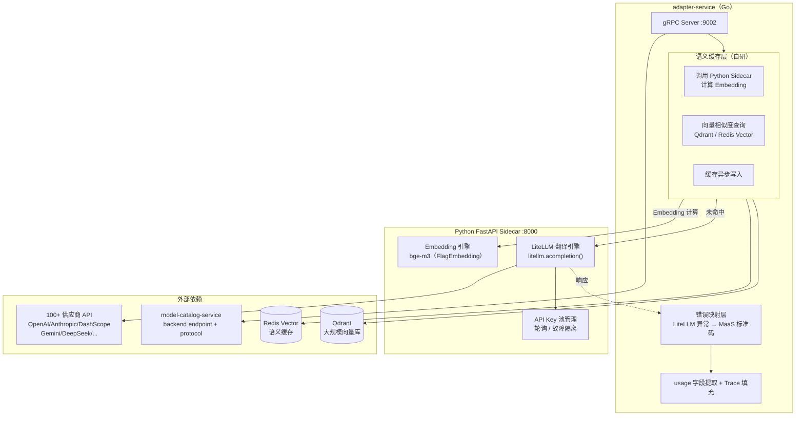

# adapter-service 详细设计文档

**文档版本：** V2.1.0  
**更新日期：** 2026年05月22日  
**基准PRD：** `产品设计/MaaS-PRD-V2.0/`  
**服务名称：** `adapter-service`  
**语言/框架：** Go 1.22（gRPC 接入层 + 语义缓存） + Python 3.11 FastAPI（LiteLLM 翻译引擎 + Embedding Sidecar）  
**变更说明：** V2.1 使用 [LiteLLM](https://github.com/BerriAI/litellm) 替代自研的 8 个 Vendor Adapter，协议转换由 Python Sidecar 统一处理，Go 主服务保留语义缓存和 gRPC 接口层。

---

## 1. 服务职责

| 职责域 | 具体能力 | 实现方式 |
|--------|---------|---------|
| **协议适配** | 将 MaaS 标准请求转换为 100+ 供应商原生格式 | **LiteLLM SDK**（Python Sidecar） |
| **SSE 流代理** | 透明代理供应商流式响应，统一 SSE 事件格式 | **litellm.acompletion(stream=True)** |
| **语义缓存** | Embedding 相似度（cosine ≥ 0.92）缓存，命中时绕过供应商 | Go 自研 + Qdrant/Redis Vector |
| **请求重试** | 供应商请求失败时指数退避重试（配合 routing-service Fallback） | LiteLLM 内置 + Go 层兜底 |
| **响应标准化** | 提取 usage 字段，填充 Trace 所需字段 | LiteLLM ModelResponse 统一格式 |
| **供应商错误映射** | 供应商原生异常 → MaaS 标准错误码 | LiteLLM 统一异常 → Go 映射层 |

---

## 2. 整体架构

### 2.1 废弃 vs 保留

| 组件 | V2.0 做法 | V2.1 做法 | 节省工作量 |
|------|---------|---------|---------|
| Vendor Protocol Adapters（8个） | 全部自研 | ✅ 删除，由 LiteLLM 替代 | ~3000 行 Go 代码 |
| SSE 流解析逻辑 | 每个供应商各写一套 | ✅ LiteLLM 统一处理 | ~800 行 |
| Token 计数 | 各供应商独立实现 | ✅ litellm.token_counter() | ~300 行 |
| 错误码映射表 | 手工维护 | ✅ LiteLLM 标准异常体系 | ~200 行 |
| 语义缓存 | 自研 | ⚙️ 保留（LiteLLM 无多租户缓存） | — |
| gRPC 接口层 | 自研 | ⚙️ 保留 | — |
| Embedding Server | Python sidecar | ⚙️ 合并到 LiteLLM sidecar | 复用 |

### 2.2 架构图



---

## 3. Python Sidecar 设计

### 3.1 依赖

```txt
# requirements.txt
litellm==1.40.x
fastapi==0.111.x
uvicorn[standard]==0.29.x
FlagEmbedding==1.2.x      # bge-m3 本地 Embedding
httpx==0.27.x
```

### 3.2 LiteLLM 供应商模型 ID 映射

LiteLLM 使用 `provider/model` 格式调用，model-catalog-service 的 `vendor_model_id` 字段直接存储此格式：

| 供应商 | LiteLLM model 参数示例 |
|--------|----------------------|
| OpenAI | `openai/gpt-4o` |
| Anthropic | `anthropic/claude-3-5-sonnet-20241022` |
| Azure OpenAI | `azure/gpt-4o` |
| 阿里云百炼 | `dashscope/qwen-max` |
| DeepSeek | `deepseek/deepseek-chat` |
| 智谱 AI | `zhipuai/glm-4` |
| 月之暗面 | `moonshot/moonshot-v1-8k` |
| Google Gemini | `gemini/gemini-1.5-pro` |
| 字节豆包 | `volcengine/doubao-pro-32k` |
| 自定义 OpenAI 兼容 | `openai/custom-model`（custom base_url） |

### 3.3 核心接口实现

```python
# sidecar/main.py
from fastapi import FastAPI, HTTPException
from fastapi.responses import StreamingResponse
import litellm
import asyncio

app = FastAPI()

# 全局配置：关闭 LiteLLM 内部日志避免噪声
litellm.suppress_debug_info = True
litellm.set_verbose = False

@app.post("/v1/chat/completions")
async def chat_completion(req: VendorCallRequest):
    """非流式调用"""
    try:
        response = await litellm.acompletion(
            model=req.litellm_model,          # 如 "anthropic/claude-3-5-sonnet"
            messages=req.messages,
            api_key=req.api_key,
            api_base=req.api_base,            # 自定义 endpoint
            timeout=req.timeout_ms / 1000,
            temperature=req.temperature,
            max_tokens=req.max_tokens,
            **req.extra_params,
        )
        return {
            "id": response.id,
            "choices": response.choices,
            "usage": {
                "prompt_tokens":     response.usage.prompt_tokens,
                "completion_tokens": response.usage.completion_tokens,
                "total_tokens":      response.usage.total_tokens,
            },
            "model": response.model,
        }
    except litellm.RateLimitError as e:
        raise HTTPException(status_code=429, detail={"maas_code": "upstream_rate_limit", "raw": str(e)})
    except litellm.ServiceUnavailableError as e:
        raise HTTPException(status_code=503, detail={"maas_code": "upstream_unavailable", "raw": str(e)})
    except litellm.ContextWindowExceededError as e:
        raise HTTPException(status_code=400, detail={"maas_code": "context_length_exceeded", "raw": str(e)})
    except litellm.ContentPolicyViolationError as e:
        raise HTTPException(status_code=400, detail={"maas_code": "upstream_content_blocked", "raw": str(e)})
    except litellm.AuthenticationError as e:
        raise HTTPException(status_code=502, detail={"maas_code": "vendor_key_invalid", "raw": str(e)})


@app.post("/v1/chat/completions/stream")
async def chat_completion_stream(req: VendorCallRequest):
    """流式调用（SSE）"""
    async def event_generator():
        async for chunk in await litellm.acompletion(
            model=req.litellm_model,
            messages=req.messages,
            api_key=req.api_key,
            api_base=req.api_base,
            stream=True,
            timeout=req.timeout_ms / 1000,
            **req.extra_params,
        ):
            yield f"data: {chunk.model_dump_json()}\n\n"
        yield "data: [DONE]\n\n"

    return StreamingResponse(event_generator(), media_type="text/event-stream")


@app.post("/v1/embeddings")
async def get_embedding(req: EmbeddingRequest):
    """本地 bge-m3 Embedding（语义缓存用）"""
    from FlagEmbedding import FlagModel
    # 模型启动时预加载，此处省略初始化代码
    embeddings = embedding_model.encode(req.texts)
    return {"embeddings": embeddings.tolist()}
```

### 3.4 LiteLLM 内置能力直接复用

```python
# Token 计数（无需调用供应商）
token_count = litellm.token_counter(
    model="gpt-4o",
    messages=messages
)

# 估算成本
cost = litellm.completion_cost(completion_response=response)

# 支持的模型列表
models = litellm.utils.get_valid_models()
```

---

## 4. Go 主服务设计

Go 层负责：**gRPC 接入 → 缓存判断 → 调用 Python Sidecar → 错误映射 → 结果返回**，不再包含任何供应商协议细节。

### 4.1 调用流程

```
gRPC: CallVendorBackend(request)
  │
  ├─ 1. 查询 model-catalog-service → 获取 backend.litellm_model_id, api_base, key_pool_ref
  │
  ├─ 2. 从 Key 池取当前可用 API Key（Redis 轮询 + 故障标记）
  │
  ├─ 3. 语义缓存查询（IsCacheCandidate 判断）
  │      ├─ 命中 → 直接返回缓存响应
  │      └─ 未命中 → 继续
  │
  ├─ 4. HTTP 调用 Python Sidecar POST /v1/chat/completions[/stream]
  │      传入：litellm_model, messages, api_key, api_base, timeout
  │
  ├─ 5. 错误处理：HTTP 4xx/5xx → MaaS 标准 gRPC 错误
  │
  ├─ 6. 提取 usage 字段，填充 TraceEvent（异步投递 Kafka）
  │
  └─ 7. 异步写入语义缓存
```

### 4.2 Go 调用 Sidecar

```go
// internal/sidecar/client.go
type SidecarClient struct {
    httpClient *http.Client
    baseURL    string
}

func (c *SidecarClient) ChatCompletion(ctx context.Context, req *VendorCallRequest) (*CompletionResponse, error) {
    payload, _ := json.Marshal(map[string]any{
        "litellm_model": req.LiteLLMModel,
        "messages":      req.Messages,
        "api_key":       req.APIKey,
        "api_base":      req.APIBase,
        "timeout_ms":    req.TimeoutMs,
        "temperature":   req.Temperature,
        "max_tokens":    req.MaxTokens,
        "extra_params":  req.ExtraParams,
    })

    resp, err := c.httpClient.Post(
        c.baseURL+"/v1/chat/completions",
        "application/json",
        bytes.NewReader(payload),
    )
    if err != nil {
        return nil, fmt.Errorf("sidecar unavailable: %w", err)
    }
    defer resp.Body.Close()

    if resp.StatusCode != 200 {
        var errBody struct {
            Detail struct {
                MaasCode string `json:"maas_code"`
                Raw      string `json:"raw"`
            } `json:"detail"`
        }
        json.NewDecoder(resp.Body).Decode(&errBody)
        return nil, &MaaSError{Code: errBody.Detail.MaasCode, Raw: errBody.Detail.Raw}
    }

    var result CompletionResponse
    json.NewDecoder(resp.Body).Decode(&result)
    return &result, nil
}
```

---

## 5. 语义缓存设计（不变）

### 5.1 缓存适用条件

```
temperature == 0  （确定性输出）
stream == false   （同步请求）
tools 为空        （工具调用不缓存）
租户 cache_enabled == true
```

### 5.2 缓存 Key 构成

```
cache_key = tenant_id + logical_model_id + SHA256(system_prompt) + EmbeddingVector(user_message)
相似度阈值：cosine ≥ 0.92（可按租户配置）
TTL：默认 4 小时（temperature=0 的确定性场景）
```

### 5.3 向量存储选型

| 存储方案 | 场景 | 说明 |
|---------|------|------|
| Redis Vector Search | 公有 SaaS（< 1000 万向量） | 复用现有 Redis 集群，运维简单 |
| Qdrant | 私有化大规模部署 | 支持复杂过滤 + 向量索引，见 [05-Qdrant.md](../中间件/05-Qdrant.md) |

---

## 6. 错误映射（LiteLLM 异常 → MaaS 标准码）

| LiteLLM 异常类 | MaaS 错误码 | HTTP 状态码 |
|---------------|-----------|------------|
| `RateLimitError` | `upstream_rate_limit` | 429 |
| `ServiceUnavailableError` | `upstream_unavailable` | 503 |
| `Timeout` | `upstream_timeout` | 504 |
| `ContextWindowExceededError` | `context_length_exceeded` | 400 |
| `ContentPolicyViolationError` | `upstream_content_blocked` | 400 |
| `AuthenticationError` | `vendor_key_invalid` | 502 |
| `BadRequestError` | `upstream_bad_request` | 400 |
| 其他未知异常 | `upstream_error` | 502 |

> LiteLLM 已统一了所有供应商的异常类型，Go 层只需处理上表 8 种，无需针对每个供应商单独判断。

---

## 7. gRPC 接口（不变）

```protobuf
service AdapterService {
    rpc CallVendorBackend(VendorCallRequest) returns (stream VendorCallResponse);
    rpc SemanticCacheLookup(CacheLookupRequest) returns (CacheLookupResponse);
    rpc SemanticCacheWrite(CacheWriteRequest) returns (google.protobuf.Empty);
}

message VendorCallRequest {
    string trace_id         = 1;
    string request_id       = 2;
    string backend_id       = 3;
    bytes  openai_body      = 4;
    bool   stream           = 5;
    bool   zero_retention   = 6;
}

message VendorCallResponse {
    oneof payload {
        bytes  chunk        = 1;   // SSE chunk（流式）
        bytes  full_body    = 2;   // 完整响应（非流式）
    }
    Usage  usage            = 3;   // 仅最后一条携带
    string maas_error_code  = 4;
}
```

---

## 8. 部署规格

```yaml
# Go 主服务
adapter-service:
  replicas: 3
  hpa: {min: 3, max: 15, targetCPU: 70%}
  resources:
    requests: {cpu: 500m, memory: 512Mi}   # 比 V2.0 降低（无复杂适配逻辑）
    limits:   {cpu: 2000m, memory: 2Gi}
  ports:
    - 9002: gRPC
    - 9093: Prometheus metrics

# Python Sidecar（每个 Pod 内，与 Go 主服务共享网络）
litellm-sidecar:
  image: python:3.11-slim
  resources:
    requests: {cpu: 1000m, memory: 2Gi}   # bge-m3 模型约 1.5GB
    limits:   {cpu: 4000m, memory: 6Gi}
  ports:
    - 8000: FastAPI HTTP
  env:
    - LITELLM_LOG: ERROR
  volumeMounts:
    - name: model-cache
      mountPath: /root/.cache/huggingface   # bge-m3 模型缓存
```

> **注意**：Python Sidecar 首次启动会下载 bge-m3 模型（约 1.5GB），生产环境需提前烘焙到镜像或使用 InitContainer 预热。
