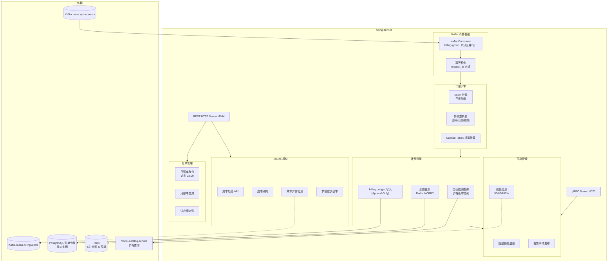
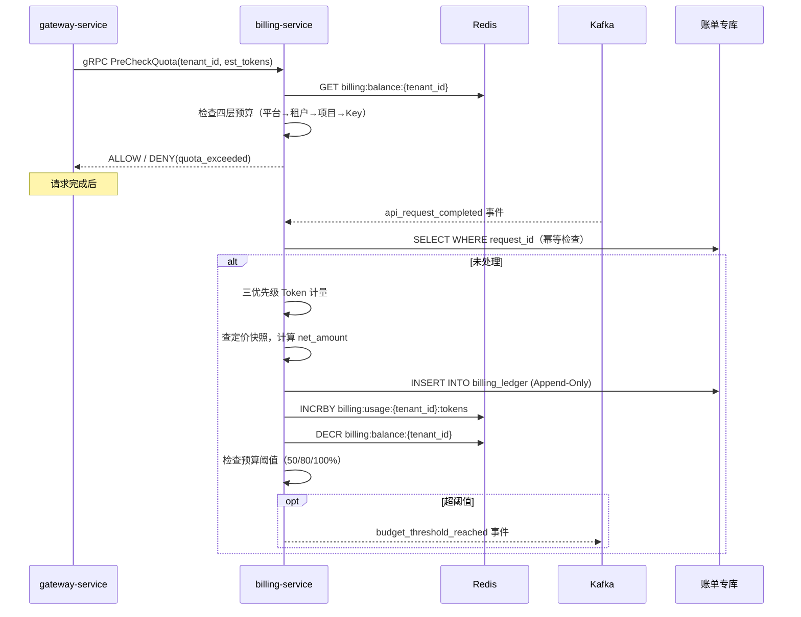

# billing-service 详细设计文档

**文档版本：** V2.0.0  
**更新日期：** 2026年05月22日  
**基准PRD：** `产品设计/MaaS-PRD-V2.0/06-计费成本与FinOps规格.md`  
**服务名称：** `billing-service`  
**前身：** `billing-auth-service`（V1.0，auth 职责已独立拆出为 auth-service）  
**语言/框架：** Go 1.22  
**变更说明：** V2.0 引入 billing_ledger Append-Only 账单模型、三层预算分层管理、FinOps 成本看板数据 API、成本异常检测、合同阶梯定价、Cached Token 折扣计量、三方计量对账。

---

## 1. 服务职责

| 职责域 | 具体能力 |
|--------|---------|
| **Token 计量** | 三优先级计量（供应商 usage 字段 > 网关 Tokenizer > 字符估算） |
| **计费账本** | billing_ledger Append-Only 写入，禁止修改，修正通过冲销记录实现 |
| **预算预检** | 为 gateway-service 提供 gRPC 余额预检接口（P99 < 5ms） |
| **实时余额** | Redis 实时维护租户/项目/Key 余额，预扣-核销两阶段 |
| **预算分层** | 平台级 → 租户级 → 项目级 → Key 级四层预算配置，层层限制 |
| **预警告警** | 预算使用率达阈值（50% / 80% / 100%）时发布告警事件 |
| **FinOps 仪表板** | 提供成本趋势、成本分摊、节省建议等 FinOps 数据查询 API |
| **成本异常检测** | 基于历史基线检测成本尖峰，自动发布异常告警 |
| **账单管理** | 日 / 月账单汇总生成，供应商账单对账（三方比对） |
| **合同定价** | 支持阶梯价、包月套餐、合同折扣等灵活定价模型 |

---

## 2. 服务架构图



---

## 3. billing_ledger 核心字段（PostgreSQL，Append-Only）

```sql
CREATE TABLE billing_ledger (
    id                      BIGSERIAL PRIMARY KEY,
    ledger_uuid             UUID NOT NULL DEFAULT gen_random_uuid(),

    -- 关联关系
    tenant_id               VARCHAR(64) NOT NULL,
    workspace_id            VARCHAR(64),
    app_id                  VARCHAR(64),
    api_key_id              VARCHAR(128) NOT NULL,
    user_id                 VARCHAR(128),

    -- 请求溯源
    request_id              VARCHAR(128) NOT NULL,
    trace_id                VARCHAR(128),
    upstream_request_id     VARCHAR(256),               -- 供应商侧请求 ID

    -- 模型信息
    logical_model_id        VARCHAR(128) NOT NULL,
    provider_id             VARCHAR(64) NOT NULL,
    provider_model_id       VARCHAR(128) NOT NULL,

    -- 计量数据
    prompt_tokens           INT NOT NULL DEFAULT 0,
    completion_tokens       INT NOT NULL DEFAULT 0,
    cached_input_tokens     INT NOT NULL DEFAULT 0,
    total_tokens            INT NOT NULL DEFAULT 0,
    is_estimated            BOOLEAN NOT NULL DEFAULT FALSE,
    is_stream               BOOLEAN NOT NULL DEFAULT FALSE,

    -- 定价快照（写入时锁定，不随后续价格修改变动）
    price_version_id        VARCHAR(64) NOT NULL,
    prompt_unit_price       NUMERIC(20,10) NOT NULL,
    completion_unit_price   NUMERIC(20,10) NOT NULL,
    cached_unit_price       NUMERIC(20,10) NOT NULL DEFAULT 0,
    currency                CHAR(3) NOT NULL DEFAULT 'USD',

    -- 金额
    prompt_amount           NUMERIC(20,6) NOT NULL,
    completion_amount       NUMERIC(20,6) NOT NULL,
    cached_token_amount     NUMERIC(20,6) NOT NULL DEFAULT 0,
    discount_amount         NUMERIC(20,6) NOT NULL DEFAULT 0,
    gross_amount            NUMERIC(20,6) NOT NULL,
    net_amount              NUMERIC(20,6) NOT NULL,

    -- 账本分类
    entry_type              VARCHAR(20) NOT NULL DEFAULT 'CHARGE',   -- CHARGE / REVERSAL / ADJUSTMENT
    billing_period          CHAR(7) NOT NULL,                        -- YYYY-MM

    -- 时间
    request_started_at      TIMESTAMP WITH TIME ZONE,
    request_completed_at    TIMESTAMP WITH TIME ZONE,
    created_at              TIMESTAMP WITH TIME ZONE NOT NULL DEFAULT NOW(),

    CONSTRAINT uq_request_id UNIQUE (request_id, entry_type)
);
```

---

## 4. 预扣-核销两阶段计费流程



---

## 5. 四层预算层级

```
平台级预算（Platform Budget）
  └─ 可分配总量上限
      ├─ 租户级预算（Tenant Budget）
      │   ├─ 月度预算上限（软限/硬限）
      │   └─ 项目级预算（Project Budget）
      │       ├─ 月度项目限额
      │       └─ Key 级预算（API Key Budget）
      │           └─ 日/月 Key 级限额

配置规则：
  - 下级预算 ≤ 上级预算
  - 硬限：超额立即拒绝请求（gateway 预检返回 DENY）
  - 软限：超额允许请求但触发告警（阈值可配）
  - 自动重置：月初 00:00 UTC 重置月度计数器
```

---

## 5.1 合同阶梯定价模型

### 5.1.1 定价规则（pricing_rule 表）

| 字段 | 类型 | 说明 |
|------|------|------|
| `rule_id` | VARCHAR(36) | UUID |
| `vendor_backend_id` | VARCHAR(36) | 关联的供应商后端 |
| `price_type` | ENUM | FLAT_RATE / TIERED_VOLUME / TIERED_COMMITMENT / PACKAGE |
| `currency` | CHAR(3) | 币种（USD / CNY） |
| `effective_from` | DATE | 价格生效日期 |
| `effective_until` | DATE | 价格失效日期（NULL 表示永久有效） |
| `price_version` | INT | 价格版本号，每次变更 +1 |

### 5.1.2 定价类型详解

```
FLAT_RATE（统一单价）：
  prompt_tokens:    0.0025 / 1K tokens
  completion_tokens: 0.0100 / 1K tokens

TIERED_VOLUME（阶梯量级价）：
  月用量 0~1M tokens:    prompt=0.0030, completion=0.0120
  月用量 1M~10M tokens:  prompt=0.0025, completion=0.0100
  月用量 >10M tokens:    prompt=0.0020, completion=0.0080
  计算方式：全量按当前阶梯价（非累进），每月 1 日阶梯重置

TIERED_COMMITMENT（预付费包）：
  包名         预付费    包含 Token    超量单价
  starter      $1000    500K tokens  0.0030 / 1K
  business     $5000    3M tokens    0.0025 / 1K
  enterprise   $20000   15M tokens   0.0020 / 1K

PACKAGE（预付费套餐，含多模型）：
  套餐名       价格      包含量                         超量单价
  chat-pro     $3000/月  2M tokens (gpt-4), 10M (gpt-3.5)  按各自 FLAT_RATE 计
```

### 5.1.3 价格生效语义

```
创建新价格 → effective_from 到达前使用旧价格
effective_from 到达 → 自动切换到新价格（无需人工切换）
追溯调整（retroactive change）：
  - 仅允许 +30 天内的追溯
  - 生成 ADJUSTMENT 类型的 billing_ledger 记录
  - 需审批工作流批准（平台 finance_admin）

价格快照机制：
  - 每笔 billing_ledger 记录写入时的 price_version_id
  - 后续价格变更不影响历史账单
  - 对账时使用 price_version_id 精确还原当时的定价
```

---

## 6. FinOps API 设计

| 方法 | 路径 | 说明 |
|------|------|------|
| GET | `/api/v1/billing/dashboard` | FinOps 仪表板（成本趋势、模型分布、供应商占比） |
| GET | `/api/v1/billing/cost/breakdown` | 成本多维度分解（按租户/项目/模型/供应商） |
| GET | `/api/v1/billing/cost/anomalies` | 成本异常检测结果（最近 N 天） |
| GET | `/api/v1/billing/savings/recommendations` | 节省建议（模型替换建议、缓存优化建议） |
| GET | `/api/v1/billing/statements/{period}` | 月账单详情 |
| POST | `/api/v1/billing/budgets` | 创建/更新预算配置 |
| GET | `/api/v1/billing/usage/realtime` | 实时用量（当前月累计） |
| POST | `/api/v1/billing/reconcile` | 触发与供应商的账单对账 |

---

## 7. 成本异常检测（PRD §06 第4章）

### 7.1 五种典型异常场景

| 场景 | 类型 | 检测窗口 | 典型原因 |
|------|------|---------|---------|
| **场景1：突发流量激增** | SPIKE | 1小时窗口 vs 7天基线 | Bug循环调用、压测误打生产、Key泄露、合法营销峰值 |
| **场景2：成本持续爬升** | TREND_DRIFT | 连续3天 vs 30天基线 | 业务量自然增长超预期、预算计划未同步更新 |
| **场景3：模型分布异常** | MODEL_DIST | 1小时窗口 vs 30天分布 | 路由策略Bug导致流量集中、降级后回退到高价模型 |
| **场景4：低效调用模式** | INEFFICIENCY | 24小时窗口 | completion/prompt token 比 < 0.05 且调用量 > 1000 |
| **场景5：预算穿透异常** | BUDGET_PENETRATION | 实时 | 某层级预算消耗速度异常（如月初即达50%） |

### 7.2 三种检测算法

#### 算法 A：Z-Score 尖峰检测（适用场景1）

$$\text{Z} = \frac{x_t - \mu}{\sigma}$$

其中 $\mu$ 为 7天×24小时 滑动窗口历史均值，$\sigma$ 为标准差。当 $|Z| > 3.0$ 时触发告警。

**优点**：计算简单、实时性好；**缺点**：对持续高消耗不敏感（高位均值导致 σ 增大）。

新应用冷启动期（< 7天历史）采用绝对阈值兜底：消耗 > $5/hour 即告警。

#### 算法 B：Prophet 时间序列分解（适用场景2）

使用 Prophet 对历史日消耗建模，分解为趋势项 $T(t)$、季节项 $S(t)$（周季节性）、节假日效应 $H(t)$：

$$y(t) = T(t) + S(t) + H(t) + \varepsilon(t)$$

计算残差 $\varepsilon(t)$，若连续多日残差为正且显著（t检验 p < 0.05），判定为趋势上升异常。

**执行时间**：每日 03:00 UTC 批处理（非实时）。**冷启动要求**：至少 30 天历史数据。

#### 算法 C：KL 散度分布检测（适用场景3）

设历史 30 天各模型消耗占比为参考分布 $P$，当前 1 小时占比为观测分布 $Q$：

$$\text{KL}(P \| Q) = \sum_{i} P(i) \log \frac{P(i)}{Q(i)}$$

KL > 0.5 时触发告警。每日 03:00 UTC 批处理，需要 ≥ 7 天数据激活。

### 7.3 cost_anomaly 表（PRD §06 4.5）

```sql
CREATE TABLE cost_anomaly (
    id              BIGSERIAL PRIMARY KEY,
    anomaly_uuid    UUID NOT NULL DEFAULT gen_random_uuid(),
    tenant_id       VARCHAR(64) NOT NULL,
    anomaly_type    VARCHAR(64) NOT NULL,   -- SPIKE / TREND_DRIFT / MODEL_DIST / INEFFICIENCY / BUDGET_PENETRATION
    severity        VARCHAR(16) NOT NULL,   -- LOW / MEDIUM / HIGH / CRITICAL
    detected_at     TIMESTAMPTZ NOT NULL,
    metric_name     VARCHAR(64),            -- 异常指标名
    metric_value    NUMERIC(20,6),
    baseline_value  NUMERIC(20,6),          -- 基线值
    deviation_pct   NUMERIC(10,2),          -- 偏离百分比
    z_score         NUMERIC(10,4),          -- Z-Score（适用时）
    kl_divergence   NUMERIC(10,4),          -- KL散度（适用时）
    context_data    JSONB,                  -- 上下文（模型分布、关联Key等）
    resolution      VARCHAR(32) DEFAULT 'OPEN', -- OPEN / ACKNOWLEDGED / RESOLVED / DISMISSED
    resolved_at     TIMESTAMPTZ,
    resolved_by     VARCHAR(64),
    resolution_note TEXT,
    created_at      TIMESTAMPTZ NOT NULL DEFAULT now()
);

CREATE INDEX idx_ca_tenant_detected ON cost_anomaly (tenant_id, detected_at DESC);
CREATE INDEX idx_ca_severity ON cost_anomaly (severity, resolution);
```

### 7.4 异常处置流程

```
检测引擎触发 → 创建 cost_anomaly 记录
  ├── LOW severity     → 站内通知，建议人工确认
  ├── MEDIUM severity  → 邮件告警 + 成本趋势图
  ├── HIGH severity    → 多渠道告警（邮件 + 短信 + DingTalk/企微）
  └── CRITICAL severity → 多渠道告警 + 自动处置选项：
                            - 立即限流（API Key THROTTLE）
                            - 紧急暂停（API Key 临时禁用）
                            - 扩容预算（审批增额）
                            - 排查问题（跳转 Trace 视图）
```

### 7.5 节省建议引擎（PRD §06 第5章）

节省建议引擎分析历史用量数据，按 ROI 排序自动生成建议：

| 建议类型 | 量化方法 | 行动路径 |
|---------|---------|---------|
| **S1：Prompt Cache 启用** | `estimated_savings = 重复前缀Token数 × 0.9 × prompt_price × 请求频率` | 提供代码示例，指导添加 `cache_control` 标记 |
| **S2：模型替换建议** | 同能力档位中最低价格模型 vs 当前模型的价格差 × 月用量 | 展示质量-成本对比，一键替换（需评测验证） |
| **S3：批处理整合** | 实时请求 vs Batch API 价格差（通常 50%） | 识别低时效性请求，建议走 Batch API |
| **S4：Token 优化** | 过长 System Prompt 的 Token 浪费 | 识别 Top-5 最长 System Prompt，建议精简 |
| **S5：低利用率 Key 回收** | 连续 30 天无调用的 Key 仍占用配额 | 提示回收或降级为 Development Key |

建议展示格式：
```json
{
  "recommendation_id": "rec-001",
  "type": "PROMPT_CACHE",
  "title": "启用 Prompt Cache 可节省 $1,250/月",
  "estimated_monthly_savings": 1250.00,
  "confidence": "HIGH",
  "affected_apps": ["app-chatbot-prod"],
  "action_url": "/console/savings/prompt-cache-setup"
}
```

---

## 8. 缓存设计（Redis）

| Key 格式 | TTL | 说明 |
|---------|-----|------|
| `billing:balance:{tenant_id}` | 永久（月初重置） | 租户剩余余额 |
| `billing:balance:{project_id}` | 永久（月初重置） | 项目剩余预算 |
| `billing:usage:{key_id}:tokens` | 月度 | Key 级 Token 累计 |
| `billing:price:{model_id}:v{version}` | 3600s | 定价快照缓存 |

---

## 9. 部署规格

```yaml
replicas: 2 (HPA min=2, max=8)
resources:
  requests: {cpu: 1000m, memory: 1Gi}
  limits:   {cpu: 4000m, memory: 4Gi}
ports:
  - 8084: HTTP REST（对外 API）
  - 9070: gRPC（供 gateway-service 预检调用）
  - 9094: Prometheus metrics
database:
  - PostgreSQL 主实例（billing_ledger，Append-Only，建议独立实例）
  - 分区策略：按 billing_period（YYYY-MM）RANGE 分区
```
