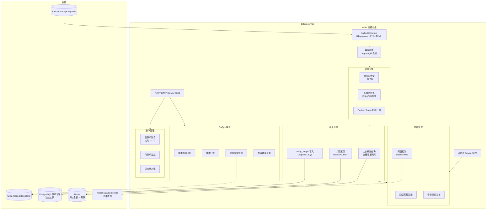
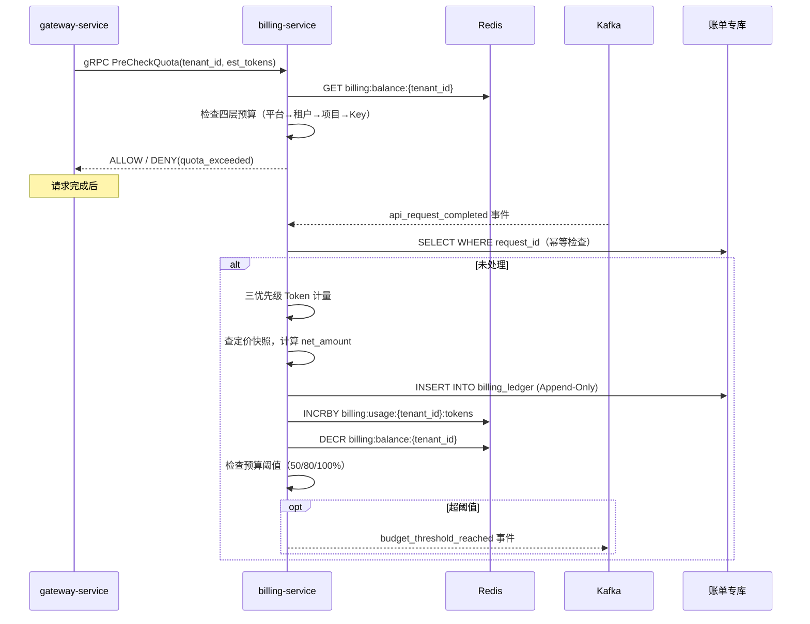

# billing-service 详细设计文档

**文档版本：** V2.0.0  
**更新日期：** 2026年05月22日  
**基准PRD：** `产品设计/MaaS-PRD-V2.0/06-计费成本与FinOps规格.md`  
**服务名称：** `billing-service`  
**前身：** `billing-auth-service`（V1.0，auth 职责已独立拆出为 auth-service）  
**语言/框架：** Go 1.22  
**变更说明：** V2.0 引入 billing_ledger Append-Only 账单模型、三层预算分层管理、FinOps 成本看板数据 API、成本异常检测、合同阶梯定价、Cached Token 折扣计量、三方计量对账。

---

## 1. 服务职责

| 职责域 | 具体能力 |
|--------|---------|
| **Token 计量** | 三优先级计量（供应商 usage 字段 > 网关 Tokenizer > 字符估算） |
| **计费账本** | billing_ledger Append-Only 写入，禁止修改，修正通过冲销记录实现 |
| **预算预检** | 为 gateway-service 提供 gRPC 余额预检接口（P99 < 5ms） |
| **实时余额** | Redis 实时维护租户/项目/Key 余额，预扣-核销两阶段 |
| **预算分层** | 平台级 → 租户级 → 项目级 → Key 级四层预算配置，层层限制 |
| **预警告警** | 预算使用率达阈值（50% / 80% / 100%）时发布告警事件 |
| **FinOps 仪表板** | 提供成本趋势、成本分摊、节省建议等 FinOps 数据查询 API |
| **成本异常检测** | 基于历史基线检测成本尖峰，自动发布异常告警 |
| **账单管理** | 日 / 月账单汇总生成，供应商账单对账（三方比对） |
| **合同定价** | 支持阶梯价、包月套餐、合同折扣等灵活定价模型 |

---

## 2. 服务架构图



---

## 3. billing_ledger 核心字段（PostgreSQL，Append-Only）

```sql
CREATE TABLE billing_ledger (
    id                      BIGSERIAL PRIMARY KEY,
    ledger_uuid             UUID NOT NULL DEFAULT gen_random_uuid(),

    -- 关联关系
    tenant_id               VARCHAR(64) NOT NULL,
    workspace_id            VARCHAR(64),
    app_id                  VARCHAR(64),
    api_key_id              VARCHAR(128) NOT NULL,
    user_id                 VARCHAR(128),

    -- 请求溯源
    request_id              VARCHAR(128) NOT NULL,
    trace_id                VARCHAR(128),
    upstream_request_id     VARCHAR(256),               -- 供应商侧请求 ID

    -- 模型信息
    logical_model_id        VARCHAR(128) NOT NULL,
    provider_id             VARCHAR(64) NOT NULL,
    provider_model_id       VARCHAR(128) NOT NULL,

    -- 计量数据
    prompt_tokens           INT NOT NULL DEFAULT 0,
    completion_tokens       INT NOT NULL DEFAULT 0,
    cached_input_tokens     INT NOT NULL DEFAULT 0,
    total_tokens            INT NOT NULL DEFAULT 0,
    is_estimated            BOOLEAN NOT NULL DEFAULT FALSE,
    is_stream               BOOLEAN NOT NULL DEFAULT FALSE,

    -- 定价快照（写入时锁定，不随后续价格修改变动）
    price_version_id        VARCHAR(64) NOT NULL,
    prompt_unit_price       NUMERIC(20,10) NOT NULL,
    completion_unit_price   NUMERIC(20,10) NOT NULL,
    cached_unit_price       NUMERIC(20,10) NOT NULL DEFAULT 0,
    currency                CHAR(3) NOT NULL DEFAULT 'USD',

    -- 金额
    prompt_amount           NUMERIC(20,6) NOT NULL,
    completion_amount       NUMERIC(20,6) NOT NULL,
    cached_token_amount     NUMERIC(20,6) NOT NULL DEFAULT 0,
    discount_amount         NUMERIC(20,6) NOT NULL DEFAULT 0,
    gross_amount            NUMERIC(20,6) NOT NULL,
    net_amount              NUMERIC(20,6) NOT NULL,

    -- 账本分类
    entry_type              VARCHAR(20) NOT NULL DEFAULT 'CHARGE',   -- CHARGE / REVERSAL / ADJUSTMENT
    billing_period          CHAR(7) NOT NULL,                        -- YYYY-MM

    -- 时间
    request_started_at      TIMESTAMP WITH TIME ZONE,
    request_completed_at    TIMESTAMP WITH TIME ZONE,
    created_at              TIMESTAMP WITH TIME ZONE NOT NULL DEFAULT NOW(),

    CONSTRAINT uq_request_id UNIQUE (request_id, entry_type)
);
```

---

## 4. 预扣-核销两阶段计费流程



---

## 5. 四层预算层级

```
平台级预算（Platform Budget）
  └─ 可分配总量上限
      ├─ 租户级预算（Tenant Budget）
      │   ├─ 月度预算上限（软限/硬限）
      │   └─ 项目级预算（Project Budget）
      │       ├─ 月度项目限额
      │       └─ Key 级预算（API Key Budget）
      │           └─ 日/月 Key 级限额

配置规则：
  - 下级预算 ≤ 上级预算
  - 硬限：超额立即拒绝请求（gateway 预检返回 DENY）
  - 软限：超额允许请求但触发告警（阈值可配）
  - 自动重置：月初 00:00 UTC 重置月度计数器
```

---

## 6. FinOps API 设计

| 方法 | 路径 | 说明 |
|------|------|------|
| GET | `/api/v1/billing/dashboard` | FinOps 仪表板（成本趋势、模型分布、供应商占比） |
| GET | `/api/v1/billing/cost/breakdown` | 成本多维度分解（按租户/项目/模型/供应商） |
| GET | `/api/v1/billing/cost/anomalies` | 成本异常检测结果（最近 N 天） |
| GET | `/api/v1/billing/savings/recommendations` | 节省建议（模型替换建议、缓存优化建议） |
| GET | `/api/v1/billing/statements/{period}` | 月账单详情 |
| POST | `/api/v1/billing/budgets` | 创建/更新预算配置 |
| GET | `/api/v1/billing/usage/realtime` | 实时用量（当前月累计） |
| POST | `/api/v1/billing/reconcile` | 触发与供应商的账单对账 |

---

## 7. 成本异常检测算法

```
基线建立：对每个（tenant_id, logical_model）维度，计算过去 30 天的日均成本 μ 和标准差 σ
检测规则：当日成本 > μ + 3σ 时触发异常告警
告警级别：
  WARNING：μ + 2σ < 当日成本 ≤ μ + 3σ
  CRITICAL：当日成本 > μ + 3σ
异常可能原因分析：
  1. 新上线业务流量激增
  2. 循环调用 bug（相似请求重复发送）
  3. 上游意外退回更贵的 Fallback 模型
  4. 外部攻击或 Key 泄露
```

---

## 8. 缓存设计（Redis）

| Key 格式 | TTL | 说明 |
|---------|-----|------|
| `billing:balance:{tenant_id}` | 永久（月初重置） | 租户剩余余额 |
| `billing:balance:{project_id}` | 永久（月初重置） | 项目剩余预算 |
| `billing:usage:{key_id}:tokens` | 月度 | Key 级 Token 累计 |
| `billing:price:{model_id}:v{version}` | 3600s | 定价快照缓存 |

---

## 9. 部署规格

```yaml
replicas: 2 (HPA min=2, max=8)
resources:
  requests: {cpu: 1000m, memory: 1Gi}
  limits:   {cpu: 4000m, memory: 4Gi}
ports:
  - 8084: HTTP REST（对外 API）
  - 9070: gRPC（供 gateway-service 预检调用）
  - 9094: Prometheus metrics
database:
  - PostgreSQL 主实例（billing_ledger，Append-Only，建议独立实例）
  - 分区策略：按 billing_period（YYYY-MM）RANGE 分区
```
