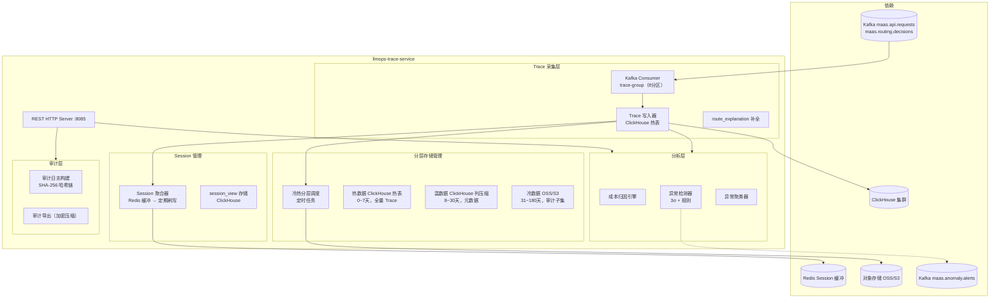

# llmops-trace-service 详细设计文档

**文档版本：** V2.0.0  
**更新日期：** 2026年05月22日  
**基准PRD：** `产品设计/MaaS-PRD-V2.0/04-LLMOps观测与请求Trace规格.md`  
**服务名称：** `llmops-trace-service`  
**前身：** `monitor-notification-service`（V1.0，告警通知职责独立为 notification-service）  
**语言/框架：** Go 1.22 + ClickHouse  
**变更说明：** V2.0 完整实现 44 字段 Trace 数据模型、Session 会话视图、成本归因分析、异常聚类、三层存储（热/温/冷）、Trace 防篡改审计、LLMOps 仪表板数据 API。

---

## 1. 服务职责

| 职责域 | 具体能力 |
|--------|---------|
| **Trace 采集** | 消费 Kafka 事件，写入 44 字段 Trace 数据模型（不可变，Append-Only） |
| **Trace 补全** | 接收 routing-service 回填的 route_explanation，补全 Trace |
| **Session 视图** | 关联同一 session_id 的多轮请求，构建 Session 级聚合视图 |
| **成本归因** | 按 tenant / project / model / vendor / user_id 多维度成本归因分析 |
| **LLMOps 仪表板** | 提供请求量、成功率、P95 延迟、TTFB、成本、缓存命中率等指标查询 API |
| **异常检测** | 基于规则和统计方法检测异常 Session / 请求，自动聚类 |
| **Trace 审计** | 生成不可篡改审计日志（面向合规/财务对账），支持加密导出 |
| **分层存储管理** | 热（0~7天）/ 温（8~30天）/ 冷（31~180天）数据自动降级 |

---

## 2. Trace 数据分层架构

```
┌──────────────────────────────────────────────────────────────────┐
│  Business 层（业务洞察）                                           │
│  成本趋势 / 模型采用率 / 供应商依赖度 / ROI 分析                    │
├──────────────────────────────────────────────────────────────────┤
│  Session 层（会话视图）                                            │
│  多轮对话关联 / Session 成本 / 上下文长度演进 / 异常 Session 识别    │
├──────────────────────────────────────────────────────────────────┤
│  Trace 层（请求级追踪）                                            │
│  单次请求全链路 / 路由解释 / Fallback 链 / Span 耗时分解             │
├──────────────────────────────────────────────────────────────────┤
│  Metrics 层（聚合指标）                                            │
│  请求量 / 成功率 / P95 延迟 / TTFB / 成本 / 缓存命中率              │
└──────────────────────────────────────────────────────────────────┘
```

---

## 3. 服务架构图



---

## 4. Trace 数据模型（核心字段）

ClickHouse 表 `trace`，按 `(tenant_id, created_at)` 分区，共 44 个字段：

```sql
CREATE TABLE trace (
    -- 主键与标识（6字段）
    trace_id            String,
    request_id          String,
    tenant_id           String,
    project_id          String,
    api_key_id          String,
    session_id          String,          -- 多轮对话 Session 标识

    -- 身份信息（3字段）
    user_id             String,
    app_id              String,
    source_ip           String,

    -- 请求信息（6字段）
    logical_model_id    String,
    vendor_backend_id   String,
    provider_id         String,
    provider_model_id   String,
    stream              UInt8,
    request_type        String,          -- chat/completion/embedding

    -- Token 计量（6字段）
    prompt_tokens       UInt32,
    completion_tokens   UInt32,
    cached_input_tokens UInt32,
    total_tokens        UInt32,
    is_estimated        UInt8,
    token_source        String,          -- vendor_usage/tokenizer/estimate

    -- 延迟指标（5字段）
    ttfb_ms             UInt32,          -- 首 Token 延迟
    total_latency_ms    UInt32,
    routing_latency_ms  UInt16,
    compliance_check_ms UInt16,
    vendor_latency_ms   UInt32,

    -- 状态与结果（5字段）
    status              String,          -- success/error/content_blocked/fallback_success
    http_status         UInt16,
    error_code          String,
    error_message       String,
    fallback_triggered  UInt8,

    -- 路由决策（4字段）
    policy_id           String,
    route_explanation   String,          -- JSON，路由解释对象
    fallback_chain      String,          -- JSON，Fallback 链路记录
    cache_hit           UInt8,

    -- 成本（3字段）
    net_amount          Decimal(20,6),
    currency            FixedString(3),
    billing_ledger_id   String,

    -- 合规（3字段）
    compliance_policy_id String,
    content_safety_result String,        -- JSON，内容安全检测结果
    zero_retention      UInt8,

    -- 时间（3字段）
    created_at          DateTime64(3),
    completed_at        DateTime64(3),
    billing_period      String           -- YYYY-MM
) ENGINE = MergeTree()
PARTITION BY (tenant_id, toYYYYMM(created_at))
ORDER BY (tenant_id, created_at, trace_id);
```

---

## 5. Session 视图设计

```
Session 聚合触发：
  - 请求携带 session_id 参数（由租户 SDK 设置）
  - 相同 tenant_id + session_id 的请求自动关联

session_view 表（ClickHouse）：
  - session_id, tenant_id, project_id
  - first_request_at, last_request_at
  - total_turns（对话轮次）
  - total_tokens, total_cost
  - max_context_length（历史最大上下文长度）
  - models_used（使用的模型列表）
  - status: active / completed / timeout

Session 超时：最后一次请求后 30 分钟无新请求，Session 自动标记为 completed
```

---

## 6. 三层存储策略

| 数据层 | 保留时长 | 存储介质 | 查询 P95 | 包含字段 |
|--------|--------|--------|--------|--------|
| 热数据 | 0~7天 | ClickHouse 本地盘（SSD） | < 2s | 全量 44 字段（含 Prompt/Response 内容，zero_retention 除外） |
| 温数据 | 8~30天 | ClickHouse 分层存储 | < 10s | 元数据字段（无 Prompt/Response 内容）+ 聚合统计 |
| 冷数据 | 31~180天 | OSS/S3 Parquet | < 60s | 审计子集（trace_id / 计费字段 / 合规执行记录） |
| 归档 | 180天+ | 归档存储（低频） | 分钟级 | 最小审计集合 |

---

## 7. REST API 设计

| 方法 | 路径 | 说明 |
|------|------|------|
| GET | `/api/v1/traces/{trace_id}` | 获取单条 Trace 详情（含 route_explanation） |
| GET | `/api/v1/traces` | Trace 列表（按 tenant/project/model/time 过滤，分页） |
| GET | `/api/v1/sessions/{session_id}` | 获取 Session 聚合视图 |
| GET | `/api/v1/dashboard/metrics` | LLMOps 仪表板指标（请求量/成功率/P95延迟/TTFB/成本/缓存命中率） |
| GET | `/api/v1/dashboard/cost/attribution` | 成本归因（多维度） |
| GET | `/api/v1/anomalies` | 异常请求列表（按聚类） |
| POST | `/api/v1/audit/export` | 触发审计日志导出（加密压缩包） |
| GET | `/api/v1/traces/{trace_id}/explanation` | 可视化路由解释 + Fallback 链 |

---

## 8. 异常检测规则

| 规则 | 触发条件 | 严重级别 |
|------|---------|---------|
| 高延迟请求 | total_latency_ms > P99 * 3 | WARNING |
| 高成本 Session | Session 单次成本 > 历史均值 10σ | CRITICAL |
| 循环调用 | 同 session_id 内相似请求（cosine > 0.99）重复 > 5 次 | CRITICAL |
| 持续 Fallback | 同 tenant 5 分钟内 fallback_triggered > 20% | WARNING |
| 内容安全拦截尖峰 | content_blocked 请求 > 平均值 5σ | WARNING |

---

## 9. 部署规格

```yaml
replicas: 2 (HPA min=2, max=8)
resources:
  requests: {cpu: 1000m, memory: 2Gi}
  limits:   {cpu: 4000m, memory: 8Gi}
ports:
  - 8085: HTTP REST
  - 9095: Prometheus metrics
storage:
  - ClickHouse 集群（3节点，含副本）
  - Redis（Session 缓冲，5分钟 TTL）
  - OSS/S3（冷数据归档）
```
