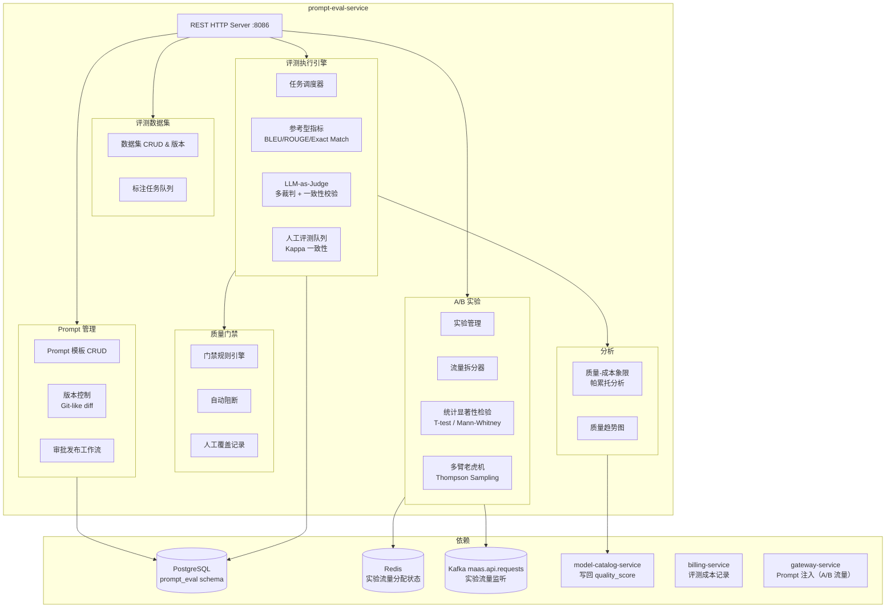
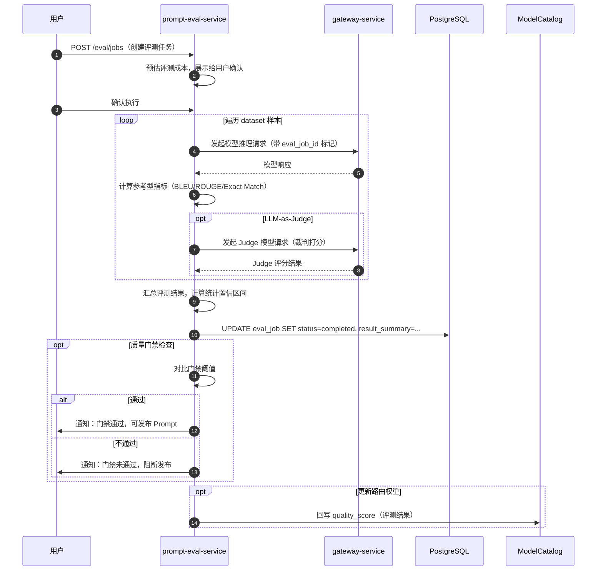

# prompt-eval-service 详细设计文档

**文档版本：** V2.0.0  
**更新日期：** 2026年05月22日  
**基准PRD：** `产品设计/MaaS-PRD-V2.0/05-Prompt实验与模型评测中心规格.md`  
**服务名称：** `prompt-eval-service`  
**前身：** 无（V2.0 新增）  
**语言/框架：** Go 1.22（主服务） + Python 3.11（评测执行器）

---

## 1. 服务职责

| 职责域 | 具体能力 |
|--------|---------|
| **Prompt 版本管理** | Prompt 模板 CRUD，版本历史，差异对比，审批发布工作流 |
| **A/B 实验** | 流量拆分，统计显著性检验，多臂老虎机自动流量调配 |
| **评测数据集** | 评测数据集 CRUD、版本管理、标注工作流集成 |
| **评测执行** | 批量评测任务调度（参考型指标 + LLM-as-Judge + 人工评测队列） |
| **上线质量门禁** | 可配置门禁规则（指标阈值），自动阻断不符合质量要求的 Prompt 发布 |
| **质量-成本联合分析** | 质量评分 vs 成本的帕累托前沿分析，辅助模型选型 |
| **路由策略联动** | 评测结果驱动路由策略权重自动更新（quality_score 回写到 model-catalog） |

---

## 2. 服务架构图



---

## 3. 核心数据模型

### 3.1 prompt_template 表

| 字段 | 类型 | 说明 |
|------|------|------|
| `template_id` | VARCHAR(36) | UUID |
| `tenant_id` | VARCHAR(64) | 所属租户 |
| `project_id` | VARCHAR(64) | 所属项目 |
| `name` | VARCHAR(100) | 模板名称 |
| `version` | INT | 版本号，每次发布 +1 |
| `status` | ENUM | draft / review_pending / approved / active / archived |
| `system_prompt` | TEXT | 系统 Prompt 内容 |
| `user_prompt_template` | TEXT | 用户 Prompt 模板（含变量占位符 {{var}}） |
| `variables_schema` | JSON | 变量定义（名称、类型、默认值） |
| `logical_model_id` | VARCHAR(36) | 关联的逻辑模型 |
| `temperature` | DECIMAL(3,2) | 温度参数 |
| `author_id` | VARCHAR(36) | 创建人 |
| `approved_by_id` | VARCHAR(36) | 审批人 |
| `quality_gate_id` | VARCHAR(36) | 关联的质量门禁规则 |
| `parent_version_id` | VARCHAR(36) | 父版本 ID（用于差异对比） |
| `created_at` | TIMESTAMP | — |

### 3.2 eval_job 表

| 字段 | 类型 | 说明 |
|------|------|------|
| `job_id` | VARCHAR(36) | UUID |
| `tenant_id` | VARCHAR(64) | — |
| `job_type` | ENUM | REFERENCE_METRIC / LLM_JUDGE / HUMAN / BATCH |
| `status` | ENUM | pending / running / completed / failed |
| `prompt_template_id` | VARCHAR(36) | 被评测的 Prompt 版本 |
| `dataset_id` | VARCHAR(36) | 评测数据集 ID |
| `model_ids` | JSON | 参与评测的逻辑模型列表 |
| `judge_model_id` | VARCHAR(36) | LLM 裁判模型（仅 LLM_JUDGE 类型） |
| `metrics` | JSON | 评测指标配置（BLEU/ROUGE/LLM_SCORE/custom） |
| `estimated_cost` | DECIMAL(10,4) | 预估评测费用 |
| `actual_cost` | DECIMAL(10,4) | 实际消耗费用 |
| `result_summary` | JSON | 汇总评测结果（各模型各指标得分） |
| `created_at` | TIMESTAMP | — |
| `completed_at` | TIMESTAMP | — |

### 3.3 ab_experiment 表

| 字段 | 类型 | 说明 |
|------|------|------|
| `experiment_id` | VARCHAR(36) | UUID |
| `name` | VARCHAR(100) | 实验名称 |
| `status` | ENUM | draft / running / paused / concluded |
| `variant_a_prompt_id` | VARCHAR(36) | 对照组 Prompt 版本 |
| `variant_b_prompt_id` | VARCHAR(36) | 实验组 Prompt 版本 |
| `traffic_split_pct` | DECIMAL(5,2) | B 组流量比例（0~100） |
| `primary_metric` | VARCHAR(50) | 主要评估指标（latency/quality_score/cost） |
| `significance_level` | DECIMAL(4,3) | 统计显著性水平 α（默认 0.05） |
| `min_sample_size` | INT | 最小样本量（统计功效 80%） |
| `conclusion` | ENUM | pending / A_wins / B_wins / inconclusive |
| `p_value` | DECIMAL(10,8) | 统计检验 p-value |

---

## 4. 评测执行流程



---

## 5. 质量门禁（Quality Gate）规则示例

```json
{
  "gate_id": "qg_001",
  "name": "生产发布门禁",
  "rules": [
    {"metric": "bleu_score",    "operator": ">=", "threshold": 0.75, "blocking": true},
    {"metric": "llm_score",     "operator": ">=", "threshold": 0.80, "blocking": true},
    {"metric": "avg_latency_ms","operator": "<=", "threshold": 2000, "blocking": false},
    {"metric": "cost_per_1k",   "operator": "<=", "threshold": 0.05, "blocking": false}
  ],
  "require_human_approval_on_warning": true
}
```

---

## 6. REST API 设计

| 方法 | 路径 | 说明 |
|------|------|------|
| GET/POST | `/api/v1/prompts` | Prompt 模板列表 / 创建 |
| GET/PUT | `/api/v1/prompts/{id}` | 详情 / 更新 |
| GET | `/api/v1/prompts/{id}/diff/{version}` | 版本差异对比 |
| POST | `/api/v1/prompts/{id}/submit-review` | 提交审批 |
| POST | `/api/v1/prompts/{id}/approve` | 审批通过 |
| POST | `/api/v1/datasets` | 创建评测数据集 |
| POST | `/api/v1/eval/jobs` | 创建评测任务 |
| GET | `/api/v1/eval/jobs/{id}` | 评测任务状态与结果 |
| POST | `/api/v1/experiments` | 创建 A/B 实验 |
| GET | `/api/v1/experiments/{id}/results` | 实验结果（含统计检验） |
| GET | `/api/v1/analytics/quality-cost` | 质量-成本帕累托象限图数据 |

---

## 7. 部署规格

```yaml
replicas: 2 (HPA min=2, max=6)
resources:
  requests: {cpu: 500m, memory: 1Gi}
  limits:   {cpu: 2000m, memory: 4Gi}
ports:
  - 8086: HTTP REST
  - 9096: Prometheus metrics
workers:
  - eval-executor: Python 3.11，独立 Deployment，负责评测指标计算
    replicas: 2~8（按评测任务队列深度 HPA）
```
