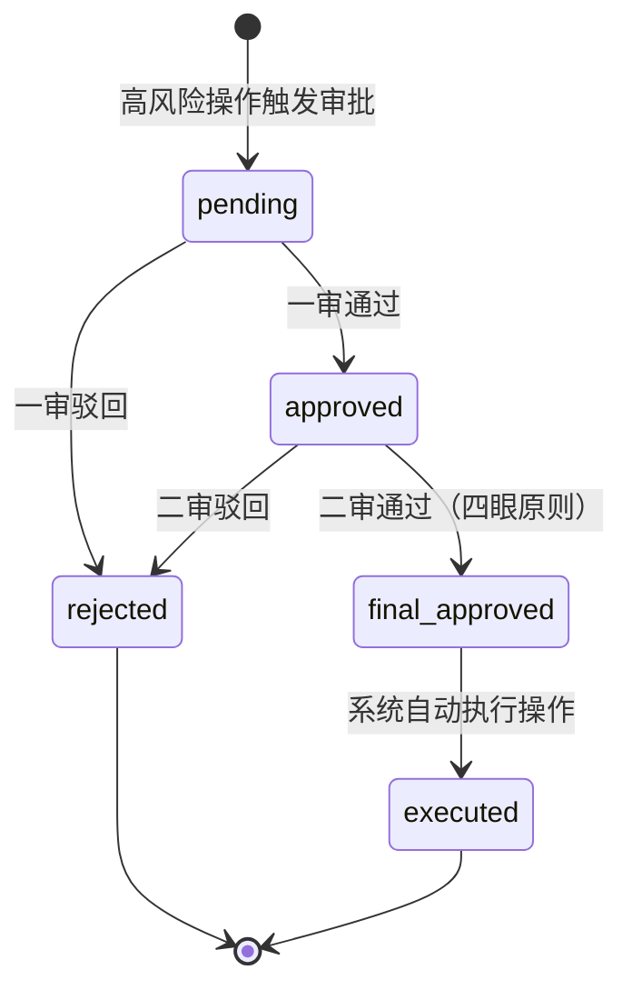

# auth-service 详细设计文档

**文档版本：** V2.0.0  
**更新日期：** 2026年05月22日  
**基准PRD：** `产品设计/MaaS-PRD-V2.0/01-产品定位与用户角色体系.md`  
**服务名称：** `auth-service`  
**前身：** `billing-auth-service`（V1.0，计费职责已独立为 billing-service）  
**语言/框架：** Go 1.22  
**变更说明：** V2.0 将原双角色体系升级为三层19角色 RBAC，新增 SSO（SAML2/OIDC）/ SCIM 2.0 集成、审批工作流引擎、API Key 细粒度权限范围、数据隔离模型。

---

## 1. 服务职责

| 职责域 | 具体能力 |
|--------|---------|
| **身份认证** | API Key HMAC 验证、SSO JWT（SAML2/OIDC）验证、本地账号密码认证 |
| **三层 RBAC** | 平台层（8角色）+ 租户层（6角色）+ 项目层（5角色）权限管理 |
| **SSO 集成** | SAML 2.0 SP、OIDC RP，支持 Okta / Azure AD / 企业微信 / 飞书等 IdP |
| **SCIM 2.0** | 用户 / 组自动同步（企业 IdP → MaaS 平台），支持自动停用离职员工 |
| **审批工作流** | 高风险操作（策略发布、模型上下线、预算修改）双人审批工作流 |
| **API Key 管理** | Key 创建 / 轮换 / 撤销，细粒度 scope 权限绑定 |
| **数据隔离** | 行级多租户隔离，确保跨租户数据不可见 |
| **会话管理** | SSO Session / 短期 JWT 颁发，支持强制登出 |

---

## 2. 三层角色体系

### 平台层（8 角色）

| 角色 | 英文标识 | 核心权限 |
|------|---------|---------|
| 超级管理员 | `platform:super_admin` | 所有操作 |
| 平台运营 | `platform:ops` | 供应商管理、模型目录管理、租户管理 |
| 合规官 | `platform:compliance_officer` | 合规策略配置、审计日志查阅 |
| 财务管理员 | `platform:finance_admin` | 计费配置、合同管理、账单查看 |
| 安全管理员 | `platform:security_admin` | 内容安全策略、KMS 配置 |
| 模型策展人 | `platform:model_curator` | 逻辑模型审批、模型生命周期管理 |
| 平台审计员 | `platform:auditor` | 只读审计日志、合规报告 |
| 客服支持 | `platform:support` | 只读租户工单、基础查询 |

### 租户层（6 角色）

| 角色 | 英文标识 | 核心权限 |
|------|---------|---------|
| 租户管理员 | `tenant:admin` | 租户内所有操作，含项目管理 |
| 技术负责人 | `tenant:tech_lead` | 路由策略、模型配置、API Key 管理 |
| 财务负责人 | `tenant:finance` | 账单查看、预算管理 |
| 审计员 | `tenant:auditor` | 只读 Trace、审计日志 |
| 安全合规 | `tenant:compliance` | 合规策略配置、数据分级设置 |
| 普通成员 | `tenant:member` | API Key 使用，只读统计 |

### 项目层（5 角色）

| 角色 | 英文标识 | 核心权限 |
|------|---------|---------|
| 项目负责人 | `project:owner` | 项目内所有操作，成员管理 |
| 开发工程师 | `project:developer` | API Key 使用、Prompt 管理、评测 |
| 只读成员 | `project:viewer` | 只读统计、Trace 查询 |
| 评测工程师 | `project:eval_engineer` | 评测数据集管理、评测任务执行 |
| 路由配置员 | `project:router` | 项目级路由策略配置 |

---

## 3. 服务架构图

```mermaid
graph TD
    subgraph AuthSvc["auth-service"]
        HttpServer[REST HTTP Server :8087]
        GrpcServer[gRPC Server :9010]

        subgraph AuthCore["认证核心"]
            APIKeyValidator[API Key 验证\nHMAC-SHA256]
            JWTIssuer[JWT 颁发 & 验证]
            LocalAuth[本地账号认证\nBcrypt 密码]
        end

        subgraph RBAC["权限管理"]
            RoleEngine[三层 RBAC 引擎\nCasbin]
            PermCheck[权限校验\nHas Permission?]
            RoleMgmt[角色分配管理]
        end

        subgraph SSO["SSO 集成"]
            SAMLProvider[SAML 2.0 SP\n元数据 / ACS]
            OIDCProvider[OIDC RP\nAuthorization Code Flow]
            SSOSessionMgr[SSO Session 管理]
        end

        subgraph SCIM["SCIM 2.0"]
            SCIMServer[SCIM Server\n/scim/v2/]
            UserSync[用户同步]
            GroupSync[组同步]
        end

        subgraph ApprovalWF["审批工作流"]
            WorkflowEngine[工作流引擎]
            TaskQueue[待审批任务队列]
            NotifyTrigger[审批结果通知]
        end

        subgraph KeyMgmt["API Key 管理"]
            KeyGen[Key 生成\nsk-maas-{random}]
            ScopeValidator[Scope 权限校验]
            KeyRotation[Key 轮换]
        end

        GrpcServer --> AuthCore & RBAC
        HttpServer --> SSO & SCIM & ApprovalWF & KeyMgmt & RoleMgmt
    end

    subgraph Deps["依赖"]
        DB[(PostgreSQL auth schema)]
        Redis[(Redis\nSession / JWT 黑名单)]
        Kafka[(Kafka maas.auth.events)]
    end

    AuthSvc --> DB & Redis
    NotifyTrigger -.-> Kafka
```

---

## 4. API Key 权限范围（Scope）设计

```
scope 格式：{resource}:{action}
支持的 scope：
  model:inference         — 调用模型推理接口（/v1/chat/completions 等）
  model:read              — 查询模型列表
  trace:read              — 查询自身请求的 Trace
  billing:read            — 查询账单与用量
  prompt:read             — 读取 Prompt 模板
  prompt:write            — 创建/修改 Prompt 模板（需项目 developer+ 角色）
  admin:*                 — 管理接口全权限（仅允许后端服务使用）

Key 默认 scope：[model:inference]（最小权限原则）
多 scope 格式：scope=model:inference trace:read billing:read
```

---

## 5. 审批工作流设计



触发审批的高风险操作：
- 路由策略从 approved → active（全量激活）
- 逻辑模型生命周期：active → deprecated / sunset
- 租户月度预算上调 > 50%
- 内容安全策略变更
- 合规数据驻留策略变更

---

## 6. gRPC 接口（供 gateway-service 调用）

```protobuf
service AuthService {
    // API Key 验证
    rpc ValidateApiKey(ValidateApiKeyRequest) returns (ApiKeyContext);
    // SSO JWT 验证
    rpc ValidateJWT(ValidateJWTRequest) returns (UserContext);
    // 权限校验
    rpc CheckPermission(CheckPermissionRequest) returns (PermissionResult);
}

message ApiKeyContext {
    string key_id       = 1;
    string tenant_id    = 2;
    string project_id   = 3;
    repeated string scopes = 4;
    bool   is_active    = 5;
    string expires_at   = 6;
}

message UserContext {
    string user_id      = 1;
    string tenant_id    = 2;
    repeated string roles = 3;
    string session_id   = 4;
}
```

---

## 7. REST API 设计

| 方法 | 路径 | 说明 |
|------|------|------|
| POST | `/api/v1/auth/login` | 本地账号登录 |
| POST | `/api/v1/auth/logout` | 登出（JWT 黑名单） |
| GET | `/api/v1/auth/saml/metadata` | SAML SP 元数据 |
| POST | `/api/v1/auth/saml/acs` | SAML ACS 端点 |
| GET | `/api/v1/auth/oidc/callback` | OIDC 回调 |
| GET | `/api/v1/users` | 用户列表 |
| POST | `/api/v1/users/{id}/roles` | 角色分配 |
| GET | `/api/v1/api-keys` | API Key 列表 |
| POST | `/api/v1/api-keys` | 创建 API Key |
| POST | `/api/v1/api-keys/{id}/rotate` | 轮换 Key |
| DELETE | `/api/v1/api-keys/{id}` | 撤销 Key |
| GET | `/api/v1/approvals` | 待审批任务列表 |
| POST | `/api/v1/approvals/{id}/approve` | 审批通过 |
| POST | `/api/v1/approvals/{id}/reject` | 审批驳回 |
| GET/POST | `/scim/v2/Users` | SCIM 用户同步 |
| GET/POST | `/scim/v2/Groups` | SCIM 组同步 |

---

## 8. 缓存设计

| Key 格式 | TTL | 说明 |
|---------|-----|------|
| `auth:apikey:{key_hash}` | 60s | API Key 验证缓存 |
| `auth:jwt:blacklist:{jti}` | JWT exp 时间 | 已撤销 JWT |
| `auth:sso:session:{session_id}` | 8h | SSO 会话 |
| `auth:rbac:{user_id}:{tenant_id}` | 300s | 用户权限缓存（Casbin 策略） |

---

## 9. 部署规格

```yaml
replicas: 2 (HPA min=2, max=6)
resources:
  requests: {cpu: 500m, memory: 512Mi}
  limits:   {cpu: 2000m, memory: 2Gi}
ports:
  - 8087: HTTP REST（SSO / SCIM / 管理面）
  - 9010: gRPC（供 gateway 验证调用）
  - 9097: Prometheus metrics
```
