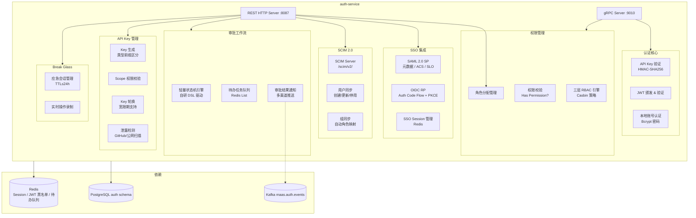
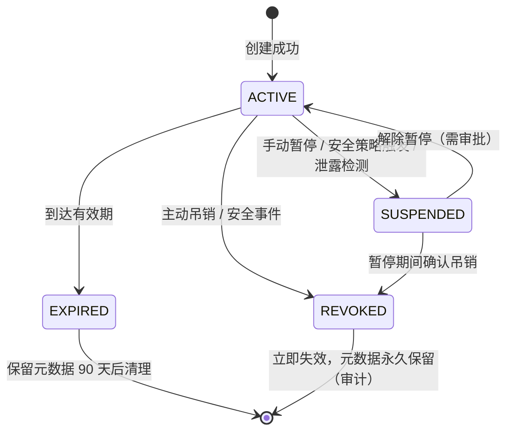
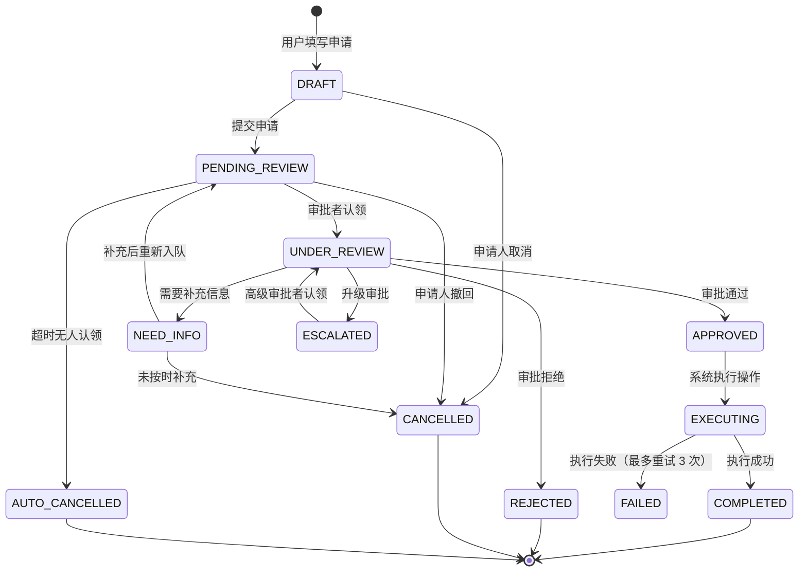

# auth-service 详细设计文档

**文档版本：** V2.1.0
**更新日期：** 2026年05月25日
**基准PRD：** `产品设计/MaaS-PRD-V2.0/01-产品定位与用户角色体系.md`
**服务名称：** `auth-service`
**前身：** `billing-auth-service`（V1.0，计费职责已独立为 billing-service）
**语言/框架：** Go 1.22
**变更说明：** V2.1 对齐 PRD V2.0 §01 完整规格：角色 ID 从 `platform:super_admin` 改为 `platform_owner` 等 PRD 标准命名、新增 Platform Owner 角色、扩展租户层从 6→6 角色（调整角色名称）、新增 API Key 五类型体系与生命周期状态机、新增 Key 泄露检测、新增 Break Glass 应急权限设计、补充审批通知多渠道配置、补充数据隔离 RLS 策略。

---

## 1. 服务职责

| 职责域 | 具体能力 |
|--------|---------|
| **身份认证** | API Key HMAC-SHA256 验证、SSO JWT（SAML2/OIDC）验证、本地账号 Bcrypt 密码认证 |
| **三层 RBAC** | 平台层（8角色）+ 租户层（6角色）+ 项目层（5角色），共 19 角色细粒度权限管理 |
| **SSO 集成** | SAML 2.0 SP、OIDC RP，支持 Okta / Azure AD / 企业微信 / 飞书等 IdP，含属性映射与组-角色自动映射 |
| **SCIM 2.0** | 用户/组自动同步（企业 IdP → MaaS 平台），离职自动停用账号，支持 SCIM 标准端点 |
| **审批工作流** | 高风险操作双人审批（四眼原则），Tier A/B/C 三级审批体系，Break Glass 应急权限 |
| **API Key 管理** | 五类 Key（prod/dev/cicd/playground/sub），生命周期状态机，Scope 细粒度权限，IP 白名单，泄露检测，自动轮换 |
| **数据隔离** | PostgreSQL RLS 行级安全 + 应用层 tenant_id 强制过滤，高级订阅支持物理隔离 |
| **会话管理** | SSO Session / 短期 JWT 颁发 / JWT 黑名单，支持强制登出与 MFA 策略 |

---

## 2. 三层角色体系

PRD V2.0 §2~§5 定义完整 19 角色体系，采用下划线命名法（非冒号分隔）：

### 2.1 平台层（8 角色）

| 中文名称 | 角色 ID | 核心权限 | 最大人数建议 |
|---------|---------|---------|------------|
| 平台超级管理员 | `platform_owner` | 所有操作，创建/删除 Platform Admin，全局开关，加密密钥策略 | ≤3 人 |
| 平台管理员 | `platform_admin` | 租户生命周期管理，平台级配置，角色任命 | ≤10 人 |
| 运营管理员 | `operations_admin` | 监控指标、SLA 追踪、熔断管理、系统健康 | — |
| 财务管理员 | `finance_admin` | 平台账单、供应商合约、成本告警、计费配置 | — |
| 安全管理员 | `security_admin` | MFA 策略、IP 白名单、内容过滤、Key 加密存储、TLS 策略 | — |
| 合规官 | `compliance_officer` | 合规策略、审计日志、数据流向报告、合规报告生成 | — |
| 模型管理员 | `model_curator` | 模型目录管理、能力标签、价格配置、租户授权白名单 | — |
| 支持管理员 | `support_admin` | 租户支持、工单处理、受限只读查看（需租户授权） | — |

**设计原则：**
- **最小权限**：每个角色只拥有完成其职责所需的最小权限集合
- **职责分离**：财务/技术/安全/审计权限分离，防止单点风险
- **范围封闭**：平台层作用域覆盖全平台，租户层仅限于所属租户，项目层仅限于所属项目
- **角色组合**：一个用户可持有多个角色，权限取并集；但平台层与租户层角色不可跨层叠加
- **时限权限**：所有权限支持有效期配置，Break Glass 最长 24h

### 2.2 租户层（6 角色）

| 中文名称 | 角色 ID | 核心权限 |
|---------|---------|---------|
| 租户超级管理员 | `tenant_owner` | 租户内最高权限，成员管理、SSO/SCIM 配置、项目创建/删除、预算上限 |
| 租户管理员 | `tenant_admin` | 租户日常管理，成员邀请/移除、API Key 策略、使用统计、路由策略 |
| 账单管理员 | `billing_admin` | 租户账单查看、项目预算设置、成本告警、账单导出、FinOps 分析 |
| 安全专员 | `security_officer` | 审计日志查看、Key 安全策略、内容过滤配置、异常 Key 吊销、MFA 策略 |
| 采购专员 | `procurement_officer` | 模型使用申请审批、预算申请审批、采购白名单管理、采购报告 |
| 项目创建者 | `project_creator` | 创建新项目（自动成为项目首个 Project Admin），申请初始配额 |

### 2.3 项目层（5 角色）

| 中文名称 | 角色 ID | 核心权限 |
|---------|---------|---------|
| 项目管理员 | `project_admin` | 项目内最高权限，成员管理、API Key 管理、路由策略配置、预算申请 |
| 项目开发者 | `project_developer` | API Key 创建/使用、Playground 调试、Prompt 模板管理、只看自己 Key 的统计 |
| 项目只读者 | `project_viewer` | 项目概览、使用统计（聚合）、模型列表、只读 Playground |
| 项目审计员 | `project_auditor` | 完整操作审计日志、Key 创建/吊销历史、成员权限变更历史、审计报告导出 |
| 项目模型策展人 | `project_model_curator` | 项目内模型策略配置、路由权重、Fallback 策略、模型参数默认值、模型性能对比 |

---

## 3. 权限矩阵（核心操作摘录）

PRD V2.0 §6 定义完整权限矩阵，以下摘录网关层关键操作：

**图例：** ✅ 允许 / ❌ 禁止 / 🔶 条件允许

### 3.1 平台操作（关键行）

| 操作 | platform_owner | platform_admin | security_admin | compliance_officer | model_curator |
|------|:---:|:---:|:---:|:---:|:---:|
| 创建 Platform Admin | ✅ | ❌ | ❌ | ❌ | ❌ |
| 创建新租户 | ✅ | ✅ | ❌ | ❌ | ❌ |
| 新增模型供应商 | ✅ | ✅ | 🔶(密钥部分) | ❌ | ✅ |
| 下线模型 | ✅ | ✅ | ❌ | ❌ | ✅ |
| 查看全平台审计日志 | ✅ | 🔶(除PO外) | ✅ | ✅ | ❌ |
| 删除审计日志 | ❌ | ❌ | ❌ | ❌ | ❌ |
| 配置平台 MFA 策略 | ✅ | ❌ | ✅ | ❌ | ❌ |
| 查看供应商 API Key | ✅ | ❌ | ✅ | ❌ | ❌ |

### 3.2 租户操作（关键行）

| 操作 | tenant_owner | tenant_admin | billing_admin | security_officer |
|------|:---:|:---:|:---:|:---:|
| 配置 SSO/SAML | ✅ | ❌ | ❌ | ❌ |
| 设置预算上限 | ✅ | 🔶(需BA) | ✅ | ❌ |
| 查看租户审计日志 | ✅ | ✅ | ❌ | ✅ |
| 吊销异常 API Key | ✅ | ✅ | ❌ | ✅ |

### 3.3 项目操作（关键行）

| 操作 | project_admin | project_developer | project_viewer | project_auditor |
|------|:---:|:---:|:---:|:---:|
| 创建 API Key | ✅ | ✅ | ❌ | ❌ |
| 配置路由策略 | ✅ | ❌ | ❌ | ❌ |
| 查看项目审计日志 | ✅ | ❌ | ❌ | ✅ |
| 查看请求内容正文 | 🔶(需权限) | ❌ | ❌ | ❌ |

---

## 4. 服务架构图



---

## 5. API Key 权限范围（Scope）设计

PRD V2.0 §9.1 定义完整 Scope 体系：

```
scope 格式：{resource}:{action}[:{qualifier}]
```

| Scope | 说明 | 适用场景 |
|-------|------|---------|
| `model:invoke` | 调用模型推理（默认最小权限） | 生产应用 Key |
| `model:invoke:stream` | 流式调用模型 | SSE 流式输出 |
| `model:invoke:batch` | 批量推理任务 | 离线批处理（需单独审批） |
| `model:list` | 查看可用模型列表 | 动态选模型的应用 |
| `model:info:read` | 读取模型详情（价格/能力） | 成本估算工具 |
| `prompt:read` | 读取 Prompt 模板 | 使用中心化 Prompt |
| `prompt:write` | 创建/修改 Prompt 模板 | Prompt 管理工具 |
| `usage:read:self` | 查看本 Key 使用量 | 应用内监控 |
| `usage:read:project` | 查看项目级使用量 | 成本 Dashboard |
| `key:create` | 创建子 Key | 多租户 SaaS 自行分发 Key |
| `key:revoke:self` | 吊销本 Key | 自动轮换脚本 |
| `audit:read:project` | 读取项目审计日志 | 合规工具集成 |
| `webhook:write` | 管理 Webhook 配置 | 自动化运维 |
| `admin:member:read` | 查看项目成员 | 企业内部管理系统 |

**组合限制规则：**
- `key:create` 不可与 `admin:*` 同时使用（防权限扩散）
- `model:invoke` 与 `audit:read:*` 互斥（操作与审计分离）
- `model:invoke:batch` 需单独审批开启

---

## 6. API Key 类型与生命周期

PRD V2.0 §9.2 定义五类 Key：

### 6.1 Key 类型

| 类型 | 前缀 | 用途 | 有效期 | 特殊限制 |
|------|------|------|--------|---------|
| Production Key | `mk-prod-` | 生产环境 API 调用 | 1~365 天（可配） | 必须绑定 IP 白名单（推荐） |
| Development Key | `mk-dev-` | 开发测试 | 默认 30 天 | 调用量限制（10K/day） |
| CI/CD Key | `mk-ci-` | 自动化流水线 | 默认 90 天 | 仅允许非生产模型 |
| Playground Key | `mk-pg-` | Console Playground | Session 级，2h | 速率限制严格，不可导出 |
| Sub Key | `mk-sub-` | 应用自行分发 | 继承父 Key 有效期 | 权限范围 ⊆ 父 Key |

### 6.2 Key 生命周期状态机



### 6.3 泄露检测

PRD V2.0 §9.3：
- 扫描 GitHub/GitLab 公开仓库匹配 Key 前缀模式
- 检测到泄露 → 自动 SUSPENDED + 发送告警
- 支持 Key 哈希比对 API（供第三方安全工具查询）

### 6.4 Key 轮换策略

- 自动轮换：支持按天/周/月自动生成新 Key
- 轮换宽限期：旧 Key 保持有效 N 分钟（可配，默认 60 分钟）
- 轮换通知：通过 Webhook 推送新 Key

---

## 7. 审批工作流设计

### 7.1 审批分级体系

PRD V2.0 §7.1 定义三级审批：

**Tier A（需双人确认，立即生效）：**
| 操作 | 申请方 | 审批方 | 超时 |
|------|--------|--------|------|
| 普通 API Key 吊销 | 持有者 | Project Admin | 24h 自动拒绝 |
| 项目成员移除 | Project Admin | Tenant Admin | 无超时 |
| 增加项目预算 ≤20% | Project Admin | Billing Admin | 48h 自动拒绝 |

**Tier B（生效前必须通过审批）：**
| 操作 | 申请方 | 审批方 | 超时 |
|------|--------|--------|------|
| 创建新项目 | Project Creator | Tenant Owner/Admin | 7 天 |
| 增加项目预算 >20% | Project Admin | Billing Admin + Tenant Owner 双签 | 7 天自动拒绝 |
| 申请使用新模型 | Project Admin | Procurement Officer | 7 天自动拒绝 |

**Tier C（四眼原则，高敏感操作）：**
| 操作 | 申请方 | 审批方 | 特殊要求 |
|------|--------|--------|---------|
| 删除租户 | Platform Admin | Platform Owner | 需 2 个 PO 确认 |
| Break Glass 应急权限 | 任意用户 | 上级管理者 | TTL≤24h，全程录制审计 |

### 7.2 审批流完整状态机

PRD V2.0 §7.2 定义：



### 7.3 审批通知渠道

PRD V2.0 §7.3 定义多渠道路由：

| 渠道 | 配置 | 默认状态 |
|------|------|---------|
| 邮件 | 使用成员注册邮箱 | 必须开启 |
| 企业微信 | Webhook URL（群机器人） | 默认关闭 |
| 钉钉 | Webhook URL + 签名 Secret | 默认关闭 |
| Slack | Webhook URL + Block Kit | 默认关闭 |
| 飞书 | Webhook URL + 卡片消息 | 默认关闭 |
| 自定义 Webhook | URL + Bearer Token 鉴权 | 默认关闭 |
| 短信 | 仅 Tier C 操作 | 默认关闭 |

### 7.4 Break Glass 应急权限

PRD V2.0 §7.4 定义：

```
流程：
  申请人 → 提交申请（原因+预计时长）
       → 审批人电话/短信通知（不能仅邮件）
       → 审批通过（电话确认码+平台确认）
       → 颁发临时令牌（TTL≤24h）
       → 全操作实时录制审计
       → 结束后 72h 内提交事后报告

数据库：
  break_glass_sessions: requestor_id / approver_id / reason / scope / started_at / expires_at / token_hash / status
  break_glass_audit: session_id / operation / resource_type / request_payload / response_status / occurred_at
```

---

## 8. 工作流引擎实现方案

自研轻量状态机，WorkflowDefinition DSL 驱动：

```json
{
  "workflow_id": "wf_strategy_activation",
  "name": "路由策略全量激活审批",
  "trigger_events": ["routing:policy:activate"],
  "timeout_hours": 48,
  "timeout_action": "auto_reject",
  "notify_on": ["approve", "reject", "timeout"],
  "states": [
    {"name": "pending",         "type": "initial"},
    {"name": "first_approval",  "type": "approval", "assignee_role": "tenant_admin"},
    {"name": "second_approval", "type": "approval", "assignee_role": "platform_admin"},
    {"name": "approved",        "type": "final_positive"},
    {"name": "rejected",        "type": "final_negative"}
  ],
  "transitions": [
    {"from": "pending",         "to": "first_approval",  "trigger": "auto"},
    {"from": "first_approval",  "to": "second_approval", "trigger": "approve"},
    {"from": "first_approval",  "to": "rejected",        "trigger": "reject"},
    {"from": "second_approval", "to": "approved",        "trigger": "approve"},
    {"from": "second_approval", "to": "rejected",        "trigger": "reject"}
  ]
}
```

**引擎组件：**
- `WorkflowRegistry`：启动时加载所有 WorkflowDefinition
- `StateMachineExecutor`：原子状态转移
- `TaskQueue`：Redis List 待办队列，按 assignee_role 分发
- `TimeoutChecker`：每分钟扫描超时实例

**触发审批的高风险操作：**
- 路由策略 approved → active（全量激活）
- 逻辑模型 active → deprecated / retired
- 租户月度预算上调 > 50%
- 内容安全策略变更
- 合规数据驻留策略变更
- 供应商准入审批

---

## 9. gRPC 接口（供 gateway-service 调用）

```protobuf
service AuthService {
    rpc ValidateApiKey(ValidateApiKeyRequest) returns (ApiKeyContext);
    rpc ValidateJWT(ValidateJWTRequest) returns (UserContext);
    rpc CheckPermission(CheckPermissionRequest) returns (PermissionResult);
}

message ApiKeyContext {
    string key_id       = 1;
    string key_type     = 2;   // production / development / cicd / playground / sub
    string tenant_id    = 3;
    string project_id   = 4;
    repeated string scopes = 5;
    bool   is_active    = 6;
    string expires_at   = 7;
    string ip_whitelist = 8;   // JSON array of CIDR
}

message UserContext {
    string user_id      = 1;
    string tenant_id    = 2;
    repeated string roles = 3;  // ["tenant_admin", "project_developer"]
    string session_id   = 4;
}

message PermissionResult {
    bool   allowed      = 1;
    string reason       = 2;   // 拒绝原因（如有）
}
```

---

## 10. REST API 设计

| 方法 | 路径 | 说明 |
|------|------|------|
| POST | `/api/v1/auth/login` | 本地账号登录 |
| POST | `/api/v1/auth/logout` | 登出（JWT 加入黑名单） |
| GET | `/api/v1/auth/saml/metadata` | SAML SP 元数据 XML |
| POST | `/api/v1/auth/saml/acs` | SAML ACS 端点 |
| GET | `/api/v1/auth/oidc/callback` | OIDC 回调 |
| GET | `/api/v1/users` | 用户列表 |
| POST | `/api/v1/users/{id}/roles` | 角色分配 |
| GET | `/api/v1/users/me/permissions` | 查询当前用户有效权限集合 |
| GET | `/api/v1/api-keys` | API Key 列表（按类型过滤） |
| POST | `/api/v1/api-keys` | 创建 API Key（指定类型/scope/IP白名单） |
| POST | `/api/v1/api-keys/{id}/rotate` | 轮换 Key（返回新 Key 明文） |
| POST | `/api/v1/api-keys/{id}/suspend` | 暂停 Key |
| POST | `/api/v1/api-keys/{id}/resume` | 恢复 Key |
| DELETE | `/api/v1/api-keys/{id}` | 撤销 Key |
| POST | `/api/v1/api-keys/{id}/sub-keys` | 创建子 Key（Sub Key） |
| GET | `/api/v1/approvals` | 待审批任务列表 |
| GET | `/api/v1/approvals/{id}` | 审批详情（含状态历史） |
| POST | `/api/v1/approvals/{id}/claim` | 认领审批任务 |
| POST | `/api/v1/approvals/{id}/approve` | 审批通过 |
| POST | `/api/v1/approvals/{id}/reject` | 审批驳回（需填写原因） |
| POST | `/api/v1/approvals/{id}/request-info` | 请求申请方补充信息 |
| POST | `/api/v1/break-glass` | 发起 Break Glass 申请 |
| POST | `/api/v1/break-glass/{id}/end` | 主动结束 Break Glass 会话 |
| GET/POST | `/scim/v2/Users` | SCIM 用户同步 |
| GET/POST | `/scim/v2/Groups` | SCIM 组同步 |
| PATCH | `/scim/v2/Groups/{id}` | SCIM 更新组成员 |

---

## 11. 数据隔离模型

PRD V2.0 §10 定义：

```
隔离层次：
  逻辑隔离 → PostgreSQL RLS（默认，所有租户共享数据库实例）
  物理隔离 → 独立 Schema 或独立实例（高级订阅/合规要求）

RLS 策略示例：
  ALTER TABLE projects ENABLE ROW LEVEL SECURITY;
  CREATE POLICY tenant_isolation ON projects
      USING (tenant_id = current_setting('app.current_tenant_id')::BIGINT);

网关层隔离：
  HTTP Request → API Key 提取 → 查询 Key 所属 tenant_id
  → 注入 X-Tenant-ID Header → 下游服务通过 Header 过滤数据

跨租户防护：
  - 所有 DB 查询必须包含 tenant_id 条件（代码规范 + CI 检查）
  - 敏感操作双重校验（应用层 + DB RLS）
  - 定期"越权查询"安全扫描
```

---

## 12. 缓存设计

| Key 格式 | TTL | 说明 |
|---------|-----|------|
| `auth:apikey:{key_hash}` | 60s | API Key 元数据缓存 |
| `auth:jwt:blacklist:{jti}` | JWT exp 时间 | 已撤销 JWT 黑名单 |
| `auth:sso:session:{session_id}` | 8h | SSO 会话状态 |
| `auth:rbac:{user_id}:{tenant_id}` | 300s | 用户权限缓存（Casbin 策略） |
| `auth:ratelimit:{key_id}:{window}` | 窗口时长 | Key 级速率限制计数器 |

---

## 13. 部署规格

```yaml
replicas: 2 (HPA min=2, max=8)
resources:
  requests: {cpu: 500m, memory: 1Gi}
  limits:   {cpu: 2000m, memory: 4Gi}
ports:
  - 8087: HTTP REST（SSO / SCIM / 管理面）
  - 9010: gRPC（供 gateway 验证调用）
  - 9097: Prometheus metrics
database:
  - PostgreSQL auth schema（独立实例推荐）
  - 关键索引：api_keys(key_hash) UNIQUE, api_keys(tenant_id, status), users(email) UNIQUE
```
