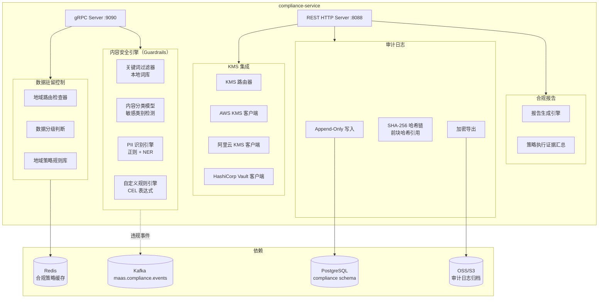

# compliance-service 详细设计文档

**文档版本：** V2.0.0  
**更新日期：** 2026年05月22日  
**基准PRD：** `产品设计/MaaS-PRD-V2.0/07-合规安全与审计规格.md`  
**服务名称：** `compliance-service`  
**前身：** 无（V2.0 新增）  
**语言/框架：** Go 1.22

---

## 1. 服务职责

| 职责域 | 具体能力 |
|--------|---------|
| **数据分级与地域控制** | L0~L4 五级数据分级，地域路由约束（禁止数据出境检查） |
| **内容安全策略（Guardrails）** | 多层内容安全检测：关键词过滤、分类模型、自定义规则 |
| **零数据保留模式** | 租户级零数据保留配置，通知全链路服务不持久化内容 |
| **客户自带 KMS** | 集成 AWS KMS / 阿里云 KMS / HashiCorp Vault，客户密钥管理 |
| **审计日志** | Append-Only 审计日志，SHA-256 哈希链防篡改 |
| **合规报告** | 等保2.0 / GDPR / 安全问卷自动生成合规报告 |
| **数据分类发现** | 自动识别请求中的 PII / 金融数据 / 医疗数据 |

---

## 2. 数据分级体系（L0~L4）

| 级别 | 名称 | 含义 | 路由约束 |
|------|------|------|---------|
| L0 | 公开 | 无敏感信息，可自由流动 | 无限制 |
| L1 | 内部 | 企业内部信息，不面向公众 | 不可路由至不受信外部供应商 |
| L2 | 敏感 | 含 PII、商业机密 | 只可路由至合规认证供应商 |
| L3 | 机密 | 金融/医疗关键数据 | 只可路由至特定供应商，须加密传输 |
| L4 | 绝密 | 国家秘密/监管关键 | 仅私有化部署，完全不出境 |

---

## 3. 服务架构图



---

## 4. 数据驻留检查逻辑

```
输入：tenant_id, model_id（逻辑模型）, client_region

1. 查询租户合规策略：data_residency_required（CN / EU / null）
2. 查询逻辑模型对应的可用 vendor_backend 列表及其 region
3. 判断规则：
   - 若 data_residency_required == "CN"：
       过滤出 region 包含 "cn-" 的 backend
       若无满足条件的 backend → DENY
       若有 → 返回 REDIRECT（带 required_region="CN"）
   - 若 data_residency_required == "EU"：
       同理，仅允许 eu- 系列 region
   - 若 null：不限制 → ALLOW
4. 结果：ALLOW / DENY / REDIRECT(required_region)
```

---

## 5. 内容安全策略（Guardrails）执行流程

```
请求进入后（在网关轻量预检通过后，routing-service 发起调用前异步执行）：

1. PII 检测：扫描 prompt 中的手机号、身份证、银行卡、邮箱等
2. 关键词过滤：匹配内置 + 租户自定义违禁词库
3. 内容分类模型：检测违法违规类别（暴力、色情、政治敏感等）
4. 自定义规则：租户配置的 CEL 表达式规则（如：contains(text, "竞争对手名称")）

执行结果：
  PASS          — 内容安全，放行
  WARN          — 低置信度可疑，记录但放行
  BLOCK         — 确认违规，拒绝请求，返回 400 content_policy_violation
  MASK          — 允许请求但脱敏 PII 后再发送给供应商（仅支持部分模式）

内容安全策略（guardrail_policy）字段：
  - policy_id, tenant_id, name
  - keyword_lists[]: 违禁词列表（内置 + 自定义）
  - pii_detection_enabled: 是否启用 PII 检测
  - pii_action: BLOCK / MASK / WARN
  - category_detection_enabled: 是否启用分类模型
  - blocked_categories[]: 阻断的类别列表
  - custom_rules[]: CEL 表达式规则
  - status: active / paused
```

---

## 6. 审计日志设计（SHA-256 哈希链）

```sql
CREATE TABLE audit_log (
    id              BIGSERIAL PRIMARY KEY,
    log_id          UUID NOT NULL DEFAULT gen_random_uuid(),
    event_type      VARCHAR(100) NOT NULL,  -- 事件类型
    actor_id        VARCHAR(64) NOT NULL,   -- 操作人
    actor_type      VARCHAR(20) NOT NULL,   -- USER / SERVICE / SYSTEM
    tenant_id       VARCHAR(64),
    resource_type   VARCHAR(50),
    resource_id     VARCHAR(64),
    action          VARCHAR(50),
    result          VARCHAR(20),            -- SUCCESS / FAILURE / DENIED
    request_meta    JSONB,                  -- 操作上下文（IP、UA等）
    change_before   JSONB,                  -- 变更前状态快照
    change_after    JSONB,                  -- 变更后状态快照
    prev_log_hash   CHAR(64),               -- 前一条记录的 SHA-256 哈希（哈希链）
    current_hash    CHAR(64),               -- 本条记录内容的 SHA-256 哈希
    created_at      TIMESTAMPTZ NOT NULL DEFAULT NOW()
);

-- 禁止 UPDATE / DELETE（触发器强制）
-- 哈希链验证：verify_chain() 存储过程，逐条验证 prev_log_hash 链完整性
```

---

## 7. KMS 集成接口

```protobuf
service KMSService {
    rpc Encrypt(EncryptRequest) returns (EncryptResponse);
    rpc Decrypt(DecryptRequest) returns (DecryptResponse);
    rpc RotateKey(RotateKeyRequest) returns (RotateKeyResponse);
}

// 租户 KMS 配置
message TenantKMSConfig {
    string tenant_id    = 1;
    string kms_type     = 2;    // AWS_KMS / ALIYUN_KMS / VAULT
    string key_id       = 3;    // 客户 KMS Key ARN / ID
    string region       = 4;
    bool   enabled      = 5;
}
```

---

## 8. REST API 设计

| 方法 | 路径 | 说明 |
|------|------|------|
| GET | `/api/v1/compliance/policies` | 合规策略列表 |
| POST | `/api/v1/compliance/policies` | 创建合规策略（进入审批流） |
| GET | `/api/v1/compliance/guardrails` | 内容安全策略列表 |
| POST | `/api/v1/compliance/guardrails` | 创建内容安全策略 |
| GET | `/api/v1/audit/logs` | 审计日志查询（分页、时间范围） |
| POST | `/api/v1/audit/export` | 触发审计日志导出（加密 ZIP） |
| GET | `/api/v1/audit/verify-chain` | 验证审计哈希链完整性 |
| GET | `/api/v1/compliance/reports/{type}` | 获取合规报告（gbsec/gdpr/questionnaire） |
| POST | `/api/v1/kms/config` | 配置客户 KMS |
| POST | `/api/v1/kms/test` | 测试 KMS 连通性 |

---

## 9. gRPC 接口（供 gateway-service 调用）

```protobuf
service ComplianceService {
    // 数据驻留检查（前置）
    rpc CheckDataResidency(ResidencyRequest) returns (ResidencyResponse);
    // 内容安全检查（异步，在请求路由前并行执行）
    rpc CheckContentSafety(ContentCheckRequest) returns (ContentCheckResponse);
}
```

---

## 10. 部署规格

```yaml
replicas: 2 (HPA min=2, max=6)
resources:
  requests: {cpu: 1000m, memory: 1Gi}
  limits:   {cpu: 4000m, memory: 4Gi}
ports:
  - 8088: HTTP REST
  - 9090: gRPC（供 gateway 调用）
  - 9098: Prometheus metrics
sidecar:
  - content-classifier: Python 3.11，内容分类模型推理服务（CPU-only）
```
