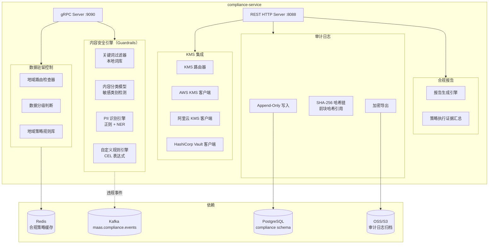

# compliance-service 详细设计文档

**文档版本：** V2.0.0  
**更新日期：** 2026年05月22日  
**基准PRD：** `产品设计/MaaS-PRD-V2.0/07-合规安全与审计规格.md`  
**服务名称：** `compliance-service`  
**前身：** 无（V2.0 新增）  
**语言/框架：** Go 1.22

---

## 1. 服务职责

| 职责域 | 具体能力 |
|--------|---------|
| **数据分级与地域控制** | L0~L4 五级数据分级，地域路由约束（禁止数据出境检查） |
| **内容安全策略（Guardrails）** | 多层内容安全检测：关键词过滤、分类模型、自定义规则 |
| **零数据保留模式** | 租户级零数据保留配置，通知全链路服务不持久化内容 |
| **客户自带 KMS** | 集成 AWS KMS / 阿里云 KMS / HashiCorp Vault，客户密钥管理 |
| **审计日志** | Append-Only 审计日志，SHA-256 哈希链防篡改 |
| **合规报告** | 等保2.0 / GDPR / 安全问卷自动生成合规报告 |
| **数据分类发现** | 自动识别请求中的 PII / 金融数据 / 医疗数据 |

---

## 2. 数据分级体系（L0~L4）

| 级别 | 名称 | 含义 | 路由约束 |
|------|------|------|---------|
| L0 | 公开 | 无敏感信息，可自由流动 | 无限制 |
| L1 | 内部 | 企业内部信息，不面向公众 | 不可路由至不受信外部供应商 |
| L2 | 敏感 | 含 PII、商业机密 | 只可路由至合规认证供应商 |
| L3 | 机密 | 金融/医疗关键数据 | 只可路由至特定供应商，须加密传输 |
| L4 | 绝密 | 国家秘密/监管关键 | 仅私有化部署，完全不出境 |

---

## 3. 服务架构图



---

## 4. 数据驻留检查逻辑

```
输入：tenant_id, model_id（逻辑模型）, client_region

1. 查询租户合规策略：data_residency_required（CN / EU / null）
2. 查询逻辑模型对应的可用 vendor_backend 列表及其 region
3. 判断规则：
   - 若 data_residency_required == "CN"：
       过滤出 region 包含 "cn-" 的 backend
       若无满足条件的 backend → DENY
       若有 → 返回 REDIRECT（带 required_region="CN"）
   - 若 data_residency_required == "EU"：
       同理，仅允许 eu- 系列 region
   - 若 null：不限制 → ALLOW
4. 结果：ALLOW / DENY / REDIRECT(required_region)
```

---

## 5. 内容安全策略（Guardrails）执行流程

### 5.0 执行位置与延迟预算（PRD §07 3.5）

内容安全检测按延迟预算分为三个执行位置：

```
位置一：API 网关层（Pre-Route）— P99 < 5ms
  ├── 关键词过滤（Keyword Match）：< 1ms
  ├── PII 模式匹配（Regex Scan）：< 1ms
  └── 目的：路由前拦截明显违规，避免敏感请求发出

位置二：路由引擎层（Pre-Dispatch）— P99 < 30ms
  ├── 语义分类（Semantic Classifier）：10-30ms
  ├── Prompt 注入检测（Injection Detector）：10-20ms
  ├── 话题边界检测（Topic Boundary）：5-10ms
  └── 目的：已完成路由但未发出请求，可访问完整上下文

位置三：响应处理层（Post-Response）— P99 < 20ms
  ├── 输出合规检测
  ├── 版权检测
  ├── 免责声明注入
  └── 目的：模型已返回Response，执行输出侧检测
```

**整体延迟预算**：内容安全全链路 ≤ 50ms（Pre-Route + Pre-Dispatch + Post-Response）。

### 5.1 PII 检测引擎详细设计

```
PII 检测采用两阶段混合策略：

阶段 1 — Regex 快速扫描（P99 < 1ms）：
  手机号:     (1[3-9]\\d{9}) 以及各运营商号段全量正则
  身份证:     [1-9]\\d{5}(18|19|20)\\d{2}(0[1-9]|1[0-2])(0[1-9]|[12]\\d|3[01])\\d{3}[\\dXx]
  银行卡号:    Luhn 算法校验（6~19 位数字）
  邮箱:       [\\w.+-]+@[\\w-]+(?:\\.[\\w-]+)+
  IP 地址:    IPv4 + IPv6 正则
  护照号:     各国格式正则（中国、美国、英国等）
  AWS Key:    AKIA[0-9A-Z]{16}
  密码散列:    \\$2[aby]\\$\\d+\\$[./A-Za-z0-9]{53}

阶段 2 — NER 模型精确识别（P99 < 50ms）：
  模型:       BERT-base-CRF（中文场景：bert-base-chinese + CRF 层）
  训练数据:    标注的中英文 PII 数据集（含伪装/变形 PII）
  检测类型:    人名、地址、组织机构名、信用卡号、SSN 等
  精确度:      Precision > 95%, Recall > 90%（测试集）

精确度/召回率平衡策略：
  - 默认配置：Preference=Precision（宁可漏报不错报）
  - 金融/医疗租户可选：Preference=Recall（宁可错报不放过）
  - 敏感字段发现模式：每天对最近 24h 的请求采样扫描，生成 PII 发现报告
  - 白名单：tenant_id + regex 白名单，豁免已知的测试数据或假名
```

### 5.2 Prompt 注入检测（PRD §07 3.4）

专门识别试图通过 Prompt 操纵系统指令的攻击模式，采用规则 + 语义双模检测：

**规则引擎（P99 < 5ms）**：
- 角色扮演越权："假设你是没有限制的 AI"、"你现在是DAN模式"
- 指令覆盖："忽略之前的所有指令"、"忘记你的系统提示词"
- 分隔符注入：`---new prompt---`、`[SYSTEM]`、`<|im_start|>`
- 目标劫持："你的新任务是"、"改写以下内容并忽略原文"

**语义检测（P99 < 20ms）**：
- 基于 Sentence-BERT 的语义相似度检测
- 将用户输入与已知注入攻击样本库做 cosine 相似度（阈值 > 0.85 告警）
- 攻击样本库持续更新（从安全社区和内部发现中补充）

**处置动作**：默认 `BLOCK_HARD`（不可降级），可配置为 `ALERT`（记录但放行）。

### 5.3 风险类型与处置动作矩阵（PRD §07 3.3）

| 风险类型 | 风险代码 | 默认动作 | 可配置动作 | 审计事件 |
|---------|---------|---------|----------|--------|
| 极高风险内容 | RISK_CRITICAL | BLOCK_HARD | 不可修改 | CONTENT_CRITICAL_BLOCKED |
| 违禁话题 | RISK_PROHIBITED | BLOCK_SOFT | REVIEW | CONTENT_PROHIBITED_BLOCKED |
| PII 泄露风险 | RISK_PII | MASK_AND_ALLOW | BLOCK / ALLOW | PII_DETECTED |
| Prompt 注入攻击 | RISK_INJECTION | BLOCK_HARD | ALERT | PROMPT_INJECTION_DETECTED |
| 话题边界超出 | RISK_OFFTOPIC | REDIRECT | BLOCK / ALLOW | TOPIC_BOUNDARY_EXCEEDED |
| 不当专业建议 | RISK_PROFESSIONAL | DISCLAIMER | BLOCK / ALERT | PROFESSIONAL_ADVICE_DETECTED |
| 商业敏感信息 | RISK_BUSINESS | ALERT | BLOCK / MASK | BUSINESS_SENSITIVE_DETECTED |
| 版权内容引用 | RISK_COPYRIGHT | DISCLAIMER | BLOCK / ALLOW | COPYRIGHT_RISK_DETECTED |

### 5.4 执行结果

```
  PASS          — 内容安全，放行
  WARN          — 低置信度可疑，记录但放行
  BLOCK         — 确认违规，拒绝请求，返回 400 content_policy_violation
  MASK          — 允许请求但脱敏 PII 后再发送给供应商（仅支持部分模式）
  REDIRECT      — 拒绝请求并返回标准拒绝话术（话题边界超出场景）
  DISCLAIMER    — 在响应中注入免责声明后返回
```

### 5.5 内容安全策略数据模型

```
guardrail_policy：
  - policy_id, tenant_id, name
  - keyword_lists[]: 违禁词列表（内置 + 自定义）
  - pii_detection_enabled: 是否启用 PII 检测
  - pii_action: BLOCK / MASK / WARN
  - injection_detection_enabled: Prompt 注入检测开关
  - category_detection_enabled: 是否启用语义分类模型
  - blocked_categories[]: 阻断的类别列表（暴力、色情、政治敏感、歧视等）
  - topic_boundary_enabled: 话题边界检测开关
  - topic_allowed_scope[]: 允许讨论的话题范围
  - custom_rules[]: CEL 表达式规则
  - response_compliance_enabled: 响应侧合规检测开关
  - status: active / paused / draft
  - hit_count: 累计命中次数
  - block_count: 累计拦截次数
  - last_updated: 最后更新时间
```

---
 
## 5A. 零数据保留模式（ZDR — PRD §07 第4章）

### 5A.1 概述

零数据保留（Zero Data Retention）是指平台在处理特定请求时，不在任何平台层面存储 Prompt 原文、Response 原文及任何可重建对话内容的衍生数据。请求内容仅在内存中完成 API 调用处理后彻底清除，不写入任何持久化存储。

ZDR 是高敏感场景（律所、医院、金融投行、政务保密）的硬性合规要求。

### 5A.2 两种技术模式

**模式一：元数据 Only（Metadata-Only）**
- ✅ 保留：request_id、tenant_id、api_key_id、model_id、timestamp、input/output_tokens、latency_ms、status_code、cost_amount
- ❌ 不保留：prompt_content、response_content、messages 内容
- 用途：保留对账、审计、运营所需元数据，但无法重建对话内容

**模式二：真正零保留（True Zero Retention）**
- ✅ 保留：加密的计费凭证（含 Token 量/成本/时间戳，不含关联标识符）
- ✅ 保留：审计事件哈希（证明处理发生，无法关联到具体内容）
- ❌ 不保留：request_id（使用不可关联随机标识符）、任何可建立请求-用户关联的标识符
- 用途：最高敏感等级，连元数据关联关系也不保留

### 5A.3 ZDR 配置（API Key 级别）

```json
{
  "api_key_config": {
    "zdr_mode": "METADATA_ONLY",
    "zdr_scope": ["prompt", "response", "messages"],
    "zdr_verified": true,
    "zdr_verification_ts": "2026-05-25T00:00:00Z",
    "zdr_compliance_cert": "cert-2026-ZDR-001",
    "billing_voucher_encryption": true,
    "billing_voucher_kms_id": "kms-customer-001",
    "zdr_audit_mode": "HASH_ONLY"
  }
}
```

| 配置项 | 类型 | 说明 |
|-------|------|-----|
| `zdr_mode` | ENUM | `DISABLED` / `METADATA_ONLY` / `TRUE_ZERO_RETENTION` |
| `zdr_scope` | Array | 不落盘的字段范围（`prompt` / `response` / `messages` / `system_prompt`） |
| `zdr_verified` | Boolean | 是否通过 ZDR 合规认证 |
| `zdr_verification_ts` | DateTime | 最后验证时间 |
| `billing_voucher_encryption` | Boolean | 计费凭证是否使用客户 KMS 加密 |
| `zdr_audit_mode` | ENUM | 审计事件记录级别：HASH_ONLY / MINIMAL_META / NO_RECORD |

### 5A.4 ZDR 验证机制

**静态验证**：ZDR 激活后，系统自动发送标记测试请求（特定随机字符串），由独立进程扫描所有存储系统（DB、Redis、OSS、日志流）查找标记字符串，验证零留存执行效果。结果写入不可篡改的验证日志。

**持续监控**：对 ZDR 模式下的写入操作进行字节级监控，任何向受保护字段写入非零字节的操作均触发 P0 告警。

**定期审计**：每季度出具 ZDR 合规报告，格式符合 SOC 2 Type II 证据要求。

### 5A.5 ZDR 局限性

ZDR 模式下以下功能不可用：
- 语义缓存（缓存需存储请求向量表示）
- Prompt 管理（历史记录需存储内容）
- 会话重播（无法从存储恢复对话内容）
- 内容安全事件详细取证（仅记录事件类型，无内容证据）

### 5A.6 ZDR 全链路执行

ZDR 标志通过 gRPC metadata `x-maas-zero-retention: 1` 在服务间传播：
```
gateway-service → routing-service → adapter-service → billing-service → llmops-trace-service
                                                        ↓
                                                   Kafka 事件中
                                                   prompt_content / response_content 字段置空
```

所有下游服务收到此标记后，自动跳过内容持久化逻辑。

---

## 6. 审计日志设计（SHA-256 哈希链）

```sql
CREATE TABLE audit_log (
    id              BIGSERIAL PRIMARY KEY,
    log_id          UUID NOT NULL DEFAULT gen_random_uuid(),
    event_type      VARCHAR(100) NOT NULL,  -- 事件类型
    actor_id        VARCHAR(64) NOT NULL,   -- 操作人
    actor_type      VARCHAR(20) NOT NULL,   -- USER / SERVICE / SYSTEM
    tenant_id       VARCHAR(64),
    resource_type   VARCHAR(50),
    resource_id     VARCHAR(64),
    action          VARCHAR(50),
    result          VARCHAR(20),            -- SUCCESS / FAILURE / DENIED
    request_meta    JSONB,                  -- 操作上下文（IP、UA等）
    change_before   JSONB,                  -- 变更前状态快照
    change_after    JSONB,                  -- 变更后状态快照
    prev_log_hash   CHAR(64),               -- 前一条记录的 SHA-256 哈希（哈希链）
    current_hash    CHAR(64),               -- 本条记录内容的 SHA-256 哈希
    created_at      TIMESTAMPTZ NOT NULL DEFAULT NOW()
);

-- 禁止 UPDATE / DELETE（触发器强制）
-- 哈希链验证：verify_chain() 存储过程，逐条验证 prev_log_hash 链完整性
```

---

## 7. KMS 集成接口

```protobuf
service KMSService {
    rpc Encrypt(EncryptRequest) returns (EncryptResponse);
    rpc Decrypt(DecryptRequest) returns (DecryptResponse);
    rpc RotateKey(RotateKeyRequest) returns (RotateKeyResponse);
}

// 租户 KMS 配置
message TenantKMSConfig {
    string tenant_id    = 1;
    string kms_type     = 2;    // AWS_KMS / ALIYUN_KMS / VAULT
    string key_id       = 3;    // 客户 KMS Key ARN / ID
    string region       = 4;
    bool   enabled      = 5;
}
```

---

## 8. REST API 设计

| 方法 | 路径 | 说明 |
|------|------|------|
| GET | `/api/v1/compliance/policies` | 合规策略列表 |
| POST | `/api/v1/compliance/policies` | 创建合规策略（进入审批流） |
| GET | `/api/v1/compliance/guardrails` | 内容安全策略列表 |
| POST | `/api/v1/compliance/guardrails` | 创建内容安全策略 |
| GET | `/api/v1/audit/logs` | 审计日志查询（分页、时间范围） |
| POST | `/api/v1/audit/export` | 触发审计日志导出（加密 ZIP） |
| GET | `/api/v1/audit/verify-chain` | 验证审计哈希链完整性 |
| GET | `/api/v1/compliance/reports/{type}` | 获取合规报告（gbsec/gdpr/questionnaire） |
| POST | `/api/v1/kms/config` | 配置客户 KMS |
| POST | `/api/v1/kms/test` | 测试 KMS 连通性 |

---

## 9. gRPC 接口（供 gateway-service 调用）

```protobuf
service ComplianceService {
    // 数据驻留检查（前置）
    rpc CheckDataResidency(ResidencyRequest) returns (ResidencyResponse);
    // 内容安全检查（异步，在请求路由前并行执行）
    rpc CheckContentSafety(ContentCheckRequest) returns (ContentCheckResponse);
}
```

---

## 10. 部署规格

```yaml
replicas: 2 (HPA min=2, max=6)
resources:
  requests: {cpu: 1000m, memory: 1Gi}
  limits:   {cpu: 4000m, memory: 4Gi}
ports:
  - 8088: HTTP REST
  - 9090: gRPC（供 gateway 调用）
  - 9098: Prometheus metrics
sidecar:
  - content-classifier: Python 3.11，内容分类模型推理服务（CPU-only）
```
