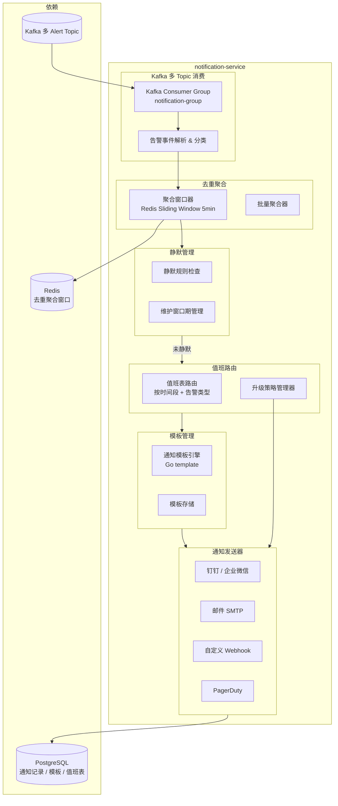

# notification-service 详细设计文档

**文档版本：** V2.0.0  
**更新日期：** 2026年05月22日  
**基准PRD：** `产品设计/MaaS-PRD-V2.0/`  
**服务名称：** `notification-service`  
**前身：** `monitor-notification-service` 告警通知部分（V1.0，LLMOps 观测职责已独立为 llmops-trace-service）  
**语言/框架：** Go 1.22

---

## 1. 服务职责

| 职责域 | 具体能力 |
|--------|---------|
| **告警通知发送** | 消费 Kafka 告警事件，通过多渠道发送通知（钉钉 / 企业微信 / 邮件 / Webhook / PagerDuty） |
| **通知模板管理** | 按告警类型维护通知模板，支持 Markdown / 纯文本格式 |
| **值班路由** | 按告警级别 + 时间段路由到对应值班人员 / 团队 |
| **去重聚合** | 相同类型告警在聚合窗口（5min）内合并为一条，避免告警轰炸 |
| **升级策略** | P0 告警超时未确认则自动升级（escalation policy） |
| **通知记录** | 持久化所有通知发送记录，支持审计查询 |
| **静默规则** | 支持维护窗口期间静默特定类型告警 |

---

## 2. 告警事件来源

| Kafka Topic | 产生方 | 告警类型 |
|-------------|-------|---------|
| `maas.billing.alerts` | billing-service | 预算阈值告警（50/80/100%）、成本异常 |
| `maas.anomaly.alerts` | llmops-trace-service | 请求异常、高延迟、Fallback 尖峰 |
| `maas.compliance.events` | compliance-service | 内容安全违规、合规策略执行失败 |
| `maas.model.events` | model-catalog-service | 供应商后端健康状态恶化、模型下线 |
| `maas.routing.decisions` | routing-service | 策略自动回滚、灰度异常 |
| `maas.auth.events` | auth-service | 异常登录、Key 泄露嫌疑 |

---

## 3. 服务架构图



---

## 4. 告警级别定义

| 级别 | 名称 | 响应时间要求 | 默认升级策略 |
|------|------|------------|------------|
| P0 | 紧急 | 5 分钟内响应 | 15min 未确认 → 升级到 TL |
| P1 | 严重 | 30 分钟内响应 | 1h 未确认 → 升级 |
| P2 | 警告 | 4 小时内处理 | 工作时间内响应 |
| P3 | 提示 | 下一工作日处理 | 邮件汇总，不打扰 |

---

## 5. 告警去重聚合逻辑

```
去重 Key = alert_type + tenant_id + resource_id
聚合窗口 = 5 分钟

算法：
  1. 收到告警事件，计算去重 Key
  2. Redis GET dedup:{key}
     - 若未命中：写入 SET dedup:{key} EX 300，立即发送通知
     - 若命中：将本条告警追加到聚合列表（LPUSH），不立即发送
  3. 定时任务（每 5 分钟）扫描有积压的告警：
     - 读取聚合列表，生成汇总通知（"过去 5 分钟内 N 条同类告警"）
     - 发送聚合通知，清空列表
```

---

## 6. 通知模板示例（钉钉 Markdown）

```markdown
## ⚠️ {{.AlertLevel}} 告警：{{.AlertTitle}}

**告警时间：** {{.Timestamp}}  
**租户：** {{.TenantName}}  
**告警详情：** {{.AlertDetail}}  
**影响范围：** {{.AffectedResources}}  
**建议操作：** {{.RecommendedAction}}  

[查看详情]({{.DashboardLink}})
```

---

## 7. REST API 设计

| 方法 | 路径 | 说明 |
|------|------|------|
| GET/POST | `/api/v1/notification/channels` | 通知渠道列表 / 添加渠道 |
| POST | `/api/v1/notification/channels/{id}/test` | 测试通知渠道连通性 |
| GET/POST | `/api/v1/notification/templates` | 通知模板列表 / 创建 |
| GET/POST | `/api/v1/oncall/schedules` | 值班表列表 / 创建 |
| GET/POST | `/api/v1/notification/silences` | 静默规则列表 / 创建 |
| GET | `/api/v1/notification/history` | 通知发送记录（分页） |
| POST | `/api/v1/notification/test` | 手动发送测试通知 |

---

## 8. 部署规格

```yaml
replicas: 2 (固定，告警发送不需要高并发扩展)
resources:
  requests: {cpu: 200m, memory: 256Mi}
  limits:   {cpu: 500m, memory: 512Mi}
ports:
  - 8089: HTTP REST（管理面）
  - 9099: Prometheus metrics
```

---

## 9. 微服务全景拓扑总览

| # | 服务名 | 端口（HTTP/gRPC） | 主要职责 | 前身 |
|---|-------|-----------------|---------|------|
| 01 | gateway-service | 8080 / — | 外部入口、认证、限流、合规前置 | V1 同名（增强） |
| 02 | routing-service | 8081 / 9001 | 策略生命周期、评分路由、Fallback | V1 同名（增强） |
| 03 | model-catalog-service | 8082 / 9030 | 三层模型架构、供应商治理 | adapter-model-service |
| 04 | adapter-service | — / 9002 | 协议适配、SSE 代理、语义缓存 | finetune-cache-service |
| 05 | billing-service | 8084 / 9070 | FinOps 计费、预算、账单 | billing-auth-service（拆分） |
| 06 | llmops-trace-service | 8085 / — | Trace 采集、Session 视图、异常检测 | monitor-notification-service（拆分） |
| 07 | prompt-eval-service | 8086 / — | Prompt 版本、A/B 实验、质量门禁 | 新增 |
| 08 | auth-service | 8087 / 9010 | 三层 RBAC、SSO、SCIM、审批工作流 | billing-auth-service（拆分） |
| 09 | compliance-service | 8088 / 9090 | 数据分级、Guardrails、KMS、审计链 | 新增 |
| 10 | notification-service | 8089 / — | 告警通知发送、去重聚合、值班路由 | monitor-notification-service（拆分） |
