# MaaS 平台架构全景图

**文档版本：** V2.0  
**编写日期：** 2026年05月25日  
**关联PRD：** `产品设计/MaaS-PRD-V2.0/`  
**用途：** 对外提供直观的架构总览，所有图表均为 Mermaid 格式

---

## 1. 宏观分层架构

```
┌─────────────────────────────────────────────────────────────────────┐
│  L0 接入层    │ 开发者 SDK │ CLI 工具 │ Web Console │ 外部 SSO/SIEM │
│              │ 协议: OpenAI / Anthropic / Gemini REST + WebSocket    │
├─────────────────────────────────────────────────────────────────────┤
│  L1 网关层    │ gateway-service (Go)                                 │
│              │ 11步中间件链: 协议检测→认证→限流→预算→合规→安全→标准化  │
│              │ →路由分发→供应商调用→响应标准化→事件埋点               │
├─────────────────────────────────────────────────────────────────────┤
│  L2 路由层    │ routing-service (Go)                                 │
│              │ 四维评分 │ 5策略类型 │ L1-L5 Fallback │ A/B联动       │
├──────────────┬──────────────────────────────────────────────────────┤
│  L3 执行层   │ adapter-service (Python + LiteLLM)                    │
│              │ 100+供应商协议翻译 │ Key池+熔断 │ 语义缓存 │ 流式代理  │
├──────────────┴──────────────────────────────────────────────────────┤
│  L4 业务层   │ model-catalog-service │ billing-service              │
│              │ llmops-trace-service  │ prompt-eval-service           │
│              │ auth-service          │ compliance-service             │
│              │ notification-service                                   │
├─────────────────────────────────────────────────────────────────────┤
│  L5 消息层   │ Apache Kafka (7个核心 Topic)                          │
├─────────────────────────────────────────────────────────────────────┤
│  L6 存储层   │ PostgreSQL │ ClickHouse │ Redis Cluster │ Qdrant     │
│              │ OSS/MinIO │ Elasticsearch                             │
└─────────────────────────────────────────────────────────────────────┘
```

---

## 2. 10微服务拓扑全景图

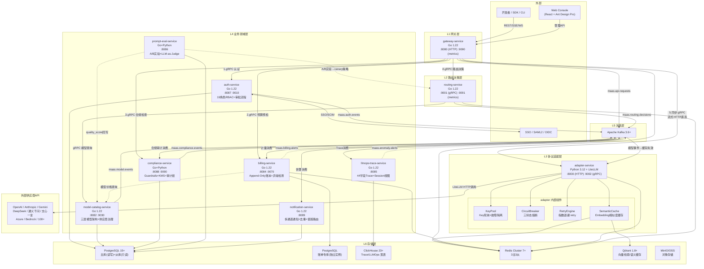

**图例：**
- 实线箭头 →：同步调用（gRPC/HTTP）
- 虚线箭头 -.->：异步消息（Kafka）
- 双向箭头 <-->：双向通信

---

## 3. 请求处理全链路时序图

### 3.1 同步请求（非流式）

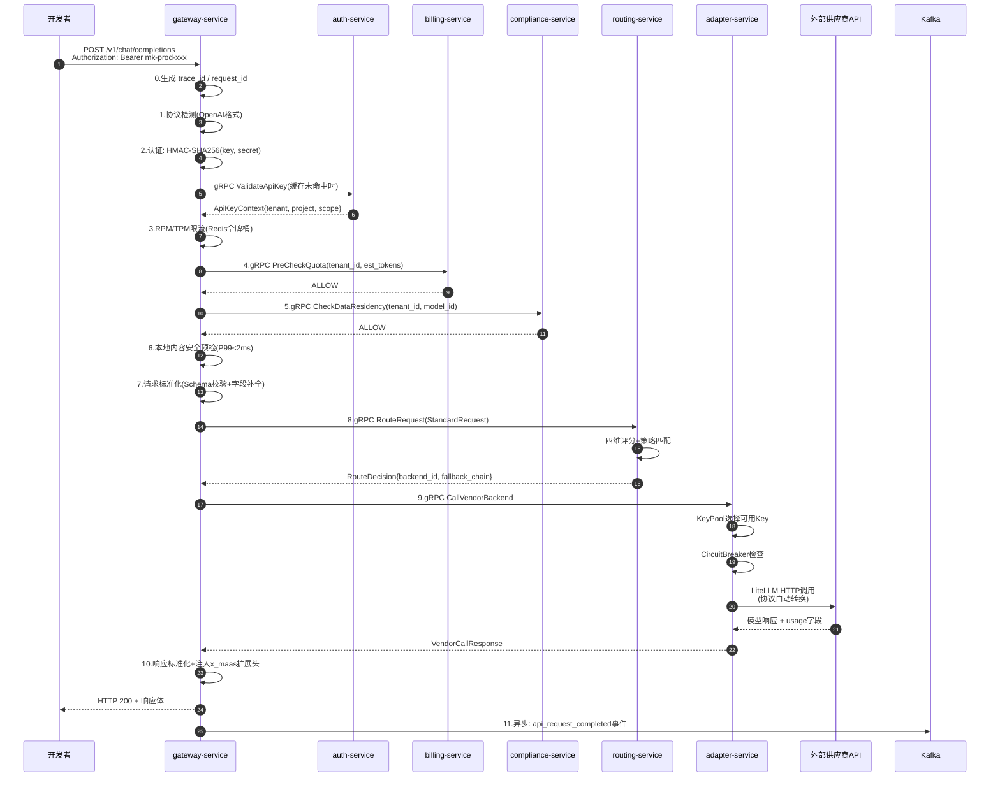

### 3.2 流式请求（SSE）

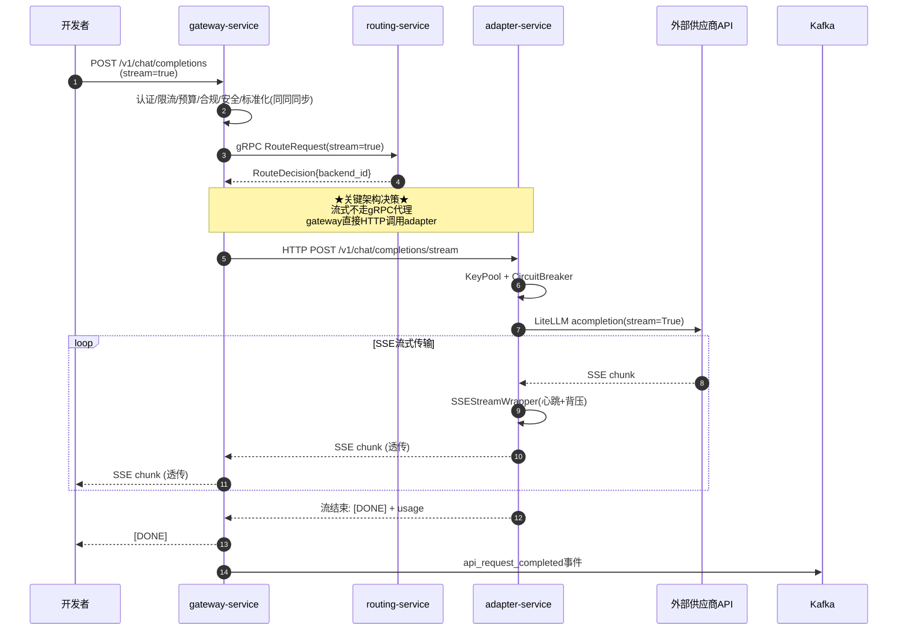

---

## 4. 网关中间件链（11步）

```mermaid
flowchart LR
    A["HTTP请求<br/>到达"] --> M0

    subgraph 网关中间件链_11步
        direction TB
        M0["0️⃣ Trace注入<br/>trace_id+request_id"] --> M1
        M1["1️⃣ 协议检测<br/>URL前缀→OpenAI/Anthropic/Gemini"] --> M2
        M2["2️⃣ 双模认证<br/>API Key + SSO JWT<br/>gRPC auth-service<br/>Redis缓存60s"] --> M3
        M3["3️⃣ 令牌桶限流<br/>RPM/TPM三档<br/>Key级/项目级/租户级"] --> M4
        M4["4️⃣ 预算预检<br/>gRPC billing-service<br/>est_tokens保守估算<br/>ALLOW/DENY"] --> M5
        M5["5️⃣ 合规前置<br/>gRPC compliance-service<br/>数据驻留地域检查<br/>ALLOW/DENY/REDIRECT"] --> M6
        M6["6️⃣ 内容安全预检<br/>本地关键词过滤<br/>P99 < 2ms<br/>严重违规直接拦截"] --> M7
        M7["7️⃣ 请求标准化<br/>Schema校验<br/>补全缺省字段<br/>注入ZDR/KMS标记"] --> M8
        M8["8️⃣ 路由分发<br/>gRPC routing-service<br/>RouteDecision{backend_id}"] --> M9
        M9["9️⃣ 供应商调用<br/>同步:gRPC adapter<br/>流式:HTTP直连adapter"] --> M10
        M10["🔟 响应标准化<br/>协议反向转换<br/>注入x_maas扩展头"] --> M11
        M11["1️⃣1️⃣ 事件埋点<br/>异步→Kafka<br/>maas.api.requests"]
    end

    M11 --> B["HTTP响应<br/>返回"]

    style M4 fill:#fff4e6
    style M5 fill:#ffe0e0
    style M6 fill:#ffe0e0
    style M8 fill:#e0f0ff
    style M9 fill:#e0ffe0
```

**延迟预算：**
- M0~M7（不含路由）：≤ 20ms P99
- M8（路由决策）：≤ 10ms P99
- M9（供应商调用）：取决于供应商
- 认证缓存命中率：≥ 95%

---

## 5. 路由决策四维评分

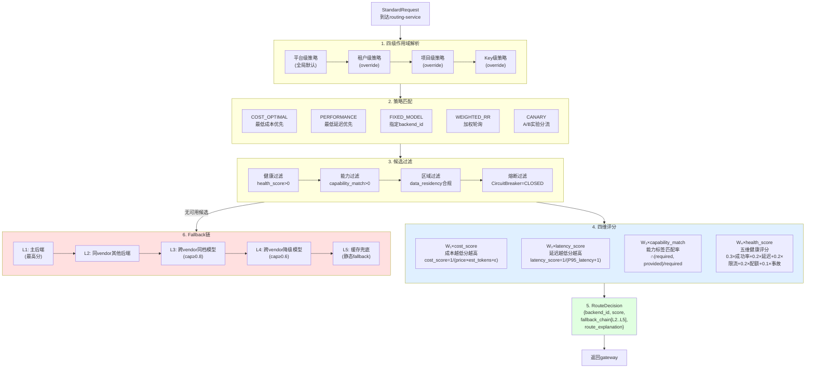

**四维权重默认值：** `W₁=0.30` `W₂=0.35` `W₃=0.20` `W₄=0.15`（可通过策略配置覆盖）

---

## 6. 模型三层架构与供应商治理

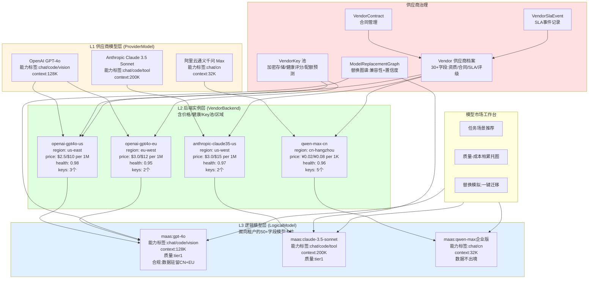

**供应商健康评分算法（5维，PRD §02 8.3）：**
```
health_score = 0.30×success_rate + 0.20×latency_score + 0.20×throttle_score 
             + 0.20×quota_score + 0.10×incident_score
```

---

## 7. Kafka 数据流拓扑

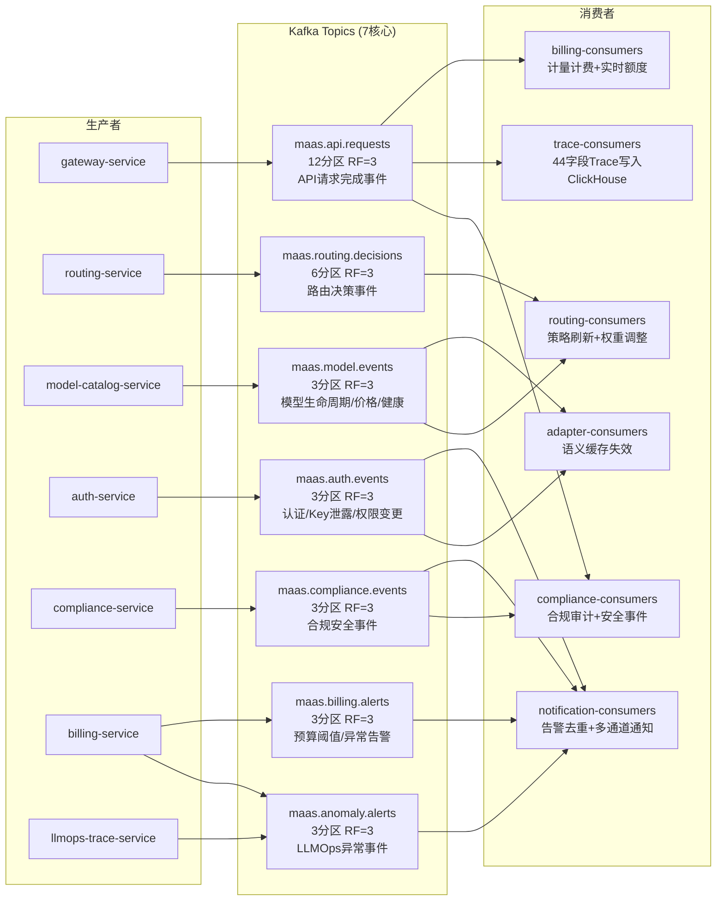

---

## 8. 合规安全四层防御架构

```mermaid
flowchart TB
    subgraph L1_Policy["L1 策略层 (Policy Layer)"]
        direction LR
        P1["数据分级<br/>L0公开→L4绝密"] 
        P2["地域控制<br/>数据驻留:CN/EU/US"]
        P3["Guardrails策略<br/>8种风险类型"]
        P4["合规审批工作流<br/>P0双人审批"]
        P5["ZDR配置<br/>METADATA_ONLY/<br/>TRUE_ZERO_RETENTION"]
    end

    subgraph L2_Enforce["L2 执行层 (Enforcement Layer)"]
        direction LR
        E1["网关预过滤<br/>关键词+PII Regex<br/>P99<5ms"]
        E2["内容安全引擎<br/>3位置检测<br/>Pre-Route→Pre-Dispatch→Post-Resp"]
        E3["路由地域过滤<br/>禁止数据出境<br/>451 Unavailable"]
        E4["KMS加密执行<br/>AWS KMS/阿里云KMS/<br/>HashiCorp Vault"]
        E5["Prompt注入检测<br/>规则+语义双模<br/>默认BLOCK_HARD"]
    end

    subgraph L3_Audit["L3 记录层 (Audit Layer)"]
        direction LR
        A1["Append-Only审计日志<br/>禁止UPDATE/DELETE"]
        A2["SHA-256哈希链<br/>prev_log_hash→current_hash<br/>防篡改可验证"]
        A3["外部审计集成<br/>Splunk/SIEM<br/>Syslog/Kafka投递"]
        A4["操作审计事件<br/>35+事件类型<br/>CRITICAL→INFO"]
    end

    subgraph L4_Evidence["L4 证明层 (Evidence Layer)"]
        direction LR
        C1["合规报告包<br/>等保2.0/GDPR/问卷"]
        C2["审计日志加密导出<br/>特定时间范围"]
        C3["策略变更全版本历史<br/>谁/何时/改了什么"]
        C4["ZDR验证报告<br/>SOC 2 Type II"]
        C5["渗透测试报告<br/>第三方出具"]
    end

    L1_Policy --> L2_Enforce --> L3_Audit --> L4_Evidence

    style L1_Policy fill:#fff4e0
    style L2_Enforce fill:#ffe0e0
    style L3_Audit fill:#e0f0ff
    style L4_Evidence fill:#e0ffe0
```

**内容安全三层执行位置与延迟：**

| 执行位置 | 检测类型 | 延迟目标 |
|---------|---------|---------|
| Pre-Route（网关层） | 关键词过滤 + PII Regex | P99 < 5ms |
| Pre-Dispatch（路由层） | 语义分类 + 注入检测 + 话题边界 | P99 < 30ms |
| Post-Response（响应层） | 输出合规 + 版权检测 + 免责声明注入 | P99 < 20ms |

**PII 检测两阶段混合策略：**
```
阶段1: Regex快速扫描(P99<1ms) → 手机号/身份证/银行卡/邮箱/IP/AWS Key
阶段2: BERT-CRF NER模型(P99<50ms) → Precision>95%, Recall>90%
```

---

## 9. 部署拓扑（生产环境）

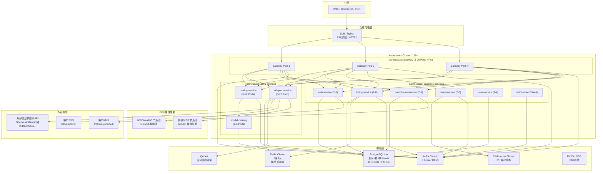

**HPA 伸缩策略：**

| 服务 | Min | Max | 触发指标 | 触发阈值 |
|------|-----|-----|---------|---------|
| gateway-service | 3 | 20 | CPU | 60% |
| routing-service | 3 | 10 | 请求队列长度 | P95>50ms |
| adapter-service | 3 | 20 | CPU + 活跃流数 | 70% / 100 streams |
| billing-service | 2 | 8 | Kafka消费延迟 | > 5000条 |
| 其他服务 | 2 | 4-6 | CPU | 70% |

---

## 10. 预扣-核销计费流

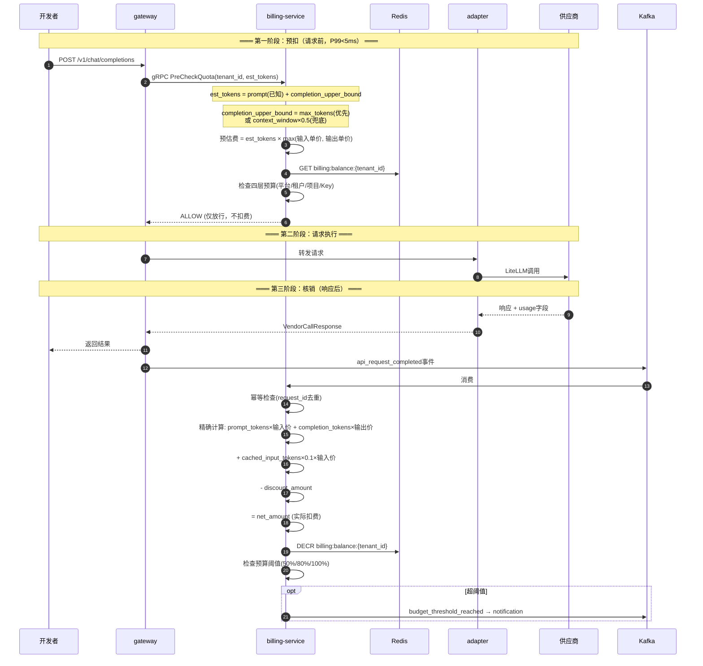

**三优先级计量：**
```
1️⃣ 供应商 usage 字段（最准，优先使用）
2️⃣ 网关侧 Tokenizer 计算（供应商未返回时）
3️⃣ 字符估算 = 字符数/4（兜底，is_estimated=true）
```

---

## 11. 多协议请求流转

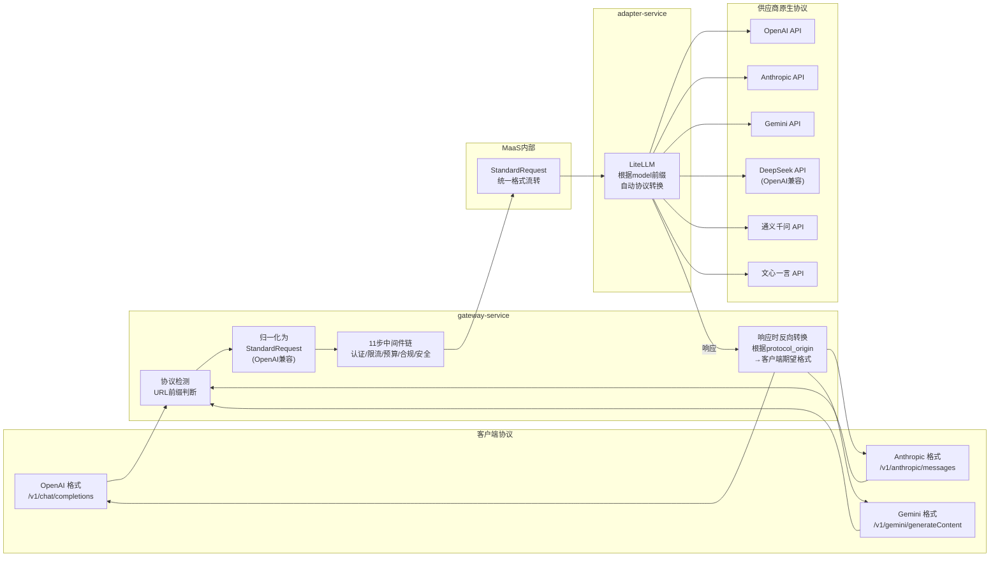

**MVP 阶段策略：**
- OpenAI 格式：完整支持
- Anthropic/Gemini 格式：轻量映射，核心字段归一化到 StandardRequest

---

## 12. 计费账单金额链

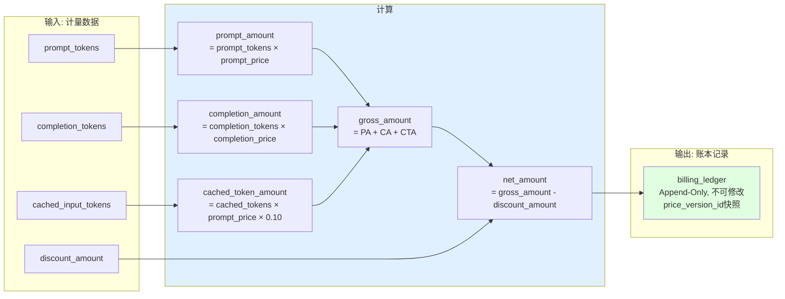

---

## 服务速查表

| # | 服务名 | 语言 | HTTP | gRPC | 核心职责 |
|---|-------|------|------|------|---------|
| 1 | gateway-service | Go | :8080 | — | 唯一外部入口，11步中间件链，多协议接入 |
| 2 | routing-service | Go | — | :9001 | 四维评分路由，Fallback链，A/B联动 |
| 3 | adapter-service | Python | :8000 | :9002 | LiteLLM协议翻译，Key池+熔断，语义缓存 |
| 4 | model-catalog-service | Go | :8082 | :9030 | 三层模型架构，供应商治理，市场工作台 |
| 5 | billing-service | Go | :8084 | :9070 | 计量计费，四层预算，异常检测，节省建议 |
| 6 | llmops-trace-service | Go | :8085 | — | 44字段Trace，Session视图，成本归因 |
| 7 | prompt-eval-service | Go+Python | :8086 | — | A/B实验，LLM-as-Judge，质量门禁 |
| 8 | auth-service | Go | :8087 | :9010 | 19角色RBAC，SSO/SCIM，审批工作流 |
| 9 | compliance-service | Go+Python | :8088 | :9090 | Guardrails，KMS，ZDR，审计哈希链 |
| 10 | notification-service | Go | :8089 | — | 多通道通知，去重聚合，值班路由 |

---

*本文档为架构全景速览图，各服务的详细设计见 `微服务设计/` 目录下的对应文档。*
