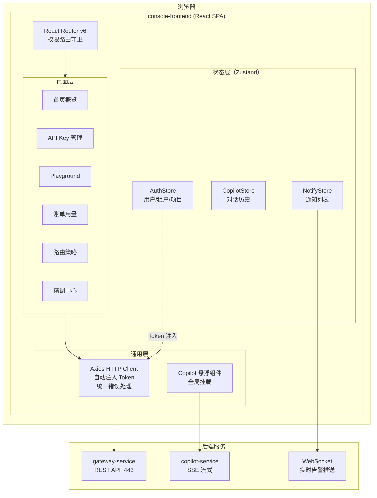
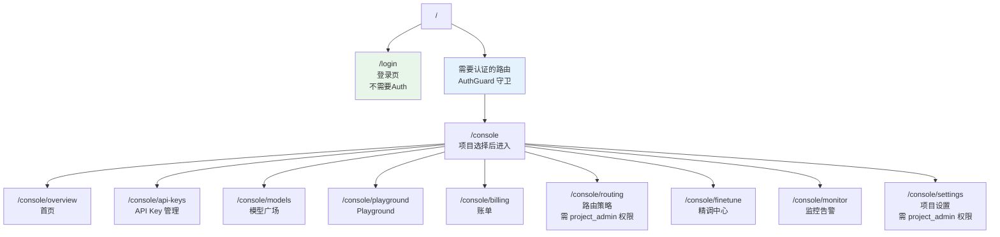
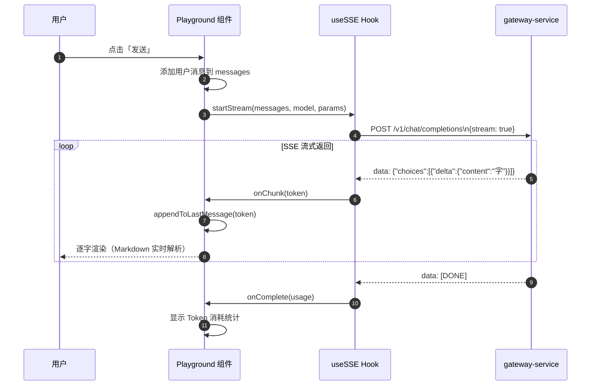
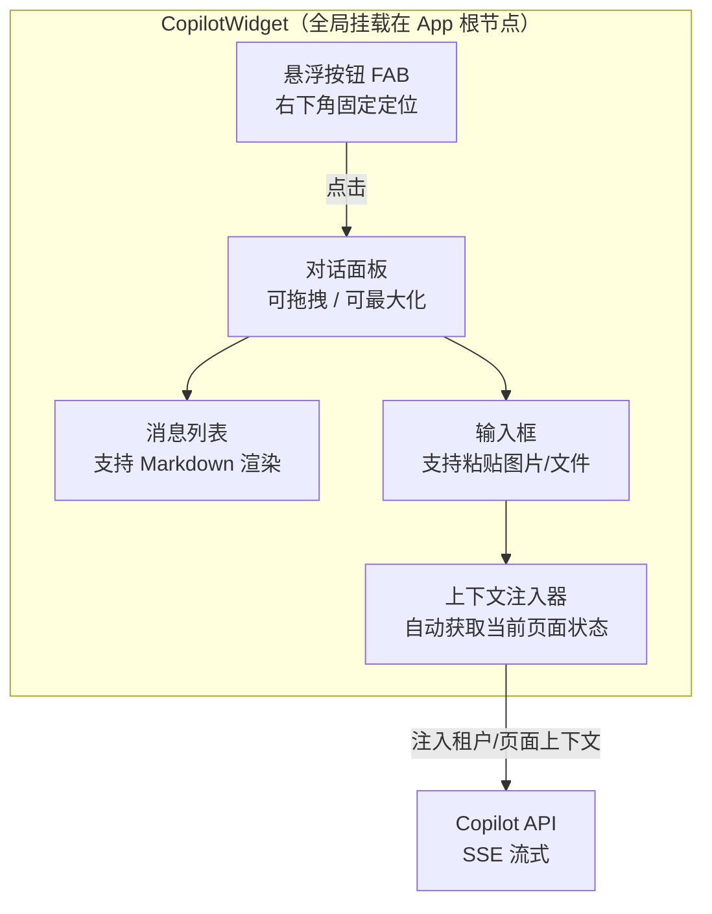

# console-frontend 详细设计文档

**文档版本：** V1.0  
**编写日期：** 2026年05月14日  
**服务名称：** `console-frontend`（开发者控制台）  
**访问地址：** `https://console.maas-platform.com`  
**技术栈：** React 18 + TypeScript 5 + Ant Design Pro 6 + Vite 5  
**负责人：** 前端团队

---

## 1. 功能定位

`console-frontend` 是面向 **API 接入开发者** 的 Web 控制台，功能包括：

- API Key 的创建和管理
- 模型广场浏览与试用
- Playground 在线调试
- 用量统计与账单查询
- 路由策略配置
- 精调任务管理
- 项目与成员管理
- MaaS Copilot 智能助手

**不包含：** 平台级管理功能（租户管理、全局模型配置等）——这些在 `admin-frontend` 中。

---

## 2. 项目工程结构

```
console-frontend/
├── public/
│   └── index.html
├── src/
│   ├── api/                    # API 请求封装
│   │   ├── apiKeys.ts
│   │   ├── billing.ts
│   │   ├── models.ts
│   │   ├── routing.ts
│   │   ├── finetune.ts
│   │   ├── monitor.ts
│   │   └── http.ts             # axios 实例 + 拦截器
│   ├── components/             # 通用组件
│   │   ├── CopilotWidget/      # Copilot 悬浮助手
│   │   ├── StreamRenderer/     # SSE 流式文字渲染
│   │   ├── TokenCounter/       # Token 用量展示
│   │   ├── ModelStatusBadge/   # 模型健康状态
│   │   └── charts/             # 图表组件（基于 ECharts）
│   ├── pages/                  # 页面组件
│   │   ├── Overview/           # 首页概览
│   │   ├── ApiKeys/            # API Key 管理
│   │   ├── ModelMarket/        # 模型广场
│   │   ├── Playground/         # 在线调试
│   │   ├── Billing/            # 用量账单
│   │   ├── Routing/            # 路由策略
│   │   ├── Finetune/           # 精调中心
│   │   ├── Monitor/            # 监控告警
│   │   └── Settings/           # 项目设置
│   ├── store/                  # 状态管理（Zustand）
│   │   ├── auth.ts             # 用户/租户/项目状态
│   │   ├── notification.ts     # 通知状态
│   │   └── copilot.ts          # Copilot 对话历史
│   ├── hooks/                  # 自定义 Hooks
│   │   ├── useSSE.ts           # SSE 流式请求 Hook
│   │   ├── usePolling.ts       # 轮询数据 Hook
│   │   └── usePermission.ts    # 权限检查 Hook
│   ├── utils/
│   │   ├── request.ts          # 请求工具
│   │   ├── tokenCount.ts       # 前端 Token 估算
│   │   └── format.ts           # 数字/时间格式化
│   ├── router/
│   │   └── index.tsx           # 路由配置 + 权限守卫
│   └── main.tsx
├── package.json
├── vite.config.ts
├── tsconfig.json
└── .env.example
```

---

## 3. 整体架构图



---

## 4. 路由设计



**权限守卫实现：**

```typescript
// router/AuthGuard.tsx
const AuthGuard: React.FC<{ children: ReactNode; requiredRole?: string }> = ({
  children,
  requiredRole,
}) => {
  const { user, currentProject } = useAuthStore();

  if (!user) {
    return <Navigate to="/login" replace />;
  }
  if (!currentProject) {
    return <ProjectSelector />;           // 未选项目，显示项目选择器
  }
  if (requiredRole && !hasRole(user, currentProject.id, requiredRole)) {
    return <NoPermission />;              // 无权限
  }
  return <>{children}</>;
};
```

---

## 5. 关键组件设计

### 5.1 Playground 流式渲染



```typescript
// hooks/useSSE.ts
import { useCallback, useRef, useState } from "react";

interface SSEOptions {
  onChunk: (token: string) => void;
  onComplete: (usage?: TokenUsage) => void;
  onError: (error: Error) => void;
}

export function useSSE() {
  const abortRef = useRef<AbortController | null>(null);
  const [streaming, setStreaming] = useState(false);

  const startStream = useCallback(
    async (url: string, body: object, options: SSEOptions) => {
      abortRef.current = new AbortController();
      setStreaming(true);

      try {
        const response = await fetch(url, {
          method: "POST",
          headers: {
            "Content-Type": "application/json",
            Authorization: `Bearer ${getApiKey()}`,
          },
          body: JSON.stringify({ ...body, stream: true }),
          signal: abortRef.current.signal,
        });

        const reader = response.body!.getReader();
        const decoder = new TextDecoder();

        while (true) {
          const { done, value } = await reader.read();
          if (done) break;
          const text = decoder.decode(value);
          for (const line of text.split("\n")) {
            if (!line.startsWith("data: ")) continue;
            const data = line.slice(6).trim();
            if (data === "[DONE]") {
              options.onComplete();
              return;
            }
            try {
              const chunk = JSON.parse(data);
              const token = chunk.choices?.[0]?.delta?.content ?? "";
              if (token) options.onChunk(token);
            } catch {}
          }
        }
      } catch (err) {
        if ((err as Error).name !== "AbortError") {
          options.onError(err as Error);
        }
      } finally {
        setStreaming(false);
      }
    },
    []
  );

  const stopStream = () => abortRef.current?.abort();

  return { startStream, stopStream, streaming };
}
```

### 5.2 Copilot 悬浮组件



### 5.3 API Key 一次性明文显示

```typescript
// components/ApiKeyCreatedModal.tsx
// 只在创建后显示一次，关闭即不可再看
const ApiKeyCreatedModal: React.FC<{ apiKey: string; onClose: () => void }> = ({
  apiKey,
  onClose,
}) => {
  const [confirmed, setConfirmed] = useState(false);
  const [copied, setCopied] = useState(false);

  const handleCopy = async () => {
    await navigator.clipboard.writeText(apiKey);
    setCopied(true);
  };

  return (
    <Modal
      title="🔑 API Key 已创建"
      open={true}
      closable={false}        // 未确认不能关闭
      footer={
        <Button
          type="primary"
          disabled={!confirmed}
          onClick={onClose}
          danger
        >
          我已安全保存，关闭
        </Button>
      }
    >
      <Alert
        type="warning"
        message="⚠️ 请立即复制保存！此 Key 仅显示一次，关闭后无法再次查看。"
      />
      <div style={{ marginTop: 16 }}>
        <Input.Password
          value={apiKey}
          readOnly
          visibilityToggle
          addonAfter={
            <Button size="small" onClick={handleCopy}>
              {copied ? "✓ 已复制" : "复制"}
            </Button>
          }
        />
      </div>
      <Checkbox
        style={{ marginTop: 16 }}
        onChange={(e) => setConfirmed(e.target.checked)}
      >
        我已将 API Key 保存到安全位置
      </Checkbox>
    </Modal>
  );
};
```

---

## 6. HTTP 客户端与错误处理

```typescript
// api/http.ts
import axios from "axios";
import { useAuthStore } from "@/store/auth";

const http = axios.create({
  baseURL: import.meta.env.VITE_API_BASE_URL,
  timeout: 30_000,
});

// 请求拦截：自动注入 API Key（Playground 用）或 JWT Token（管理操作用）
http.interceptors.request.use((config) => {
  const { jwtToken } = useAuthStore.getState();
  if (jwtToken) {
    config.headers.Authorization = `Bearer ${jwtToken}`;
  }
  return config;
});

// 响应拦截：统一错误处理
http.interceptors.response.use(
  (response) => response.data,
  (error) => {
    const status = error.response?.status;
    const code = error.response?.data?.error?.code;

    if (status === 401) {
      // Token 失效，跳转登录
      useAuthStore.getState().logout();
      window.location.href = "/login";
    } else if (status === 429) {
      message.error("请求过于频繁，请稍后再试");
    } else if (status >= 500) {
      message.error(`服务器错误（${status}），请联系支持`);
    }

    return Promise.reject(error);
  }
);

export default http;
```

---

## 7. 状态管理设计

```typescript
// store/auth.ts（Zustand）
interface AuthState {
  user: User | null;
  currentTenant: Tenant | null;
  currentProject: Project | null;
  jwtToken: string | null;
  projects: Project[];

  login: (credentials: LoginPayload) => Promise<void>;
  logout: () => void;
  switchProject: (projectId: string) => void;
}

export const useAuthStore = create<AuthState>()(
  persist(
    (set, get) => ({
      user: null,
      currentProject: null,
      jwtToken: null,
      projects: [],

      login: async (credentials) => {
        const { user, token, projects } = await authApi.login(credentials);
        set({ user, jwtToken: token, projects });
        // 自动选择上次使用的项目
        const lastProjectId = localStorage.getItem("lastProjectId");
        const defaultProject = projects.find(p => p.id === lastProjectId) ?? projects[0];
        set({ currentProject: defaultProject });
      },

      logout: () => set({ user: null, jwtToken: null, currentProject: null }),

      switchProject: (projectId) => {
        const project = get().projects.find(p => p.id === projectId);
        if (project) {
          set({ currentProject: project });
          localStorage.setItem("lastProjectId", projectId);
        }
      },
    }),
    { name: "maas-auth", partialize: (s) => ({ jwtToken: s.jwtToken }) }
  )
);
```

---

## 8. Prometheus 指标（前端性能监控）

通过 OpenTelemetry Web SDK 上报前端性能指标：

| 指标 | 说明 |
|------|------|
| `maas_console_page_load_time` | 各页面加载耗时 |
| `maas_console_api_request_duration` | API 请求耗时（按接口） |
| `maas_console_stream_ttft` | Playground 流式首 Token 时间（TTFT） |
| `maas_console_error_total` | 前端 JS 错误次数 |
| `maas_console_copilot_session_total` | Copilot 使用次数 |

---

## 9. 构建与部署

```yaml
# Dockerfile（多阶段构建）
FROM node:20-alpine AS builder
WORKDIR /app
COPY package*.json .
RUN npm ci
COPY . .
RUN npm run build        # Vite build，输出到 dist/

FROM nginx:1.25-alpine
COPY --from=builder /app/dist /usr/share/nginx/html
COPY nginx.conf /etc/nginx/conf.d/default.conf
# CSP Header、Gzip、SPA fallback 在 nginx.conf 中配置
EXPOSE 80
```

```nginx
# nginx.conf 关键配置
server {
    listen 80;
    root /usr/share/nginx/html;
    index index.html;

    # SPA 路由回退
    location / {
        try_files $uri $uri/ /index.html;
    }

    # 静态资源强缓存（带 hash 的 JS/CSS）
    location ~* \.(js|css|woff2)$ {
        expires 1y;
        add_header Cache-Control "public, immutable";
    }

    # 安全响应头
    add_header X-Frame-Options "DENY";
    add_header X-Content-Type-Options "nosniff";
    add_header Content-Security-Policy "default-src 'self'; ...";

    # Gzip 压缩
    gzip on;
    gzip_types text/plain text/css application/javascript;
    gzip_min_length 1024;
}
```

**K8s 部署：**

```yaml
apiVersion: apps/v1
kind: Deployment
metadata:
  name: console-frontend
  namespace: maas-frontend
spec:
  replicas: 3
  selector:
    matchLabels:
      app: console-frontend
  template:
    spec:
      containers:
        - name: console-frontend
          image: registry.maas-platform.com/maas/console-frontend:latest
          ports:
            - containerPort: 80
          resources:
            requests: { cpu: "100m", memory: "64Mi" }
            limits:   { cpu: "500m", memory: "256Mi" }
          env:
            - name: VITE_API_BASE_URL
              valueFrom:
                configMapKeyRef:
                  name: frontend-config
                  key: api_base_url
```
