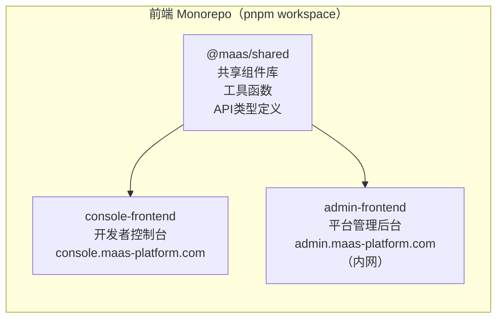
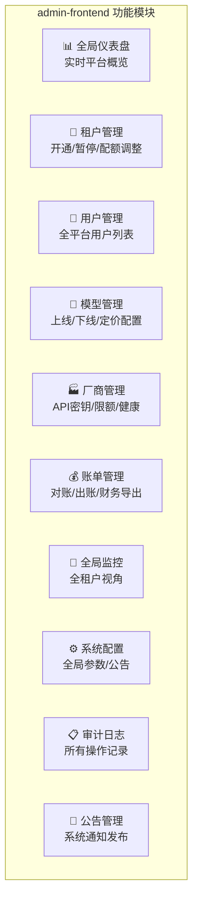
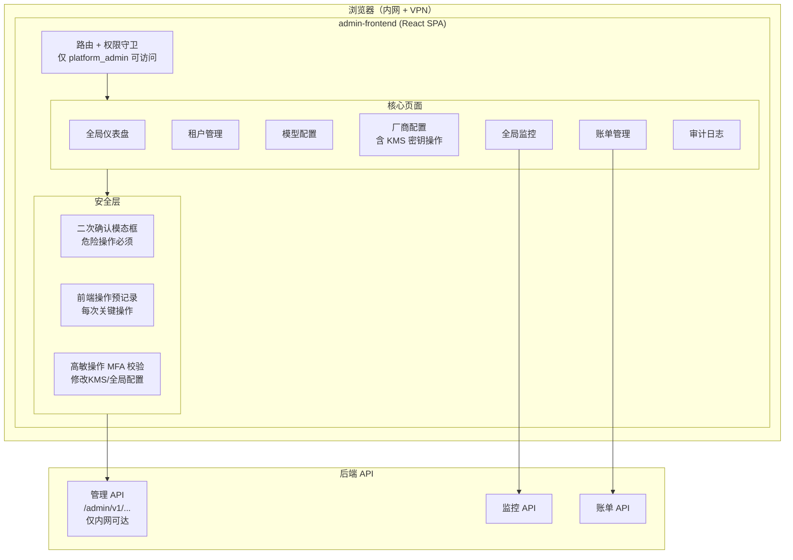
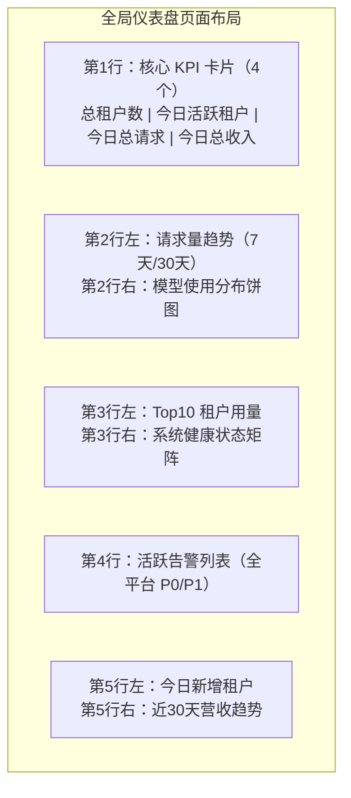
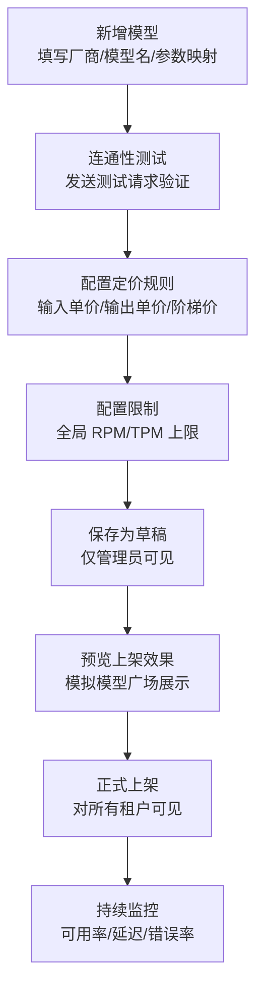

# admin-frontend 详细设计文档

**文档版本：** V1.0  
**编写日期：** 2026年05月14日  
**服务名称：** `admin-frontend`（平台管理后台）  
**访问地址：** `https://admin.maas-platform.com`（内网访问，VPN 限制）  
**技术栈：** React 18 + TypeScript 5 + Ant Design Pro 6 + Vite 5  
**访问权限：** 仅限平台管理员（platform_admin）/ SRE / 审计员  
**负责人：** 前端团队

---

## 1. 与 console-frontend 的关系



**两个前端的差异：**

| 维度 | console-frontend | admin-frontend |
|------|-----------------|----------------|
| 目标用户 | API 开发者 | 平台管理员/SRE/运营 |
| 访问方式 | 公网 | 内网 + VPN |
| 核心功能 | API 接入/调试/账单 | 租户管理/模型配置/全局监控 |
| 数据范围 | 当前租户/项目 | 全平台所有租户 |
| 安全要求 | 标准 | 更高（操作二次确认/审计日志） |

---

## 2. 功能模块



---

## 3. 项目工程结构

```
admin-frontend/
├── src/
│   ├── api/
│   │   ├── tenants.ts          # 租户管理接口
│   │   ├── models.ts           # 模型管理接口
│   │   ├── vendors.ts          # 厂商管理接口
│   │   ├── billing-admin.ts    # 后台账单接口
│   │   ├── system.ts           # 系统配置接口
│   │   └── http.ts             # axios 实例（与 console 独立）
│   ├── components/
│   │   ├── ConfirmDangerModal/ # 危险操作二次确认框
│   │   ├── AuditTrail/         # 审计链路展示
│   │   ├── TenantSelector/     # 全租户选择器
│   │   └── charts/             # 管理端图表（ECharts）
│   ├── pages/
│   │   ├── Dashboard/          # 全局仪表盘
│   │   ├── Tenants/            # 租户管理
│   │   ├── Models/             # 模型管理
│   │   ├── Vendors/            # 厂商 API 配置
│   │   ├── BillingAdmin/       # 账单管理
│   │   ├── Monitor/            # 全局监控
│   │   ├── AuditLog/           # 审计日志
│   │   └── SystemConfig/       # 系统配置
│   ├── store/
│   │   ├── admin-auth.ts       # 管理员认证状态
│   │   └── platform.ts         # 平台全局状态
│   └── main.tsx
```

---

## 4. 整体架构图



---

## 5. 全局仪表盘设计



**实时数据刷新策略：**

```typescript
// 仪表盘数据刷新（不同数据不同频率）
const REFRESH_INTERVALS = {
  criticalAlerts: 10_000,     // 10s：活跃告警
  realtimeMetrics: 30_000,    // 30s：QPS/成功率
  tenantStats: 60_000,        // 60s：租户统计
  revenueStats: 300_000,      // 5min：营收数据
};
```

---

## 6. 租户管理模块

### 6.1 租户列表与操作

```
┌──────────────────────────────────────────────────────────────────┐
│  租户管理                               [新建租户] [批量操作 ▾]   │
├──────────────────────────────────────────────────────────────────┤
│  🔍 搜索租户名/ID      状态: 全部▾    套餐: 全部▾   排序: 用量▾  │
├───────┬──────────────┬──────┬──────────┬────────────┬────────────┤
│  ID   │ 租户名        │ 状态  │ 今日调用  │ 本月费用    │ 操作       │
├───────┼──────────────┼──────┼──────────┼────────────┼────────────┤
│ t_001 │ 公司A        │ ●正常 │ 145,230  │ ¥ 1,823    │ 详情 配置  │
│ t_002 │ 公司B        │ ●正常 │  12,080  │ ¥   234    │ 详情 配置  │
│ t_003 │ 公司C        │ ○暂停 │       0  │ ¥     0    │ 详情 恢复  │
│ t_004 │ 公司D        │ 🔴欠费│   3,420  │ ¥ 2,100    │ 详情 催费  │
└───────┴──────────────┴──────┴──────────┴────────────┴────────────┘
```

### 6.2 危险操作二次确认

暂停租户、删除 API Key、修改计费规则等高风险操作必须经过二次确认：

```typescript
// components/ConfirmDangerModal/index.tsx
interface Props {
  title: string;
  description: string;
  confirmText: string;           // 用户必须手动输入的确认文字
  onConfirm: () => Promise<void>;
}

const ConfirmDangerModal: React.FC<Props> = ({ title, description, confirmText, onConfirm }) => {
  const [inputValue, setInputValue] = useState("");
  const [loading, setLoading] = useState(false);
  const canConfirm = inputValue === confirmText;

  return (
    <Modal title={<span style={{ color: "#ff4d4f" }}>⚠️ {title}</span>} ...>
      <Alert type="error" message={description} />
      <p style={{ marginTop: 16 }}>
        请输入 <strong>{confirmText}</strong> 以确认操作：
      </p>
      <Input
        value={inputValue}
        onChange={(e) => setInputValue(e.target.value)}
        placeholder={`请输入"${confirmText}"`}
      />
      <Button
        danger
        type="primary"
        disabled={!canConfirm}
        loading={loading}
        onClick={async () => {
          setLoading(true);
          await onConfirm();
          setLoading(false);
        }}
      >
        确认执行
      </Button>
    </Modal>
  );
};

// 使用示例：暂停租户
<ConfirmDangerModal
  title="暂停租户"
  description="暂停后该租户所有 API Key 立即失效，已有请求不受影响。"
  confirmText="暂停 公司A"
  onConfirm={() => tenantApi.suspend(tenant.id)}
/>
```

---

## 7. 模型管理模块

### 7.1 模型配置流程



### 7.2 模型定价配置界面

```
┌──────────────────────────────────────────────────────────────────┐
│  模型定价：gpt-4o                                                 │
│                                                                   │
│  标准价格（元 / 1000 tokens）                                      │
│  输入: ┌──────────────────┐  输出: ┌──────────────────┐         │
│        │     0.04000      │        │     0.12000      │         │
│        └──────────────────┘        └──────────────────┘         │
│                                                                   │
│  阶梯定价  ☑ 启用                                                 │
│  ┌──────────────────────────────────────────────────────────┐   │
│  │ 用量范围（月累计 tokens） │ 输入单价    │ 输出单价         │   │
│  ├───────────────────────┼────────────┼───────────────────┤   │
│  │ 0 - 10M               │ 0.04000    │ 0.12000           │   │
│  │ 10M - 100M            │ 0.03200    │ 0.09600           │   │
│  │ 100M+                 │ 0.02400    │ 0.07200           │   │
│  │ [+ 添加阶梯]           │            │                   │   │
│  └──────────────────────────────────────────────────────────┘   │
│                                                                   │
│  生效时间:  ● 立即生效   ○ 定时生效: [选择日期]                    │
│                                                                   │
│  [取消]                                    [保存定价规则]          │
└──────────────────────────────────────────────────────────────────┘
```

---

## 8. 厂商管理（含密钥管理）

厂商 API 密钥是高度敏感信息，前端设计需特别处理：

```typescript
// 厂商 API Key 的前端显示策略
interface VendorKeyDisplay {
  // 规则：
  // 1. 前端绝不接收/存储完整密钥明文
  // 2. 显示时只展示 masked 版本（如 sk-****...****AbCd）
  // 3. "更新密钥" 操作走独立的安全流程，需要 MFA 验证
  maskedKey: string;     // sk-****...****AbCd
  lastRotated: string;   // 最后轮换时间
  status: "active" | "expiring_soon" | "expired";
  expiresAt?: string;
}

// 更新密钥时需要 MFA
const handleUpdateKey = async () => {
  // Step 1: 验证 MFA（TOTP 或 SMS）
  const mfaResult = await showMFAChallenge();
  if (!mfaResult.success) return;

  // Step 2: 提交新密钥（通过 HTTPS，后端直接转存 KMS）
  await vendorApi.updateApiKey({
    vendorId,
    newKey: newKeyInput,   // 提交后前端立即清空 input
    mfaToken: mfaResult.token,
  });
  setNewKeyInput("");      // 清空明文，防止残留
};
```

---

## 9. 审计日志模块

审计日志是只读的，提供全面的操作追踪：

```
┌──────────────────────────────────────────────────────────────────┐
│  审计日志                                             [导出 CSV]  │
├──────────────────────────────────────────────────────────────────┤
│  时间范围: [2026-05-01] ~ [2026-05-14]   操作人: 全部▾           │
│  操作类型: 全部▾   资源类型: 全部▾   结果: 全部▾                  │
├───────────────┬──────────┬──────────────┬────────┬──────────────┤
│ 操作时间       │ 操作人    │ 操作类型      │ 结果   │ 详情          │
├───────────────┼──────────┼──────────────┼────────┼──────────────┤
│ 05-14 14:23  │ admin@   │ 暂停租户      │ ✅成功 │ [查看]        │
│ 05-14 13:11  │ sre@     │ 更新模型定价  │ ✅成功 │ [查看]        │
│ 05-14 11:05  │ admin@   │ 重置 API Key  │ ✅成功 │ [查看]        │
│ 05-14 09:30  │ ops@     │ 修改厂商密钥  │ ✅成功 │ [查看]        │
└───────────────┴──────────┴──────────────┴────────┴──────────────┘

 ── 日志详情抽屉 ──────────────────────────────────────────────
┌────────────────────────────────────────────┐
│  操作详情                              ✕   │
│  操作：暂停租户                             │
│  时间：2026-05-14 14:23:45               │
│  操作人：admin@maas-platform.com           │
│  IP：10.0.1.100                           │
│  资源：租户 公司A（t_001）                  │
│  操作前状态：active                         │
│  操作后状态：suspended                      │
│  关联工单：TICKET-2026-0514-001            │
│  备注：欠费超过30天，按合同条款暂停服务       │
└────────────────────────────────────────────┘
```

---

## 10. 安全设计

### 10.1 访问控制

```
admin-frontend 访问控制层次：

1. 网络层：仅内网 + VPN 可访问
   nginx: allow 10.0.0.0/8; deny all;

2. 认证层：独立的管理员登录流程
   - 账密 + MFA（TOTP）强制要求
   - Session 有效期 8 小时，操作无活跃则 30 分钟失效

3. 鉴权层：路由级别权限检查
   - platform_admin: 全部功能
   - sre: 监控 + 厂商状态（只读） + 告警处理
   - auditor: 仅审计日志 + 账单（只读）

4. 操作层：高风险操作额外保护
   - 修改定价/暂停租户/更新厂商密钥 → 二次确认
   - 修改 KMS 密钥 → MFA 验证
   - 所有操作 → 审计日志
```

### 10.2 CSP 策略（更严格）

```
Content-Security-Policy:
  default-src 'self';
  script-src 'self';          # 不允许 inline script
  style-src 'self' 'unsafe-inline';
  connect-src 'self' https://admin-api.maas-platform.internal;
  frame-ancestors 'none';     # 防止 Clickjacking
  form-action 'self';
```

---

## 11. 构建产物说明

两个前端应用共享工程配置，但独立构建和部署：

```bash
# 构建开发者控制台
cd packages/console-frontend && npm run build
# 产物: console-frontend/dist/ → 部署到 console.maas-platform.com

# 构建管理后台
cd packages/admin-frontend && npm run build
# 产物: admin-frontend/dist/ → 部署到 admin.maas-platform.com（内网）
```

```yaml
# admin-frontend K8s 部署（内网 namespace）
apiVersion: apps/v1
kind: Deployment
metadata:
  name: admin-frontend
  namespace: maas-admin     # 独立 namespace，与开发者控制台隔离
spec:
  replicas: 2
  template:
    spec:
      containers:
        - name: admin-frontend
          image: registry.maas-platform.com/maas/admin-frontend:latest
          resources:
            requests: { cpu: "100m", memory: "64Mi" }
            limits:   { cpu: "300m", memory: "128Mi" }
---
# admin-frontend 只暴露内网 Service，不创建公网 Ingress
apiVersion: v1
kind: Service
metadata:
  name: admin-frontend
  namespace: maas-admin
spec:
  type: ClusterIP   # 仅集群内可达，通过 VPN Gateway 转发
  selector:
    app: admin-frontend
  ports:
    - port: 80
```

---

**变更历史**

| 版本 | 日期 | 说明 | 修改人 |
|------|------|------|--------|
| V1.0 | 2026-05-14 | 初稿 | 前端团队 |
