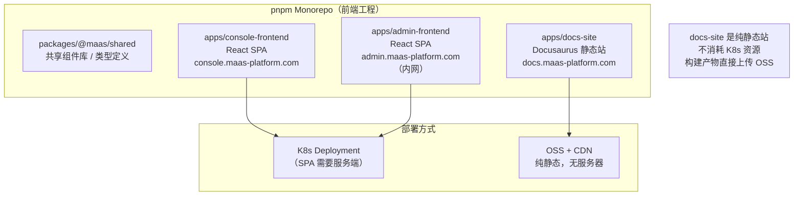
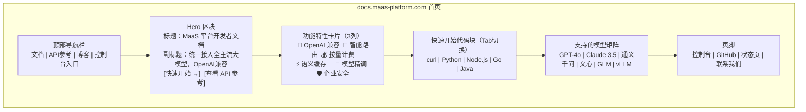
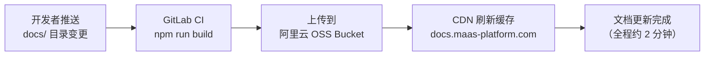

# docs-site 详细设计文档

**文档版本：** V1.0  
**编写日期：** 2026年05月14日  
**服务名称：** `docs-site`（产品文档站）  
**访问地址：** `https://docs.maas-platform.com`  
**技术栈：** Docusaurus 3 + MDX + Algolia 搜索  
**部署方式：** 静态构建 → 阿里云 OSS + CDN  
**负责人：** 前端团队 + 产品团队

---

## 1. 与其他前端的关系



**关键区别：** docs-site 是静态生成站点，不需要 K8s Pod，每次内容更新只需重新构建并上传 OSS，成本接近零。

---

## 2. 技术选型：Docusaurus 3

### 2.1 选型理由

| 框架 | 优点 | 缺点 | 结论 |
|------|------|------|------|
| **Docusaurus 3** | React 生态、MDX 支持、内置搜索、OpenAPI 插件 | 构建稍慢 | ✅ 选用 |
| VitePress | 构建极快、Vue 生态 | 与 React 团队不匹配 | ❌ |
| Mintlify | AI-native、界面美观 | 商业平台，数据不在本地 | ❌ |
| GitBook | 所见即所得编辑 | 功能弱、商业定价 | ❌ |

### 2.2 核心插件

```json
// docs-site/package.json（关键依赖）
{
  "dependencies": {
    "@docusaurus/core": "^3.5.0",
    "@docusaurus/preset-classic": "^3.5.0",
    "docusaurus-plugin-openapi-docs": "^3.0.0",  // 自动生成 API 参考页
    "@docusaurus/theme-search-algolia": "^3.5.0", // Algolia 搜索
    "docusaurus-plugin-image-zoom": "^2.0.0",     // 图片放大
    "remark-mermaid": "^1.0.0"                    // Mermaid 图表支持
  }
}
```

---

## 3. 项目工程结构

```
apps/docs-site/
├── docusaurus.config.ts       # 主配置
├── sidebars.ts                # 侧边栏结构
├── src/
│   ├── css/
│   │   └── custom.css         # 品牌色覆盖（MaaS 主题）
│   ├── components/
│   │   ├── HomepageHero/      # 首页 Hero 区块
│   │   ├── FeatureCards/      # 功能特性卡片
│   │   └── QuickstartBanner/  # 快速开始横幅
│   └── pages/
│       └── index.tsx          # 产品首页（landing page）
├── docs/                      # 文档内容（Markdown / MDX）
│   ├── getting-started/
│   │   ├── quickstart.md
│   │   ├── authentication.md
│   │   └── first-request.md
│   ├── concepts/
│   │   ├── routing.md
│   │   ├── semantic-cache.md
│   │   └── billing.md
│   ├── api-reference/
│   │   └── openapi.yaml       # OpenAPI Spec → 自动生成 API 参考页
│   ├── guides/
│   │   ├── migrate-from-openai.md
│   │   ├── cost-optimization.md
│   │   ├── finetune.md
│   │   └── streaming.md
│   └── changelog/
│       └── v1.0.0.md
├── blog/                      # 技术博客（可选）
├── static/
│   ├── img/
│   │   ├── logo.svg
│   │   └── architecture.png
│   └── openapi/
│       └── maas-api-v1.yaml   # OpenAPI Spec 文件
└── Dockerfile                 # 本地预览用（生产不需要）
```

---

## 4. 首页设计（Landing Page）



### 4.1 首页核心代码

```tsx
// src/pages/index.tsx
import React from 'react';
import Layout from '@theme/Layout';
import HomepageHero from '@site/src/components/HomepageHero';
import FeatureCards from '@site/src/components/FeatureCards';
import QuickstartBanner from '@site/src/components/QuickstartBanner';

export default function Home(): JSX.Element {
  return (
    <Layout
      title="MaaS 平台开发者文档"
      description="统一接入全主流大模型，OpenAI 兼容 API，智能路由与语义缓存"
    >
      <HomepageHero />
      <main>
        <FeatureCards />
        <QuickstartBanner />
      </main>
    </Layout>
  );
}
```

---

## 5. Docusaurus 配置

```typescript
// docusaurus.config.ts
import type { Config } from '@docusaurus/types';

const config: Config = {
  title: 'MaaS 平台',
  tagline: '统一接入全主流大模型，OpenAI 兼容',
  url: 'https://docs.maas-platform.com',
  baseUrl: '/',
  favicon: 'img/favicon.ico',

  i18n: {
    defaultLocale: 'zh-Hans',
    locales: ['zh-Hans', 'en'],
  },

  presets: [
    ['classic', {
      docs: {
        sidebarPath: './sidebars.ts',
        editUrl: 'https://gitlab.maas-platform.com/docs/edit/main/',
        showLastUpdateTime: true,
        showLastUpdateAuthor: true,
      },
      blog: {
        showReadingTime: true,
      },
      theme: {
        customCss: './src/css/custom.css',
      },
    }],
  ],

  plugins: [
    // OpenAPI 文档自动生成
    ['docusaurus-plugin-openapi-docs', {
      id: 'api',
      docsPluginId: 'classic',
      config: {
        maas: {
          specPath: 'static/openapi/maas-api-v1.yaml',
          outputDir: 'docs/api-reference',
          sidebarOptions: { groupPathsBy: 'tag' },
        },
      },
    }],
  ],

  themeConfig: {
    // Algolia 文档搜索
    algolia: {
      appId: 'MAAS_ALGOLIA_APP_ID',
      apiKey: 'MAAS_ALGOLIA_SEARCH_KEY',  // 只读 Key，可公开
      indexName: 'maas-docs',
    },
    // 导航栏
    navbar: {
      title: 'MaaS 平台',
      logo: { src: 'img/logo.svg' },
      items: [
        { to: '/docs/getting-started/quickstart', label: '快速开始', position: 'left' },
        { to: '/docs/api-reference', label: 'API 参考', position: 'left' },
        { to: '/docs/guides', label: '指南', position: 'left' },
        { to: '/blog', label: '博客', position: 'left' },
        { href: 'https://console.maas-platform.com', label: '控制台', position: 'right', className: 'navbar-console-btn' },
      ],
    },
    // 品牌色
    colorMode: { defaultMode: 'light', respectPrefersColorScheme: true },
  },
};

export default config;
```

---

## 6. OpenAPI 自动生成 API 参考

docs-site 的 API 参考页面从 OpenAPI Spec 自动生成，无需手写：

```yaml
# static/openapi/maas-api-v1.yaml（片段）
openapi: "3.1.0"
info:
  title: MaaS Platform API
  version: "1.0.0"
  description: OpenAI 兼容的大模型统一接入 API

servers:
  - url: https://api.maas-platform.com
    description: 生产环境

paths:
  /v1/chat/completions:
    post:
      summary: 创建对话补全
      tags: [Chat]
      requestBody:
        required: true
        content:
          application/json:
            schema:
              $ref: '#/components/schemas/ChatCompletionRequest'
      responses:
        '200':
          description: 成功
```

**自动生成效果：** 每个接口都会生成带有「Try it」交互式测试按钮的文档页面。

---

## 7. 构建与部署

### 7.1 CI/CD 流程



### 7.2 GitLab CI 配置

```yaml
# .gitlab-ci.yml（docs-site 专用 job）
build-docs:
  stage: build
  only:
    changes:
      - apps/docs-site/**/*
  script:
    - cd apps/docs-site
    - npm ci
    - npm run build
    # 上传到 OSS
    - ossutil cp -r build/ oss://maas-docs-bucket/ --update
    # 刷新 CDN
    - aliyun cdn RefreshObjectCaches --ObjectPath https://docs.maas-platform.com/
  artifacts:
    paths:
      - apps/docs-site/build/
    expire_in: 1 week
```

### 7.3 OSS Bucket 配置

```
Bucket 名称：maas-docs-bucket
地域：华东1（杭州）
访问控制：公共读
静态网站托管：
  默认首页：index.html
  默认 404 页：404.html         # Docusaurus 自动生成
CDN 加速域名：docs.maas-platform.com
HTTPS：强制跳转（HTTP → HTTPS）
缓存策略：
  *.html：no-cache（内容实时）
  *.js / *.css：max-age=31536000（1年，带 hash 文件名）
  图片：max-age=2592000（30天）
```

---

## 8. 搜索：Algolia DocSearch

```
申请方式：
1. 提交 Algolia DocSearch 申请（免费用于开源/公开文档）
   地址：https://docsearch.algolia.com/apply/
2. 审核通过后获得 appId + apiKey + indexName
3. 填入 docusaurus.config.ts

爬虫配置（Algolia 自动爬取，也可手动配置）：
indexName: maas-docs
startUrls:
  - https://docs.maas-platform.com
selectors:
  lvl0: ".navbar__title"
  lvl1: "article h1"
  lvl2: "article h2"
  text: "article p, article li"
```

---

## 9. 多语言支持（国际化）

```
当前计划：
- 默认：中文（zh-Hans）
- V1.1 添加：英文（en）

目录结构（启用国际化后）：
docs/
  getting-started/quickstart.md       # 中文（默认）
i18n/
  en/
    docusaurus-plugin-content-docs/
      current/
        getting-started/quickstart.md  # 英文翻译
```

---

## 10. SEO 配置

```typescript
// 每个文档页面的 SEO 配置
// （在 Markdown frontmatter 中设置）
---
title: 快速开始 - MaaS 平台
description: 5分钟接入 MaaS 平台，发送第一个 API 请求
keywords: [MaaS, LLM API, OpenAI兼容, 大模型接入]
sidebar_position: 1
---
```

```typescript
// docusaurus.config.ts 全局 SEO
headTags: [
  {
    tagName: 'meta',
    attributes: { name: 'og:image', content: 'https://docs.maas-platform.com/img/og-image.png' },
  },
],
```

---

**变更历史**

| 版本 | 日期 | 说明 | 修改人 |
|------|------|------|--------|
| V1.0 | 2026-05-14 | 初稿 | 前端团队 |
