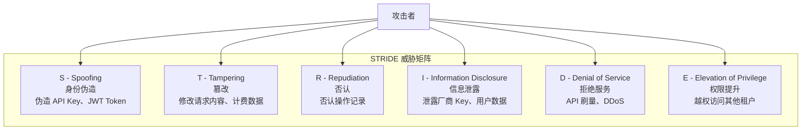
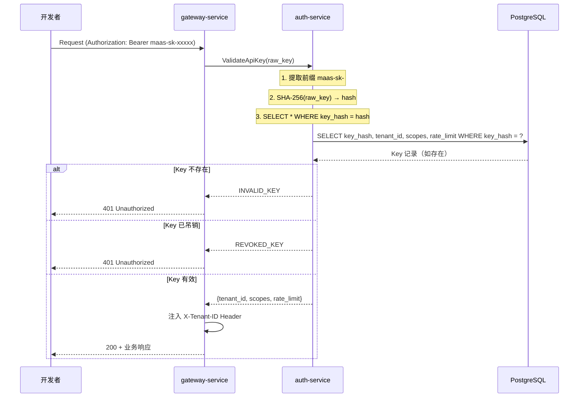
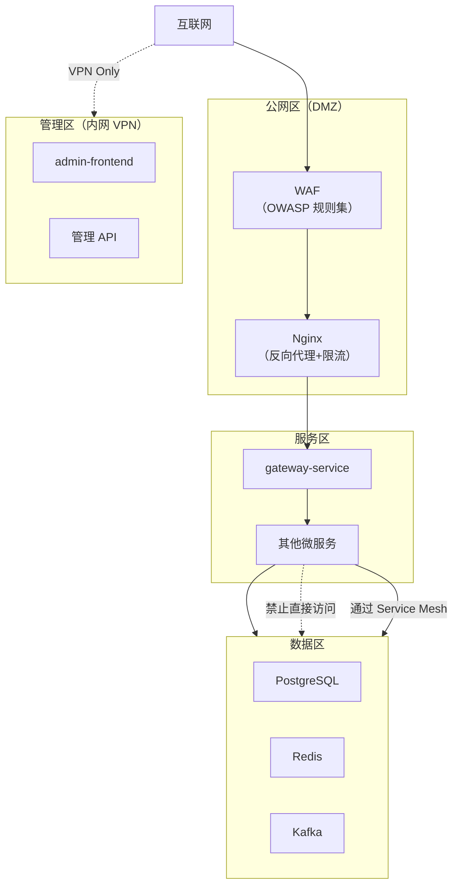
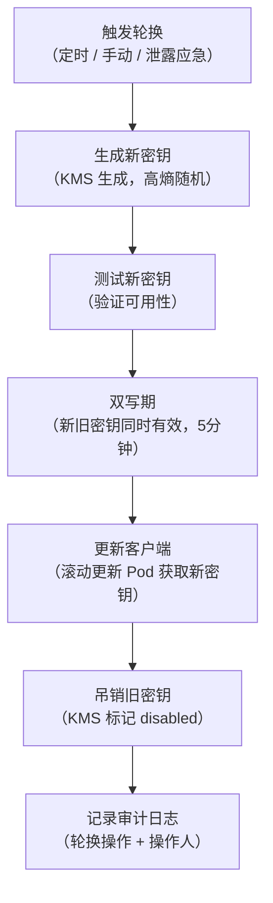
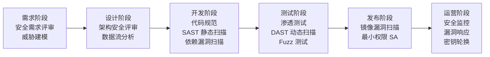

# 安全设计文档

**文档版本：** V1.0  
**编写日期：** 2026年05月14日  
**密级：** 内部保密  
**负责人：** 安全架构师 + 后端负责人  
**审批人：** 技术总监

---

## 1. 安全目标与原则

### 1.1 安全目标

| 目标 | 说明 |
|------|------|
| 机密性（Confidentiality） | 租户数据、厂商 API Key、用户凭证不被未授权访问 |
| 完整性（Integrity） | 计费数据、审计日志不被篡改 |
| 可用性（Availability） | 在攻击（DDoS、爬虫）下维持平台可用性 |
| 不可抵赖性 | 所有管理操作留有审计日志，操作者不可否认 |

### 1.2 安全设计原则

- **最小权限**：每个服务、角色只拥有完成任务所需的最低权限
- **纵深防御**：网络层 → 应用层 → 数据层，多层安全控制
- **安全默认**：新功能默认关闭、需主动开启（Secure by Default）
- **快速失败**：认证失败立即拒绝，不透露多余错误信息
- **明文零存储**：API Key、厂商密钥、密码均不以明文存入数据库

---

## 2. 威胁建模（STRIDE）

### 2.1 威胁识别



### 2.2 威胁缓解措施

| 威胁 | 具体场景 | 缓解措施 | 负责组件 |
|------|---------|---------|---------|
| **Spoofing** | 伪造 API Key | SHA-256 Hash 对比，Key 前缀快速路由 | auth-service |
| **Spoofing** | JWT Token 伪造 | RS256 非对称签名，公钥验证 | auth-service |
| **Tampering** | 篡改计费记录 | Kafka 消息签名 + 幂等消费，DB 审计字段 | billing-service |
| **Repudiation** | 否认管理操作 | 全量审计日志，操作人 IP + UserAgent 记录 | audit |
| **Info Disclosure** | 厂商 Key 泄露 | KMS 加密存储，前端 masked 显示，MFA 解锁 | adapter-service + KMS |
| **Info Disclosure** | 错误信息泄露 | 统一错误响应，不透露内部细节 | gateway-service |
| **DoS** | API 刷量 | 多级限流（IP/ApiKey/Tenant/Global） | gateway-service |
| **DoS** | DDoS | WAF + Nginx 限流 + CDN | 基础设施层 |
| **Elevation** | 越权访问租户数据 | 所有 DB 查询携带 tenant_id 过滤，Casbin RBAC | 所有服务 |

---

## 3. 认证与授权

### 3.1 API Key 安全设计



**API Key 规范：**

```
格式：maas-sk-{base62随机串，32字节}
示例：maas-sk-a8Kz3mNpQrXvYwZe9bCdEfGh7jLiMoTu

存储规则：
- 明文：仅在创建时返回一次，之后无法再次获取
- 数据库：存储 SHA-256(raw_key)
- 前缀：maas-sk- 用于路由到 auth-service（避免全量扫描）
- 最小长度：32 字节熵 ≈ 192 bits，抵抗暴力破解
```

### 3.2 JWT 设计

```json
// Header
{ "alg": "RS256", "typ": "JWT" }

// Payload
{
  "sub": "user_id_xxx",
  "tenant_id": "t_001",
  "roles": ["developer"],
  "scopes": ["api:call", "key:read"],
  "iat": 1715673600,
  "exp": 1715760000,     // 24小时
  "jti": "unique-jwt-id" // 防重放
}
```

**JWT 密钥管理：**
- 签名算法：RS256（非对称）
- 私钥：存储于 KMS，每 90 天轮换
- 公钥：通过 `/.well-known/jwks.json` 发布
- 黑名单：吊销的 JWT jti 存入 Redis Set（TTL = 剩余有效期）

### 3.3 RBAC 权限矩阵

```
Casbin 策略（domain-scoped）：

p, developer,     {tenant_id}, /v1/chat/completions, POST, allow
p, developer,     {tenant_id}, /v1/keys/*,            GET,  allow
p, developer,     {tenant_id}, /v1/keys,              POST, allow
p, project_admin, {tenant_id}, /v1/keys/*,            *,    allow
p, project_admin, {tenant_id}, /v1/routing/*,         *,    allow
p, project_admin, {tenant_id}, /v1/billing/*,         GET,  allow
p, platform_admin, *,          /admin/v1/*,           *,    allow
p, auditor,        *,          /admin/v1/audit/*,     GET,  allow
p, auditor,        *,          /admin/v1/billing/*,   GET,  allow
```

---

## 4. 数据安全

### 4.1 数据分类

| 级别 | 数据类型 | 示例 | 保护措施 |
|------|---------|------|---------|
| **L0 - 公开** | 产品文档、模型列表 | 模型名称、功能描述 | 无需额外保护 |
| **L1 - 内部** | 使用统计、聚合指标 | 平台日 QPS 趋势 | 需认证访问 |
| **L2 - 机密** | 用户数据、API 调用日志 | 请求内容、账单明细 | 加密存储、租户隔离 |
| **L3 - 绝密** | 厂商 API Key、签名私钥 | OpenAI Key、JWT 私钥 | KMS 加密、MFA 访问 |

### 4.2 敏感数据处理规范

```go
// ❌ 错误：明文日志输出
log.Infof("Using vendor key: %s", vendorKey)

// ✅ 正确：脱敏后输出
log.Infof("Using vendor key: %s****%s", vendorKey[:4], vendorKey[len(vendorKey)-4:])

// ❌ 错误：API Key 存明文
db.Save(&ApiKey{Key: rawKey})

// ✅ 正确：存 Hash
hash := sha256.Sum256([]byte(rawKey))
db.Save(&ApiKey{KeyHash: hex.EncodeToString(hash[:])})

// 请求体中的敏感字段，日志中 mask 处理
type LogSafeRequest struct {
    Model    string `json:"model"`
    Messages []struct {
        Role    string `json:"role"`
        Content string `json:"content"` // 日志中截断到 100 字符
    }
}
```

### 4.3 传输安全

| 链路 | 协议 | 证书管理 |
|------|------|---------|
| 外部 HTTPS | TLS 1.3，禁用 TLS 1.0/1.1 | Let's Encrypt / 企业证书，自动续期 |
| 服务间通信 | Istio mTLS（强制模式） | Istio CA 自动颁发，24h 轮换 |
| 数据库连接 | PostgreSQL TLS + 证书认证 | K8s Secret 挂载 |
| Redis 连接 | Redis TLS + AUTH | K8s Secret 挂载 |

### 4.4 存储加密

```
PostgreSQL:
- 磁盘级：Kubernetes PV 使用加密 StorageClass（AES-256）
- 字段级：vendor_keys 表的 encrypted_key 列由 KMS 加密（信封加密）

KMS 信封加密流程：
1. 明文 vendor_key → KMS 加密 → ciphertext
2. ciphertext 存入 DB
3. 使用时：ciphertext → KMS 解密 → 明文（在内存中，不落盘）
4. KMS 主密钥每年轮换

Redis：
- 敏感缓存值（如 session token）使用 AES-GCM 加密后存储
- Redis AUTH 密码 + TLS 传输
```

---

## 5. 网络安全

### 5.1 网络分区



### 5.2 WAF 规则

```yaml
# WAF 关键规则配置
rules:
  - id: SQLI-001
    desc: SQL 注入防护
    action: block
    patterns: ["' OR 1=1", "UNION SELECT", "DROP TABLE"]

  - id: XSS-001
    desc: XSS 防护
    action: block
    patterns: ["<script>", "javascript:", "onerror="]

  - id: PATH-001
    desc: 路径遍历防护
    action: block
    patterns: ["../", "..\\", "%2e%2e"]

  - id: RATELIMIT-001
    desc: 单 IP 速率限制
    threshold: 1000req/min
    action: throttle

  - id: BOTNET-001
    desc: 恶意 IP 黑名单
    source: threat_intelligence_feed
    action: block
```

---

## 6. API 安全

### 6.1 输入验证

```go
// gateway-service 输入验证层
type ChatRequest struct {
    Model    string    `json:"model" validate:"required,max=100,alphanum_dash"`
    Messages []Message `json:"messages" validate:"required,min=1,max=100,dive"`
    MaxTokens *int     `json:"max_tokens" validate:"omitempty,min=1,max=32768"`
    Stream   bool      `json:"stream"`
}

type Message struct {
    Role    string `json:"role" validate:"required,oneof=system user assistant"`
    Content string `json:"content" validate:"required,min=1,max=65536"` // 64KB 上限
}

// 验证失败返回标准错误，不泄露内部细节
func validateRequest(req *ChatRequest) error {
    if err := validate.Struct(req); err != nil {
        return ErrInvalidRequest // 统一错误，不返回具体字段信息给外部
    }
    return nil
}
```

### 6.2 安全响应头

```nginx
# gateway/admin 均需添加
add_header X-Content-Type-Options "nosniff" always;
add_header X-Frame-Options "DENY" always;
add_header X-XSS-Protection "1; mode=block" always;
add_header Referrer-Policy "strict-origin-when-cross-origin" always;
add_header Strict-Transport-Security "max-age=31536000; includeSubDomains" always;

# 不暴露服务器信息
server_tokens off;
proxy_hide_header X-Powered-By;
proxy_hide_header Server;
```

### 6.3 SSRF 防护

```go
// adapter-service 调用外部厂商 API 时需校验目标 URL
var allowedVendorDomains = map[string]bool{
    "api.openai.com":           true,
    "api.anthropic.com":        true,
    "dashscope.aliyuncs.com":   true,
    "aip.baidubce.com":         true,
    "open.bigmodel.cn":         true,
}

func validateVendorURL(rawURL string) error {
    u, err := url.Parse(rawURL)
    if err != nil || !allowedVendorDomains[u.Host] {
        return ErrUntrustedVendorURL
    }
    if u.Scheme != "https" {
        return ErrInsecureScheme
    }
    return nil
}
```

---

## 7. 密钥管理

### 7.1 密钥清单

| 密钥类型 | 存储位置 | 轮换周期 | 访问控制 |
|---------|---------|---------|---------|
| JWT 签名私钥 | KMS | 90 天 | auth-service 服务账号 |
| 厂商 API Key | KMS（信封加密）→ DB | 按需/每年 | adapter-service + MFA 管理员 |
| DB 连接密码 | K8s Secret（加密 etcd） | 180 天 | 对应微服务 ServiceAccount |
| Redis AUTH 密码 | K8s Secret | 180 天 | 对应微服务 ServiceAccount |
| mTLS 证书 | Istio CA | 24 小时（自动） | Istio 自动管理 |
| 管理员登录密码 | bcrypt(cost=12) in DB | 强制 90 天 | 个人账号 |

### 7.2 密钥轮换流程



---

## 8. 等保 2.0 合规映射

| 等保控制项 | 级别 | 实现方式 | 状态 |
|-----------|------|---------|------|
| 身份鉴别 | 三级 | API Key SHA-256 + JWT RS256 + MFA（管理员） | ✅ |
| 访问控制 | 三级 | Casbin RBAC + tenant_id 行级隔离 | ✅ |
| 安全审计 | 三级 | 全量操作审计日志，不可删除，保留 180 天 | ✅ |
| 入侵防范 | 三级 | WAF + 异常行为检测 + 速率限制 | ✅ |
| 数据完整性 | 三级 | Kafka 消息签名 + DB 约束 | ✅ |
| 数据保密性 | 三级 | TLS 1.3 传输 + AES-256 存储加密 | ✅ |
| 个人信息保护 | 三级 | 数据最小化 + 留存策略（见数据合规文档） | ✅ |
| 网络架构安全 | 三级 | Istio mTLS + 网络分区 + 防火墙策略 | ✅ |

---

## 9. 安全开发生命周期（SDL）



### 9.1 CI/CD 安全检查项

```yaml
# .gitlab-ci.yml 安全流水线
security:
  stage: security
  parallel:
    - job: sast
      script:
        - gosec ./...                    # Go SAST
        - bandit -r . -l                 # Python SAST
        - semgrep --config=auto .        # 通用规则

    - job: dependency-check
      script:
        - go list -json -m all | nancy sleuth  # Go 依赖漏洞
        - pip-audit                              # Python 依赖漏洞
        - npm audit --audit-level=high           # Node 依赖漏洞

    - job: container-scan
      script:
        - trivy image --exit-code 1 --severity HIGH,CRITICAL $IMAGE
```

### 9.2 渗透测试范围

| 测试项 | 频率 | 工具/方式 |
|-------|------|---------|
| OWASP Top 10 | 每次大版本发布前 | OWASP ZAP + 手工 |
| API 权限越权 | 每次大版本发布前 | 手工 + 自动化脚本 |
| 注入测试（SQL/命令） | 每次大版本发布前 | SQLMap + 手工 |
| 密钥泄露扫描 | 每次提交（CI） | git-secrets + TruffleHog |
| 容器逃逸 | 每季度 | kube-bench + 手工 |

---

## 10. 安全事件响应

### 10.1 响应级别

| 级别 | 事件类型 | 响应时间 | 通知范围 |
|------|---------|---------|---------|
| **P0 - 紧急** | 厂商 Key 泄露、数据大规模泄露 | 15分钟内 | 安全团队 + CTO + 法务 |
| **P1 - 严重** | 认证绕过、SQL注入被利用 | 30分钟内 | 安全团队 + 技术负责人 |
| **P2 - 重要** | DDoS攻击、暴力破解 | 2小时内 | 安全团队 + SRE |
| **P3 - 一般** | 异常扫描、低危漏洞 | 24小时内 | 安全团队 |

### 10.2 密钥泄露应急响应（P0）

```
T+0min   发现泄露（告警 / 用户报告 / 自动扫描）
T+5min   立即在 KMS 中吊销泄露密钥
T+10min  评估泄露范围（日志分析，哪些 Key 被哪些 IP 使用）
T+15min  通知受影响租户，引导重新生成 Key
T+30min  全量审计泄露期间的 API 调用记录
T+60min  出具初步影响评估报告
T+24h    完成根因分析，出具 PIR（事后分析报告）
```

---

**变更历史**

| 版本 | 日期 | 说明 | 修改人 |
|------|------|------|--------|
| V1.0 | 2026-05-14 | 初稿 | 安全架构师 |
