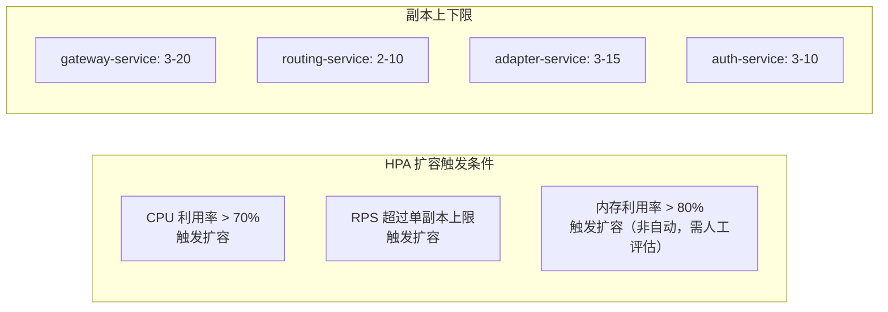

# 容量规划文档

**文档版本：** V1.0  
**编写日期：** 2026年05月14日  
**规划周期：** 2026年Q3 ~ 2027年Q2（MVP 上线后 12 个月）  
**负责人：** SRE 负责人 + 技术负责人

---

## 1. 规划目标与假设

### 1.1 规划目标

- 确保 MVP 上线（2026-09-01）时资源充足，支撑初期用户负载
- 制定明确的扩容触发阈值，避免资源不足导致 SLA 违约
- 提供 12 个月资源成本估算，支持预算决策

### 1.2 增长假设

| 时间点 | 活跃租户数 | 日均 API 请求量 | 日均 Token 消耗 | 备注 |
|--------|-----------|---------------|---------------|------|
| 2026-09（GA） | 50 | 500,000 | 2.5 亿 | MVP 上线 |
| 2026-12（Q4末） | 200 | 3,000,000 | 15 亿 | 推广期 |
| 2027-03（Q1末） | 500 | 10,000,000 | 50 亿 | 规模增长 |
| 2027-06（Q2末） | 1,000 | 30,000,000 | 150 亿 | 稳定增长 |

**增长率假设：** 前 6 个月月均增长 60%，之后稳定在 20-30%

---

## 2. 计算资源规划

### 2.1 微服务资源基线（单副本）

| 服务 | CPU Request | CPU Limit | Memory Request | Memory Limit | 初始副本数 |
|------|------------|----------|---------------|-------------|-----------|
| gateway-service | 500m | 2000m | 256Mi | 1Gi | 3 |
| routing-service | 200m | 1000m | 128Mi | 512Mi | 2 |
| adapter-service | 500m | 2000m | 256Mi | 1Gi | 3 |
| model-service | 100m | 500m | 128Mi | 512Mi | 2 |
| billing-service | 200m | 1000m | 256Mi | 1Gi | 2 |
| auth-service | 300m | 1000m | 128Mi | 512Mi | 3 |
| cache-service | 200m | 1000m | 512Mi | 2Gi | 2 |
| monitor-service | 200m | 500m | 256Mi | 1Gi | 2 |
| notification-service | 100m | 500m | 128Mi | 512Mi | 2 |
| finetune-service | 200m | 1000m | 512Mi | 2Gi | 1 |
| console-frontend | 50m | 200m | 64Mi | 128Mi | 2 |
| admin-frontend | 50m | 200m | 64Mi | 128Mi | 2 |

### 2.2 HPA 扩容策略



| 服务 | 最小副本 | 最大副本 | 扩容触发（CPU） | 单副本峰值 RPS |
|------|---------|---------|--------------|-------------|
| gateway-service | 3 | 20 | 70% | 500 RPS |
| routing-service | 2 | 10 | 70% | 2000 RPS |
| adapter-service | 3 | 15 | 70% | 200 RPS（含厂商调用等待） |
| auth-service | 3 | 10 | 70% | 5000 RPS（缓存命中后） |
| cache-service | 2 | 8 | 70% | 1000 RPS |

### 2.3 K8s 节点规划

```
生产环境节点配置：

API 处理节点（3 AZ 各 3 节点）：
  机型：8C / 32Gi
  数量：9 节点（初期）→ 最大 30 节点（按需扩展）
  用途：gateway / routing / adapter / auth / cache 等核心服务

GPU 推理节点（2 AZ）：
  机型：NVIDIA A100 80GB × 8
  数量：2 节点（初期）→ 最大 8 节点
  用途：自托管模型推理（vLLM）+ 精调作业

GPU 精调节点（昇腾，可选）：
  机型：昇腾 910B × 8
  数量：1 节点（按需添加）
  用途：国产模型精调（Qwen/GLM）

数据节点（3 AZ 各 2 节点）：
  机型：16C / 64Gi / 2TB SSD
  数量：6 节点
  用途：PostgreSQL / Kafka / Redis / Milvus
```

---

## 3. 存储容量规划

### 3.1 PostgreSQL 存储估算

```
数据增长估算：

auth schema（用户/租户/API Key）：
  - 每租户约 10 个 API Key，每 Key 记录 ~1KB
  - 1000 租户 × 10 Key × 1KB ≈ 10MB（极小）

billing schema（账单/账目明细）：
  - 每次 API 调用产生 1 条账目记录 ~500B
  - 日均 3,000,000 请求 × 500B ≈ 1.5GB/天
  - 按月归档策略：热数据保留 12 个月 ≈ 548GB/年

routing schema（路由策略/端点）：
  - 约 1,000 个端点配置，<100MB

总 PostgreSQL 存储规划：
  初期（GA）：1TB SSD × 3（含副本）
  12 个月后：2TB SSD × 3（需扩容）
  扩容触发：磁盘使用率 > 70%
```

### 3.2 Elasticsearch 存储估算

```
API 访问日志：
  - 每条日志 ~2KB（含 headers、状态码、token 数量，不含 Prompt）
  - 日均 3,000,000 条 × 2KB ≈ 6GB/天
  - 保留 90 天 ≈ 540GB

监控日志（服务日志）：
  - 约 1GB/天
  - 保留 30 天 ≈ 30GB

总 ES 存储规划：
  初期：500GB SSD（3 节点，单节点 ~167GB）
  12 个月增长后：2TB SSD × 3 节点
  索引策略：按天创建索引，超过 90 天自动 Delete
```

### 3.3 Redis 存储估算

```
缓存数据：
  - API Key 缓存：50,000 个 Key × 200B = 10MB
  - 限流计数器：10,000 租户 × 10 个维度 × 100B = 10MB
  - 语义缓存元数据（命中映射）：~100MB

Milvus 向量存储：
  - bge-m3 embedding：1024 维 × 4 bytes = 4KB/向量
  - 缓存语义条目预估：100,000 条 × 4KB ≈ 400MB

Redis Cluster 规划：
  初期：6 节点（3 主 3 从）× 32Gi = 192Gi 总容量
  实际使用率预计 < 10%，空间充足
```

### 3.4 MinIO / OSS 对象存储

```
精调数据集：
  - 每次精调上传数据集 ~1GB
  - 每月约 50 次精调作业 = 50GB/月
  - 保留 6 个月 = 300GB

精调模型权重：
  - LoRA 增量权重 ~100MB/模型
  - 100 个精调模型 = 10GB

企业认证文件（营业执照等）：
  - ~10MB/租户 × 1000 租户 = 10GB

总对象存储规划：
  初期：2TB（含冗余）
  12 个月后：10TB
```

---

## 4. 网络带宽规划

### 4.1 出口带宽估算

```
API 请求/响应流量：
  - 非流式：平均请求 1KB + 响应 2KB = 3KB/请求
  - 流式：平均传输 5KB（SSE 分片）
  - 比例：流式 70% / 非流式 30%

峰值 QPS 3,000 时：
  3,000 × (0.7×5KB + 0.3×3KB) ≈ 13.5MB/s ≈ 108Mbps

厂商 API 调用（入口带宽）：
  等量，约 108Mbps

GPU 模型推理（内部）：
  自托管模型响应，内网流量，不计出口带宽

出口带宽规划：
  初期（GA）：500Mbps 保底，1Gbps 峰值
  12 个月后：2Gbps 保底，5Gbps 峰值
```

---

## 5. 成本估算

### 5.1 基础设施月成本（阿里云 / 自建机房）

| 资源类型 | 规格 | 数量 | 单价（月） | 月成本 |
|---------|------|------|----------|--------|
| K8s 工作节点 | 8C32G | 9 节点 | ¥3,000 | ¥27,000 |
| GPU 节点（A100） | 8×A100 | 2 节点 | ¥80,000 | ¥160,000 |
| PostgreSQL HA | 16C64G × 3 | 1 套 | ¥15,000 | ¥15,000 |
| Redis Cluster | 6节点32Gi | 1 套 | ¥8,000 | ¥8,000 |
| Kafka Cluster | 3节点 16C32G | 1 套 | ¥10,000 | ¥10,000 |
| Elasticsearch | 3节点 8C32G | 1 套 | ¥9,000 | ¥9,000 |
| Milvus | 3节点 16G内存 | 1 套 | ¥6,000 | ¥6,000 |
| 对象存储（OSS） | 2TB | 1 | ¥500 | ¥500 |
| 出口带宽 | 500Mbps | 1 | ¥20,000 | ¥20,000 |
| **合计** | | | | **¥255,500/月** |

> 注：GPU 节点按需计费，精调高峰期额外增加 ¥80,000/月

### 5.2 成本随规模变化

| 阶段 | 月均请求量 | 预计月成本 | 主要驱动 |
|------|----------|----------|---------|
| GA（2026-09） | 500万 | ¥26万 | 基础设施 |
| 增长期（2026-12） | 3000万 | ¥45万 | 节点扩容 + 带宽 |
| 规模期（2027-06） | 3亿 | ¥120万 | GPU节点 + 带宽 + DB |

---

## 6. 扩容触发阈值与流程

### 6.1 自动扩容（HPA）

| 指标 | 触发阈值 | 动作 |
|------|---------|------|
| CPU 利用率 | > 70%（持续 2 分钟） | HPA 自动添加副本 |
| RPS/副本 | > 80% 上限 | HPA 基于自定义指标扩容 |

### 6.2 手动扩容触发阈值（SRE 介入）

| 资源 | 告警阈值 | 动作 |
|------|---------|------|
| K8s 节点 CPU | > 75%（集群整体，持续 15 分钟） | 添加新节点 |
| PostgreSQL 磁盘 | > 70% | 扩容 PV 或迁移归档数据 |
| Redis 内存 | > 70% | 扩容 Redis 节点 |
| ES 磁盘 | > 60% | 扩容 ES 节点或加速数据清理 |
| 出口带宽 | > 70%（持续 5 分钟） | 申请带宽升级 |

### 6.3 扩容操作流程

```
1. 监控告警触发 → SRE 评估是短暂峰值还是持续增长
2. 短暂峰值（< 30 分钟）：观察 HPA 自动处理，记录日志
3. 持续增长：
   a. 评估是否需要新增节点
   b. 提交扩容申请（附：当前资源利用率截图 + 预测）
   c. 审批（SRE 负责人批准）→ 执行扩容
   d. 验证扩容效果
   e. 更新容量规划文档
```

---

## 7. 容量规划复查计划

| 时间 | 复查内容 |
|------|---------|
| 每月 | 实际资源利用率 vs 预测，更新增长曲线 |
| 每季度 | 全面重新评估 12 个月预测，更新成本估算 |
| 重大业务事件前（大促/发布） | 压测评估峰值承载能力，提前准备资源 |

---

**变更历史**

| 版本 | 日期 | 说明 | 修改人 |
|------|------|------|--------|
| V1.0 | 2026-05-14 | 初稿 | SRE 负责人 |
