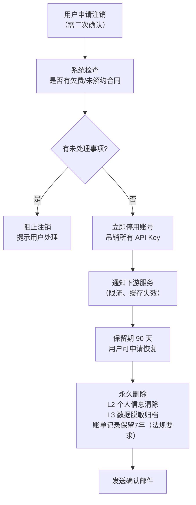

# 数据合规与隐私文档

**文档版本：** V1.0  
**编写日期：** 2026年05月14日  
**密级：** 内部保密  
**负责人：** 法务合规 + 后端负责人  
**适用范围：** MaaS 平台全服务

---

## 1. 概述

MaaS 平台作为企业级 API 服务平台，处理企业客户的 API 调用数据、账单数据及用户信息。本文档规定数据分类、收集原则、存储规范、留存策略、跨境传输、用户权利及合规要求。

---

## 2. 数据分类分级

### 2.1 分级定义

| 级别 | 名称 | 描述 | 示例 |
|------|------|------|------|
| **L0** | 公开数据 | 无需保护，可公开访问 | 产品文档、模型能力说明、公开价格 |
| **L1** | 内部数据 | 内部使用，不对外公开 | 聚合使用统计、平台运营指标 |
| **L2** | 敏感数据 | 含个人/企业业务信息，需保护 | 用户邮箱、企业名称、API 调用日志 |
| **L3** | 机密数据 | 高度敏感，泄露可导致严重损失 | 厂商 API Key、JWT 私钥、计费明细 |

### 2.2 数据资产清单

| 数据类型 | 级别 | 收集方式 | 存储位置 | 留存期限 |
|---------|------|---------|---------|---------|
| 用户账号信息（邮箱、手机） | L2 | 注册时填写 | auth DB | 账号注销后 90 天删除 |
| 企业认证信息（营业执照） | L2 | 企业认证时上传 | MinIO + DB | 合作关系终止后 3 年 |
| API 调用日志（请求/响应） | L2 | 自动采集 | Elasticsearch | 90 天后删除 |
| 用户 Prompt 内容 | L2 | API 请求 | 内存处理，不持久化 | 不存储（零留存） |
| 账单明细 | L3 | 自动生成 | billing DB | 7 年（财务合规要求） |
| 厂商 API Key | L3 | 管理员录入 | KMS + DB（加密） | 有效期内 + 删除后立即销毁 |
| 审计日志 | L1 | 自动记录 | PostgreSQL audit schema | 180 天 |
| 系统监控指标 | L1 | 自动采集 | VictoriaMetrics | 90 天 |

---

## 3. 个人信息收集原则

### 3.1 最小化原则

```
收集范围：
✅ 注册所需：邮箱（唯一标识）、密码（bcrypt存储）
✅ 企业功能：企业名称、联系方式（用于账单通知）
✅ 安全审计：登录 IP、操作时间戳

❌ 不收集：
- 用户 Prompt 中的个人信息（不持久化）
- 用户实际业务数据
- 位置信息
- 设备指纹（仅用于安全检测，不存储）
```

### 3.2 Prompt 零留存承诺

```
MaaS 平台对 API 请求内容（Prompt）的处理原则：

1. 转发处理：Prompt 内容仅在内存中传递给厂商 API，不写入任何持久化存储
2. 日志脱敏：访问日志中仅记录 token 数量，不记录 Prompt 文本
3. 语义缓存例外：若用户启用语义缓存，Prompt embedding 向量存储于 Milvus，
   但不存储原始 Prompt 文本，且用户可关闭此功能
4. 厂商数据协议：各厂商的数据留存政策由厂商自行负责，平台在对接文档中披露

// 日志记录示例（不含 Prompt 内容）
{
  "request_id": "req_xxx",
  "tenant_id": "t_001",
  "model": "gpt-4o",
  "input_tokens": 245,       // 只记录 token 数
  "output_tokens": 512,
  "latency_ms": 1234,
  "status": "success"
  // ❌ 不记录 messages 字段
}
```

---

## 4. 数据存储规范

### 4.1 数据库安全配置

```sql
-- 行级安全（RLS）确保租户数据隔离
ALTER TABLE api_keys ENABLE ROW LEVEL SECURITY;

CREATE POLICY tenant_isolation ON api_keys
    USING (tenant_id = current_setting('app.tenant_id')::uuid);

-- 审计触发器：记录所有 UPDATE/DELETE
CREATE OR REPLACE FUNCTION audit_trigger_func()
RETURNS TRIGGER AS $$
BEGIN
    INSERT INTO audit.data_changes (
        table_name, operation, old_data, new_data,
        changed_by, changed_at
    ) VALUES (
        TG_TABLE_NAME, TG_OP,
        row_to_json(OLD), row_to_json(NEW),
        current_setting('app.current_user'), now()
    );
    RETURN NEW;
END;
$$ LANGUAGE plpgsql;
```

### 4.2 数据留存与删除

```python
# 数据留存清理任务（定时执行）
class DataRetentionJob:

    RETENTION_POLICIES = {
        "api_call_logs":    timedelta(days=90),    # ES: 90天
        "audit_logs":       timedelta(days=180),   # PG: 180天
        "metrics":          timedelta(days=90),    # VM: 90天
        "billing_records":  timedelta(days=365*7), # PG: 7年
    }

    async def run_cleanup(self):
        for data_type, retention in self.RETENTION_POLICIES.items():
            cutoff = datetime.utcnow() - retention
            deleted = await self.delete_before(data_type, cutoff)
            logger.info(f"Cleaned {deleted} records from {data_type} before {cutoff}")
            # 记录清理操作到审计日志
            await self.audit_log(f"data_retention_cleanup: {data_type}, deleted={deleted}")
```

---

## 5. 用户权利（数据主体权利）

### 5.1 权利清单

| 权利 | 说明 | 实现方式 | 响应时限 |
|------|------|---------|---------|
| **查阅权** | 用户可查看平台持有的个人信息 | 控制台个人信息页 + 数据导出 | 即时 |
| **更正权** | 用户可更正错误的个人信息 | 控制台自助更改 | 即时 |
| **删除权** | 用户可申请删除账号及数据 | 控制台申请 + 人工审核（企业账号需审批） | 30天内 |
| **可携权** | 用户可导出自己的数据 | API 调用历史、账单数据 CSV 导出 | 即时 |
| **反对权** | 用户可反对特定数据处理 | 关闭语义缓存、关闭分析统计 | 即时 |

### 5.2 账号注销流程



---

## 6. 数据跨境传输

### 6.1 厂商 API 调用的数据出境

| 厂商 | 数据中心 | 是否跨境 | 协议依据 |
|------|---------|---------|---------|
| OpenAI | 美国 | ✅ 跨境 | SCCs（标准合同条款）+ 企业用户自行评估 |
| Anthropic | 美国 | ✅ 跨境 | SCCs |
| 通义千问（阿里） | 中国大陆 | ❌ 境内 | 国内法规适用 |
| 文心（百度） | 中国大陆 | ❌ 境内 | 国内法规适用 |
| GLM（智谱） | 中国大陆 | ❌ 境内 | 国内法规适用 |

**重要披露：** 用户选择调用境外厂商模型时，Prompt 内容将传输至境外服务器。平台在文档中明确告知此信息，由用户自行判断合规性。

### 6.2 合规披露模板

```
【数据出境告知】
当您使用以下模型时，您的请求内容（Prompt）将被发送至对应厂商的境外服务器：
- GPT-4o / GPT-4o-mini（OpenAI，美国）
- Claude 3.5（Anthropic，美国）

请确认您的业务数据符合所在地区的数据出境法规要求。
如需使用境内服务，请选择：通义千问、文心一言、GLM 系列模型。
```

---

## 7. 合规要求

### 7.1 《个人信息保护法》（PIPL）合规

| 条款 | 要求 | 平台实现 |
|------|------|---------|
| 第 6 条 | 处理目的明确、必要 | 隐私政策明确说明各数据用途 |
| 第 13 条 | 取得同意 | 注册时勾选协议，记录同意时间戳 |
| 第 17 条 | 信息告知义务 | 隐私政策 + Cookie 声明 |
| 第 45 条 | 查阅、复制权 | 控制台数据导出功能 |
| 第 47 条 | 删除权 | 账号注销流程 |
| 第 55 条 | 个人信息保护影响评估 | 新功能上线前完成 PIA |

### 7.2 《数据安全法》合规

| 要求 | 实现 |
|------|------|
| 数据分类分级 | 见第 2 节四级分类 |
| 重要数据识别 | 账单数据、用户认证数据纳入重要数据管理 |
| 数据出境安全评估 | 境外厂商调用披露 + 用户告知 |
| 数据安全监测 | monitor-service 异常检测 + 告警 |

---

## 8. 隐私设计检查清单

新功能上线前，开发者需完成以下检查：

```
□ 是否收集了超出功能需要的个人信息？
□ 收集的数据是否在隐私政策中有说明？
□ 数据是否有明确的留存期限和删除机制？
□ 是否涉及数据出境？是否已经过评估？
□ 日志中是否可能意外记录 Prompt 内容或个人信息？
□ 新数据库表是否启用了 RLS（行级安全）？
□ 第三方 SDK/依赖是否会收集额外数据？
□ 是否已更新隐私政策？
```

---

**变更历史**

| 版本 | 日期 | 说明 | 修改人 |
|------|------|------|--------|
| V1.0 | 2026-05-14 | 初稿 | 合规团队 |
