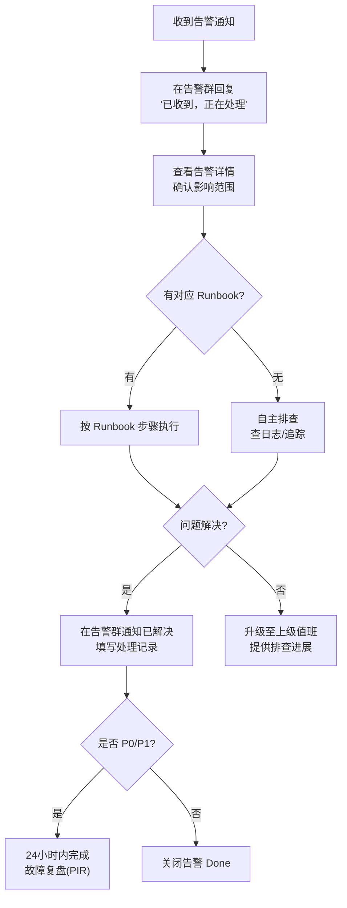

# MaaS平台 运维手册（SRE Runbook）

**文档版本：** V1.0  
**编写日期：** 2026年05月14日  
**适用角色：** SRE / 运维工程师 / 值班人员  
**密级：** 内部  
**更新方式：** 每次重大故障后 24 小时内更新

---

## 目录

1. [值班规范](#值班规范)
2. [常用命令速查](#常用命令速查)
3. [服务健康检查](#服务健康检查)
4. [告警处理流程](#告警处理流程)
5. [故障处理手册（按场景）](#故障处理手册)
6. [数据库运维操作](#数据库运维操作)
7. [Kafka 运维操作](#kafka-运维操作)
8. [扩缩容操作](#扩缩容操作)
9. [发布与回滚](#发布与回滚)
10. [故障复盘模板](#故障复盘模板)

---

## 1. 值班规范

### 1.1 值班职责

```
一线值班（L1）：
  - 监控告警首响应（5分钟内）
  - 执行标准 Runbook 处理步骤
  - 判断是否需要升级

二线值班（L2）：
  - 收到 L1 升级后 15 分钟内响应
  - 深度排查和修复
  - 跨团队协调

三线值班（L3 / 专家）：
  - 收到 L2 升级后 30 分钟内响应
  - 架构级问题处理
```

### 1.2 告警响应 SLA

| 告警级别 | 首次响应 | 止损目标 | 修复目标 |
|---------|---------|---------|---------|
| P0（服务不可用） | 5分钟 | 15分钟 | 1小时 |
| P1（严重降级） | 15分钟 | 30分钟 | 4小时 |
| P2（部分影响） | 30分钟 | 2小时 | 24小时 |
| P3（轻微异常） | 4小时 | 24小时 | 72小时 |

### 1.3 通知升级链路

```
P0: 
  0min  → 通知一线值班 + 钉钉告警群
  5min  → 未响应则升级至二线值班
  15min → 未止损则升级至 CTO/技术负责人 + 电话呼叫

P1:
  0min  → 钉钉告警群通知一线
  15min → 未响应则升级二线

P2/P3:
  仅钉钉群通知，无自动升级
```

---

## 2. 常用命令速查

### 2.1 K8s 基础操作

```bash
# 查看所有命名空间的 Pod 状态
kubectl get pods -A | grep -v Running | grep -v Completed

# 查看某服务的 Pod 日志（最近100行）
kubectl logs -n maas-core deployment/gateway-service --tail=100 -f

# 查看 Pod 事件（排查 CrashLoop 原因）
kubectl describe pod -n maas-core <pod-name>

# 进入 Pod 排查
kubectl exec -it -n maas-core deployment/routing-service -- /bin/sh

# 强制重启某服务
kubectl rollout restart deployment/gateway-service -n maas-gateway

# 查看服务 HPA 状态
kubectl get hpa -n maas-core

# 查看资源使用（需要 metrics-server）
kubectl top pods -n maas-core --sort-by=cpu
```

### 2.2 快速健康检查

```bash
# 检查所有 MaaS 服务 Pod 是否全部 Running
kubectl get pods -n maas-gateway maas-core maas-frontend

# 检查服务 Endpoint
kubectl get endpoints -n maas-core

# 直接调用 API 健康检查
curl -sf https://api.maas-platform.com/healthz | jq .

# 检查 Kafka 消费者延迟
kubectl exec -n maas-infra kafka-0 -- kafka-consumer-groups.sh \
  --bootstrap-server localhost:9092 \
  --describe --group billing-consumers

# 检查 Redis 集群状态
kubectl exec -n maas-infra redis-cluster-0 -- redis-cli cluster info
```

### 2.3 日志查询（Kibana 等效 ES 查询）

```bash
# 查询近5分钟错误日志
curl -X GET "http://elasticsearch:9200/maas-logs-*/_search" -H 'Content-Type: application/json' -d '{
  "query": {
    "bool": {
      "must": [
        {"range": {"@timestamp": {"gte": "now-5m"}}},
        {"term": {"level": "error"}}
      ]
    }
  },
  "sort": [{"@timestamp": {"order": "desc"}}],
  "size": 50
}'

# 查询特定 request_id 的完整链路日志
# (在 Jaeger UI 中搜索 TraceID 更方便)
```

---

## 3. 服务健康检查

### 3.1 健康检查端点列表

| 服务 | 健康检查 URL | 预期响应 |
|------|------------|---------|
| gateway-service | `GET /healthz` | `{"status":"ok","version":"1.x.x"}` |
| routing-service | `GET /healthz` | `{"status":"ok"}` |
| adapter-service | `GET /healthz` | `{"status":"ok"}` |
| auth-service | `GET /healthz` | `{"status":"ok"}` |
| billing-service | `GET /healthz` | `{"status":"ok","kafka_lag":N}` |
| monitor-service | `GET /healthz` | `{"status":"ok"}` |
| 全平台 API | `GET /v1/health` | HTTP 200 |

### 3.2 依赖服务检查

```bash
# PostgreSQL 主库可写
kubectl exec -n maas-infra postgres-master-0 -- psql -U maas -c "SELECT 1"

# Redis Cluster 可写
kubectl exec -n maas-infra redis-cluster-0 -- redis-cli -c SET test:health ok EX 10

# Kafka 可生产
kubectl exec -n maas-infra kafka-0 -- kafka-console-producer.sh \
  --broker-list localhost:9092 --topic maas.health.check <<< "ping"

# Elasticsearch 集群健康
curl -sf http://elasticsearch:9200/_cluster/health | jq .status
```

---

## 4. 告警处理流程



---

## 5. 故障处理手册

### 5.1 场景：API 请求错误率激增（P0）

**告警信息：** `GatewayHighErrorRate: error_rate=8.5% > 5%`

```
Step 1: 快速定位错误类型
  kubectl logs -n maas-gateway deployment/gateway-service --tail=200 \
    | grep '"level":"error"' | jq '.error_code' | sort | uniq -c | sort -rn

Step 2: 判断错误来源
  a) 如果错误集中在 401/403 → 检查 auth-service 是否正常
     kubectl get pods -n maas-core | grep auth

  b) 如果错误集中在 429 → 检查上游模型限流
     kubectl logs -n maas-core deployment/adapter-service --tail=200 \
       | grep "rate_limit\|429"
     → 执行: 临时降低该模型路由权重，切换到备用模型

  c) 如果错误集中在 502/503 → 检查 routing/adapter 服务
     kubectl describe pods -n maas-core | grep -A5 "Warning"

  d) 如果错误集中在 504 → 检查上游模型超时
     → 临时增大超时配置，或执行模型 Failover

Step 3: 临时止损（切流量到备用模型）
  kubectl edit configmap routing-policy -n maas-core
  # 将故障模型权重设为 0，确认生效后错误率下降

Step 4: 通知用户
  # 如果影响面广，通过控制台发布服务状态通知

Step 5: 根因排查
  # 完成止损后，用 Jaeger 追踪异常 TraceID
  # 访问 https://jaeger.maas-platform.internal
```

---

### 5.2 场景：Kafka 消费延迟积压（P1）

**告警信息：** `BillingLag: lag=50000 > 10000`

```
Step 1: 查看消费者组状态
  kubectl exec -n maas-infra kafka-0 -- kafka-consumer-groups.sh \
    --bootstrap-server localhost:9092 \
    --describe --group billing-consumers

Step 2: 检查 billing-service 是否正常
  kubectl get pods -n maas-core | grep billing
  kubectl logs -n maas-core deployment/billing-service --tail=100

Step 3a: 如果是服务 Crash，重启
  kubectl rollout restart deployment/billing-service -n maas-core

Step 3b: 如果是消费速度慢（CPU 瓶颈）
  # 手动扩容消费者
  kubectl scale deployment billing-service -n maas-core --replicas=6

Step 3c: 如果是数据库慢查询
  # 连接到账单专库
  kubectl exec -n maas-infra postgres-billing-0 -- psql -U billing \
    -c "SELECT pid, state, query, age(clock_timestamp(), query_start) AS duration
        FROM pg_stat_activity
        WHERE query != '<idle>'
        ORDER BY duration DESC LIMIT 10;"
  # 如有慢查询，CANCEL 或 KILL 相关进程

Step 4: 等待积压消化，观察 lag 下降趋势
```

---

### 5.3 场景：PostgreSQL 主库故障

**告警信息：** `PostgresDown` 或 业务大量 DB 连接错误

```
Step 1: 确认主库状态
  kubectl get pods -n maas-infra | grep postgres

Step 2: 检查是否触发自动 Failover
  # 使用 Patroni（如果部署了）或手动触发
  kubectl exec -n maas-infra postgres-master-0 -- patronictl -c /etc/patroni.yml list

Step 3: 如果自动 Failover 未触发，手动 Failover
  kubectl exec -n maas-infra postgres-slave1-0 -- patronictl -c /etc/patroni.yml failover maas-cluster

Step 4: 更新应用连接配置（如使用 PgBouncer/Service，切换已自动完成）
  # 检查 K8s Service 是否指向新主库
  kubectl get endpoints -n maas-infra postgres-primary

Step 5: 确认各服务恢复正常
  # 观察错误率恢复

Step 6: 修复原主库（降为从库加入集群）
  # 联系 DBA 处理
```

---

### 5.4 场景：Redis Cluster 节点故障

**告警信息：** Redis 连接报错 / 缓存命中率骤降至 0

```
Step 1: 检查 Redis Cluster 状态
  kubectl exec -n maas-infra redis-cluster-0 -- redis-cli cluster info | grep cluster_state

Step 2: 检查哪些节点不可用
  kubectl exec -n maas-infra redis-cluster-0 -- redis-cli cluster nodes

Step 3: 如果是单节点故障（有从节点接管）
  # 等待自动 Failover（通常 30s 内完成）
  # 观察 cluster_state 恢复为 ok

Step 4: 如果多节点故障导致 cluster_state=fail
  # 执行紧急降级：将 cache-service 配置为 bypass 模式
  # 所有请求直接走上游模型（成本会上升，但服务不中断）
  kubectl set env deployment/cache-service CACHE_BYPASS=true -n maas-core

Step 5: 恢复 Redis 集群后，关闭 bypass 模式
  kubectl set env deployment/cache-service CACHE_BYPASS=false -n maas-core
```

---

### 5.5 场景：GPU 节点故障（精调任务失败）

```
Step 1: 检查 GPU 节点状态
  kubectl get nodes -l accelerator=nvidia --show-labels
  kubectl describe node <gpu-node-name> | grep -A10 "Conditions"

Step 2: 检查失败的精调任务
  kubectl get jobs -n maas-finetune | grep -v Complete
  kubectl logs -n maas-finetune job/<job-name> --tail=50

Step 3: 如果是 OOM（内存不足）
  # 通知用户减小 batch_size，重新提交

Step 4: 如果是节点硬件故障
  kubectl cordon <gpu-node-name>  # 标记为不可调度
  # 通知基础设施团队处理硬件

Step 5: 将挂起的精调任务重调度到其他 GPU 节点
  kubectl delete job <job-name> -n maas-finetune  # 删除卡住的 Job
  # 在控制台重新提交任务（finetune-service 会自动重建 Job）
```

---

## 6. 数据库运维操作

### 6.1 连接数管理

```sql
-- 查看当前连接数
SELECT count(*), state, application_name
FROM pg_stat_activity
GROUP BY state, application_name
ORDER BY count DESC;

-- 终止空闲超过10分钟的连接
SELECT pg_terminate_backend(pid)
FROM pg_stat_activity
WHERE state = 'idle'
  AND query_start < now() - interval '10 minutes'
  AND application_name != 'pgbouncer';
```

### 6.2 表分区维护（每月1日执行）

```sql
-- 创建下个月的分区（usage_records 表）
-- 示例：创建 2026年7月的分区
CREATE TABLE billing.usage_records_2026_07
PARTITION OF billing.usage_records
FOR VALUES FROM ('2026-07-01') TO ('2026-08-01');

-- 在新分区上创建索引
CREATE INDEX CONCURRENTLY idx_usage_records_2026_07_created_at
ON billing.usage_records_2026_07 (created_at);

-- 验证分区创建成功
SELECT tablename, pg_size_pretty(pg_total_relation_size(tablename::regclass))
FROM pg_tables
WHERE tablename LIKE 'usage_records_%'
ORDER BY tablename DESC LIMIT 5;
```

### 6.3 归档旧数据

```sql
-- 归档 90 天前的日志数据到 OSS（先导出再删除）
-- Step 1: 导出
\COPY (SELECT * FROM audit.operation_logs WHERE created_at < NOW() - INTERVAL '90 days')
TO PROGRAM 'gzip > /tmp/audit_logs_archive_$(date +%Y%m).csv.gz' CSV HEADER;

-- Step 2: 上传到 OSS（在 Shell 中执行）
-- mc cp /tmp/audit_logs_archive_*.csv.gz oss/maas-archive/audit-logs/

-- Step 3: 删除已归档数据
DELETE FROM audit.operation_logs WHERE created_at < NOW() - INTERVAL '90 days';
```

---

## 7. Kafka 运维操作

### 7.1 Topic 管理

```bash
# 查看所有 Topic
kubectl exec -n maas-infra kafka-0 -- kafka-topics.sh \
  --bootstrap-server localhost:9092 --list

# 查看 Topic 详情（分区/副本）
kubectl exec -n maas-infra kafka-0 -- kafka-topics.sh \
  --bootstrap-server localhost:9092 \
  --describe --topic maas.api.requests

# 查看 Topic 消息量（用于判断积压）
kubectl exec -n maas-infra kafka-0 -- kafka-log-dirs.sh \
  --bootstrap-server localhost:9092 \
  --topic-list maas.api.requests --describe
```

### 7.2 重置消费者 Offset（慎用）

```bash
# 将 billing-consumers 的 offset 重置到1小时前
# ⚠️ 注意：这会导致重复消费（billing-service 有幂等保护，相对安全）
kubectl exec -n maas-infra kafka-0 -- kafka-consumer-groups.sh \
  --bootstrap-server localhost:9092 \
  --group billing-consumers \
  --topic maas.api.requests \
  --reset-offsets \
  --to-datetime 2026-05-14T12:00:00.000 \
  --execute
```

---

## 8. 扩缩容操作

### 8.1 手动扩容（流量高峰）

```bash
# 紧急扩容 gateway-service（通常由 HPA 自动处理，手动覆盖）
kubectl scale deployment gateway-service -n maas-gateway --replicas=20

# 查看扩容是否完成（等待所有 Pod Ready）
kubectl rollout status deployment/gateway-service -n maas-gateway

# 高峰过后恢复（或让 HPA 自动缩容）
kubectl scale deployment gateway-service -n maas-gateway --replicas=5
```

### 8.2 HPA 配置参考

```yaml
apiVersion: autoscaling/v2
kind: HorizontalPodAutoscaler
metadata:
  name: gateway-service-hpa
  namespace: maas-gateway
spec:
  scaleTargetRef:
    apiVersion: apps/v1
    kind: Deployment
    name: gateway-service
  minReplicas: 3
  maxReplicas: 20
  metrics:
    - type: Resource
      resource:
        name: cpu
        target:
          type: Utilization
          averageUtilization: 70
  behavior:
    scaleUp:
      stabilizationWindowSeconds: 60    # 扩容冷却：1分钟
    scaleDown:
      stabilizationWindowSeconds: 300   # 缩容冷却：5分钟（防抖动）
```

---

## 9. 发布与回滚

### 9.1 标准发布流程（ArgoCD）

```bash
# 1. 查看 ArgoCD 应用状态
argocd app list

# 2. 同步到最新版本（正常情况下 ArgoCD 自动同步）
argocd app sync maas-gateway --prune

# 3. 查看发布进度
argocd app get maas-gateway

# 4. 金丝雀发布：先切5%流量观察
# 修改 Istio VirtualService weight: stable=95, canary=5
kubectl edit virtualservice gateway-service-vs -n maas-gateway
```

### 9.2 紧急回滚（30秒内完成）

```bash
# 方法1: ArgoCD 回滚到上一版本（推荐）
argocd app rollback maas-gateway

# 方法2: kubectl 直接回滚
kubectl rollout undo deployment/gateway-service -n maas-gateway

# 验证回滚完成
kubectl rollout status deployment/gateway-service -n maas-gateway

# 回滚后立即检查错误率是否恢复
# 访问 Grafana: https://grafana.maas-platform.internal/d/gateway
```

### 9.3 镜像版本管理

```bash
# 查看当前运行的镜像版本
kubectl get deployment -n maas-core -o jsonpath='{range .items[*]}{.metadata.name}{"\t"}{.spec.template.spec.containers[0].image}{"\n"}{end}'

# 手动指定版本部署（紧急降级时用）
kubectl set image deployment/gateway-service \
  gateway-service=registry.maas-platform.com/maas/gateway-service:v1.2.3 \
  -n maas-gateway
```

---

## 10. 故障复盘模板（PIR）

---

### 故障复盘报告

**事件标题：** [P?] [服务名] [故障简述]  
**故障时间：** 开始 YYYY-MM-DD HH:MM  结束 YYYY-MM-DD HH:MM  
**持续时长：** X 小时 Y 分钟  
**影响范围：** 受影响用户数/请求数/服务  
**严重程度：** P0 / P1 / P2  

---

#### 1. 故障摘要（2-3 句话）

简洁描述：发生了什么 → 影响了什么 → 如何解决的。

---

#### 2. 时间线

| 时间 | 事件 |
|------|------|
| HH:MM | 首次告警触发 |
| HH:MM | 值班人员确认 |
| HH:MM | 定位根因 |
| HH:MM | 执行修复操作 |
| HH:MM | 服务恢复正常 |
| HH:MM | 解除告警 |

---

#### 3. 根因分析（5-Why）

- **直接原因：** 表面上是什么触发了故障
- **Why 1：** 为什么会发生直接原因
- **Why 2：** 为什么...
- **Why 3：** ...
- **根本原因：** 最深层的原因

---

#### 4. 影响评估

- API 请求失败数：XX 次
- 受影响租户数：XX 个
- 估算营收影响：¥XX

---

#### 5. 改进措施

| 措施 | 类型 | 负责人 | 截止日期 |
|------|------|--------|---------|
| 增加 XX 监控告警 | 监控 | @XXX | YYYY-MM-DD |
| 添加 XX 自动恢复逻辑 | 工程 | @XXX | YYYY-MM-DD |
| 更新 Runbook XX 步骤 | 流程 | @XXX | YYYY-MM-DD |

---

#### 6. 值班工程师签名

主要处理人：___________  
复盘会议日期：___________

---

**变更历史**

| 版本 | 日期 | 说明 | 修改人 |
|------|------|------|--------|
| V1.0 | 2026-05-14 | 初稿 | DevOps 团队 |
