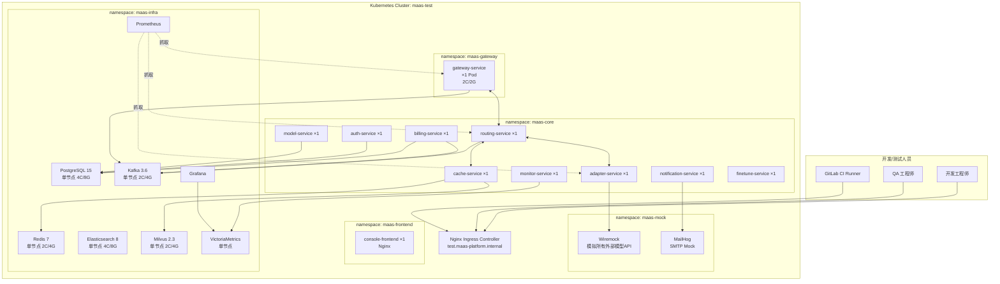
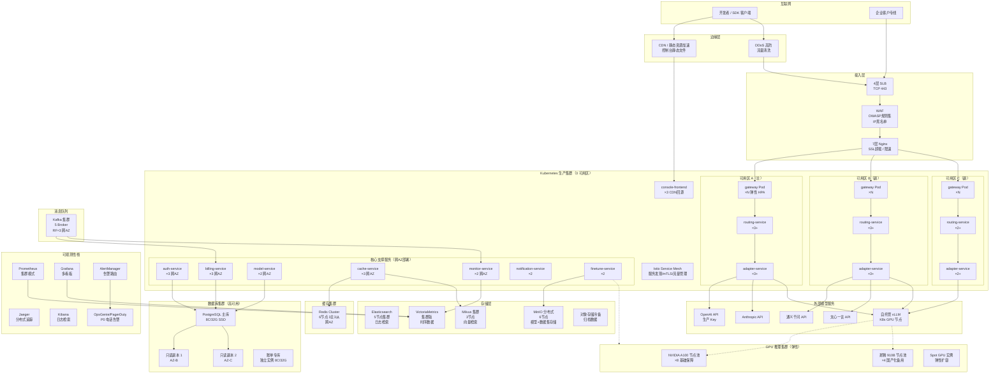
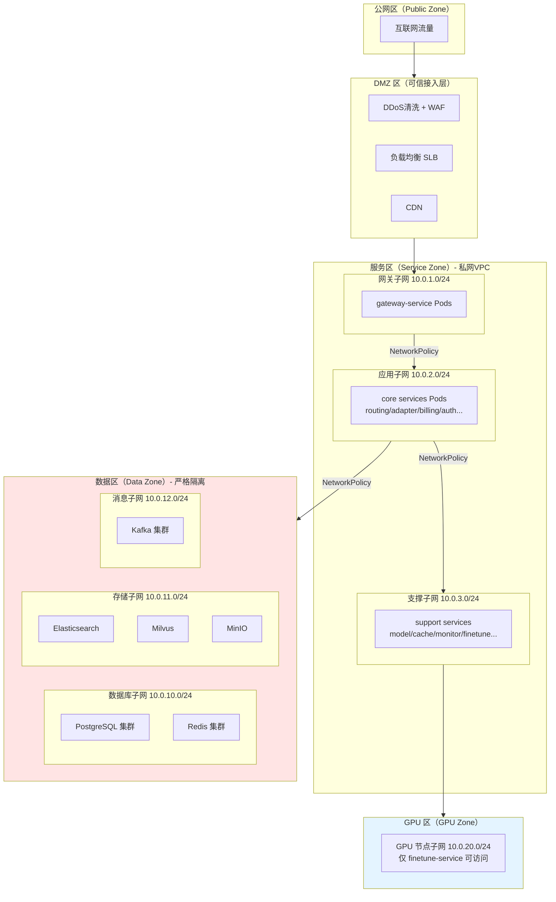
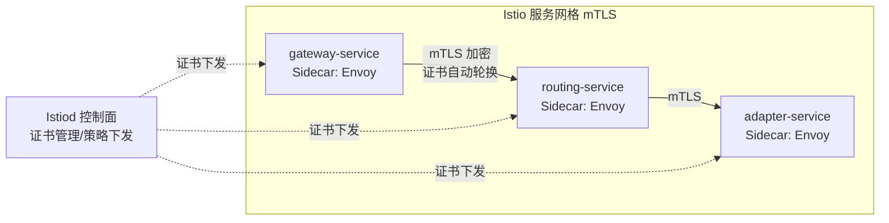
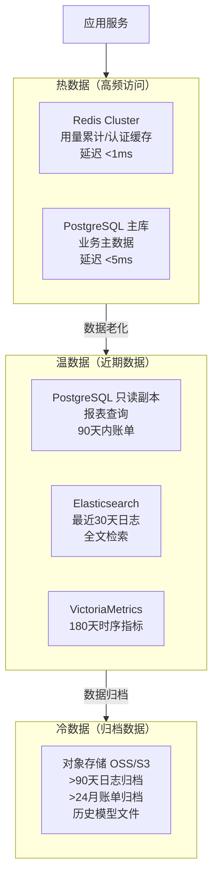
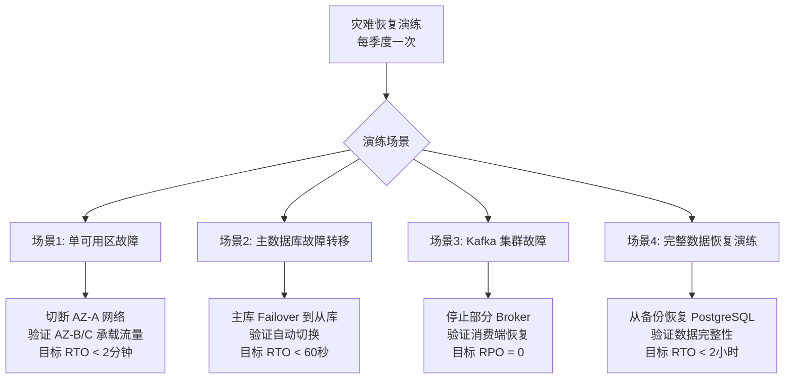
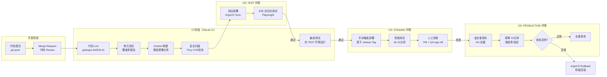

# MaaS平台 部署拓扑文档

**文档版本：** V1.0  
**编写日期：** 2026年05月14日  
**文档状态：** 初稿  
**关联文档：** 技术架构设计文档.md / 系统设计文档(HLD).md  
**DevOps Owner：** DevOps/SRE 团队  
**密级：** 内部

---

## 目录

1. [环境概述与对比](#环境概述与对比)
2. [TEST 测试环境拓扑](#test-测试环境拓扑)
3. [STAGING 预生产环境拓扑](#staging-预生产环境拓扑)
4. [PRODUCTION 生产环境拓扑](#production-生产环境拓扑)
5. [网络隔离设计](#网络隔离设计)
6. [存储规划](#存储规划)
7. [备份与灾难恢复](#备份与灾难恢复)
8. [发布流水线](#发布流水线)

---

## 1. 环境概述与对比

| 维度 | TEST 测试环境 | STAGING 预生产 | PRODUCTION 生产 |
|------|-------------|--------------|----------------|
| **用途** | QA 功能/集成测试 | 预发布验证，仿真生产 | 真实业务流量 |
| **K8s 集群** | 单集群，共享 namespace | 独立集群 | 多可用区集群（跨AZ） |
| **副本数** | 1 副本/服务 | 2 副本/服务 | 3-20 副本/服务（HPA） |
| **数据库** | 共享 PostgreSQL 实例 | 独立实例，生产数据脱敏镜像 | 主从集群，独立账单专库 |
| **外部模型API** | 全部 Mock（Wiremock） | 混合（部分真实API） | 真实 API |
| **GPU 节点** | 无（Mock推理延迟） | 2 × A100（精调测试用） | 弹性 GPU 节点池 |
| **监控** | 基础 Prometheus + Grafana | 完整监控栈 | 完整监控栈 + 值班告警 |
| **告警** | 仅写日志，不发通知 | 发送测试钉钉群 | 发送真实通知（P0电话） |
| **数据保留** | 7 天自动清理 | 30 天 | 按合规要求保留 |

---

## 2. TEST 测试环境拓扑

### 2.1 整体拓扑图



### 2.2 TEST 环境资源规格

| 组件 | CPU | 内存 | 存储 |
|------|-----|------|------|
| gateway-service | 0.5C | 512Mi | - |
| routing-service | 0.5C | 512Mi | - |
| adapter-service | 0.5C | 512Mi | - |
| auth-service | 0.5C | 256Mi | - |
| billing-service | 0.5C | 256Mi | - |
| model-service | 0.5C | 256Mi | - |
| cache-service | 0.5C | 512Mi | - |
| monitor-service | 0.5C | 256Mi | - |
| notification-service | 0.25C | 128Mi | - |
| finetune-service | 0.5C | 512Mi | - |
| PostgreSQL | 2C | 4Gi | 50GB SSD |
| Redis | 1C | 2Gi | - |
| Kafka | 2C | 4Gi | 50GB SSD |
| Elasticsearch | 2C | 4Gi | 100GB SSD |
| Milvus | 1C | 2Gi | 20GB SSD |
| **总计** | ~15C | ~22Gi | ~220GB |

### 2.3 访问地址

| 服务 | 地址 |
|------|------|
| API 端点 | `https://test-api.maas-platform.internal` |
| 控制台 | `https://test-console.maas-platform.internal` |
| Grafana | `https://test-grafana.maas-platform.internal` |
| Wiremock 管理 | `http://test-mock.maas-platform.internal:8080` |

---

## 3. STAGING 预生产环境拓扑

### 3.1 整体拓扑图

```mermaid
graph TD
    subgraph Internet["外网访问"]
        InternalTeam[内部团队\nVPN接入]
        LoadTest[压测机器\nk6 Runner]
    end

    subgraph LB_Staging["负载均衡层"]
        LB_S[4层 LB / SLB\nstaging.maas-platform.com]
        WAF_S[WAF\n简化配置]
    end

    subgraph K8s_Staging["Kubernetes Cluster: maas-staging（独立集群）"]
        direction TB

        subgraph Zone_A["可用区 A"]
            subgraph NS_GW_S["namespace: maas-gateway"]
                GW_S1[gateway-service Pod 1\n2C/2G]
                GW_S2[gateway-service Pod 2\n2C/2G]
            end
            subgraph NS_Core_S_A["namespace: maas-core (AZ-A)"]
                RS_S1[routing-service ×1\n1C/1G]
                AS_S1[adapter-service ×1\n1C/1G]
                BS_S1[billing-service ×1]
                AUTH_S1[auth-service ×1]
            end
        end

        subgraph Zone_B["可用区 B"]
            subgraph NS_Core_S_B["namespace: maas-core (AZ-B)"]
                RS_S2[routing-service ×1]
                AS_S2[adapter-service ×1]
                BS_S2[billing-service ×1]
                AUTH_S2[auth-service ×1]
            end
        end

        subgraph NS_Support_S["namespace: maas-support"]
            MS_S[model-service ×2]
            CS_S[cache-service ×2]
            MON_S[monitor-service ×2]
            NS_S[notification-service ×1]
            FS_S[finetune-service ×1]
        end

        subgraph NS_FE_S["namespace: maas-frontend"]
            FE_S[console-frontend ×2]
        end

        Ingress_S[Nginx Ingress Controller]
    end

    subgraph Infra_Staging["基础设施（独立实例）"]
        direction LR
        PG_S_Master[PostgreSQL 主\n4C/16G]
        PG_S_Slave[PostgreSQL 从\n只读副本]
        RD_S[Redis Cluster\n3主3从]
        KF_S[Kafka 集群\n3节点]
        ES_S[Elasticsearch\n2节点]
        MV_S[Milvus\n2节点]
        VM_S[VictoriaMetrics\n2节点]
        MinIO_S[MinIO 分布式\n3节点]
    end

    subgraph GPU_Staging["GPU 节点（小规格）"]
        GPU_S1[GPU Node 1\nA100×2]
    end

    subgraph External_Staging["外部服务（部分真实）"]
        OpenAI_Real[OpenAI API\n真实调用（沙盒Key）]
        Mock_S[Wiremock\n其他厂商仍 Mock]
        SMTP_S[SMTP 测试邮箱]
        DT_Test[钉钉测试群]
    end

    InternalTeam & LoadTest --> LB_S --> WAF_S --> Ingress_S
    GW_S1 & GW_S2 --> RS_S1 & RS_S2
    RS_S1 & RS_S2 --> AS_S1 & AS_S2
    AS_S1 --> OpenAI_Real
    AS_S2 --> Mock_S
    PG_S_Master --> PG_S_Slave
    CS_S --> RD_S & MV_S
    FS_S --> GPU_S1 & MinIO_S
    NS_S --> SMTP_S & DT_Test
```



### 3.2 STAGING 特殊配置

**流量配置：**
- OpenAI 适配器：使用真实 OpenAI 沙盒 API Key（有限额度）
- 其余厂商：继续使用 Wiremock 模拟
- 压测场景：全部走 Mock，防止产生真实费用

**数据配置：**
- 数据库：从生产库导出并脱敏（每月更新一次）
- 脱敏规则：手机号 → `138****8888`，邮箱域名保留前缀

**发布验证流程：**
```
代码合并到 release 分支
→ CI 自动构建镜像
→ ArgoCD 部署到 STAGING
→ 自动运行 E2E 测试套件
→ 性能基准测试（k6，15分钟）
→ 人工验收（PM + QA）
→ 通过后手动触发 PROD 部署
```

---

## 4. PRODUCTION 生产环境拓扑

### 4.1 整体架构拓扑



---

### 4.2 生产环境 K8s 资源规格

| 服务 | 副本数 | CPU Request | CPU Limit | Memory | HPA |
|------|--------|------------|-----------|--------|-----|
| gateway-service | 3~20 | 1C | 2C | 512Mi~1Gi | CPU>70% |
| routing-service | 3~15 | 1C | 2C | 512Mi~1Gi | CPU>70% |
| adapter-service | 3~15 | 1C | 2C | 512Mi~1Gi | RPS>500 |
| auth-service | 3 | 0.5C | 1C | 512Mi | CPU>80% |
| billing-service | 3 | 0.5C | 1C | 512Mi | Kafka Lag |
| model-service | 2 | 0.5C | 1C | 256Mi | - |
| cache-service | 3 | 1C | 2C | 1Gi | CPU>70% |
| monitor-service | 2 | 0.5C | 1C | 512Mi | - |
| notification-service | 2 | 0.25C | 0.5C | 256Mi | - |
| finetune-service | 2 | 0.5C | 1C | 1Gi | - |
| console-frontend | 3 | 0.25C | 0.5C | 128Mi | CPU>70% |

---

### 4.3 生产数据库集群规格

| 实例 | 规格 | 存储 | 备份 | 用途 |
|------|------|------|------|------|
| PostgreSQL 主库 | 8C/32G | 1TB SSD IOPS优化 | 每日全量+binlog实时 | 业务主数据 |
| PostgreSQL 只读副本×2 | 4C/16G | 同步复制 | 无需单独备份 | 只读查询 |
| PostgreSQL 账单专库 | 8C/32G | 2TB SSD | 每日全量+WAL归档 | 计费数据（独立隔离） |
| Redis Cluster | 6节点 各16G | 内存 | RDB+AOF | 缓存/限流/额度 |
| Kafka | 5 Broker 各4C/16G | 每Broker 1TB | 数据复制RF=3 | 消息队列 |
| Elasticsearch | 5节点 各8C/32G | 每节点 2TB | 快照至对象存储 | 日志索引 |
| Milvus | 3节点 | 500GB NVMe | - | 向量缓存 |
| VictoriaMetrics | 集群版 3节点 | 每节点 500GB | 定期快照 | 时序指标 |
| MinIO | 6节点 各4C/8G | 每节点 2TB | 副本冗余 | 模型/数据集 |

---

## 5. 网络隔离设计

### 5.1 网络分区规划



### 5.2 K8s NetworkPolicy 关键规则

```yaml
# 数据库子网只允许应用子网访问，禁止直接外部访问
apiVersion: networking.k8s.io/v1
kind: NetworkPolicy
metadata:
  name: db-access-policy
  namespace: maas-infra
spec:
  podSelector:
    matchLabels:
      tier: database
  ingress:
    - from:
        - namespaceSelector:
            matchLabels:
              name: maas-core
        - namespaceSelector:
            matchLabels:
              name: maas-support
      ports:
        - protocol: TCP
          port: 5432   # PostgreSQL
        - protocol: TCP
          port: 6379   # Redis
  egress: []   # 数据库不主动发起外部连接
```

### 5.3 服务间 mTLS（Istio）



---

## 6. 存储规划

### 6.1 数据分层存储



---

## 7. 备份与灾难恢复

### 7.1 备份策略

| 数据 | 备份频率 | 备份方式 | 保留期 | RTO | RPO |
|------|---------|---------|--------|-----|-----|
| PostgreSQL 主库 | 每日全量 + 连续 WAL | pg_dump + WAL 归档至 OSS | 30天 | 2小时 | 5秒 |
| PostgreSQL 账单专库 | 每日全量 + 每小时增量 | 专用备份策略，更严格 | 7年（合规） | 1小时 | 1分钟 |
| Redis Cluster | RDB 每6小时 + AOF 持续 | 备份至 OSS | 7天 | 30分钟 | <1分钟 |
| Elasticsearch | 每日快照 | Snapshot API → OSS | 90天 | 4小时 | 24小时 |
| MinIO 模型文件 | 实时跨 Zone 副本 | EC纠删码（4+2） | 永久 | 30分钟 | 接近0 |
| K8s 配置/Manifests | 实时 | Git 仓库（ArgoCD） | 永久 | 10分钟 | 接近0 |

### 7.2 灾难恢复演练计划



---

## 8. 发布流水线

### 8.1 CI/CD 全流程



### 8.2 金丝雀发布配置（Istio）

```yaml
# Istio VirtualService 金丝雀配置
apiVersion: networking.istio.io/v1beta1
kind: VirtualService
metadata:
  name: gateway-service-vs
spec:
  hosts:
    - gateway-service
  http:
    - route:
        - destination:
            host: gateway-service
            subset: stable
          weight: 95    # 95% 流量到稳定版
        - destination:
            host: gateway-service
            subset: canary
          weight: 5     # 5% 流量到金丝雀版
```

---

## 变更历史

| 版本 | 日期 | 修改内容 | 修改人 |
|------|------|---------|--------|
| V1.0 | 2026-05-14 | 初始版本，基于PRD V4.0和技术架构文档生成 | - |
