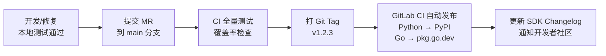

# SDK 开发指南

**文档版本：** V1.0  
**编写日期：** 2026年05月14日  
**范围：** 官方 Python SDK + Go SDK 的设计规范与实现指南  
**仓库：**
- Python SDK：`gitlab.maas-platform.com/sdk/maas-python`（发布至 PyPI：`maas-sdk`）  
- Go SDK：`gitlab.maas-platform.com/sdk/maas-go`（发布至 pkg.go.dev：`github.com/maas-platform/maas-go`）  
**负责人：** 后端团队（各服务 Owner 协同）

---

## 1. SDK 设计原则

```
1. OpenAI Drop-in 兼容
   - Python SDK：继承 openai.OpenAI 的接口风格，用户只需换 base_url + api_key
   - 降低迁移成本，不引入陌生的心智模型

2. 最小依赖
   - Python：仅依赖 httpx（异步）+ pydantic（类型）
   - Go：仅依赖标准库，零第三方依赖

3. 类型完备
   - 所有请求/响应都有完整类型定义（Python Pydantic + Go struct）
   - IDE 自动补全友好

4. 错误可处理
   - 所有错误分类明确，可按类型捕获（APIError / RateLimitError / AuthError）

5. 流式一等公民
   - 流式（SSE）与非流式使用同一接口，通过 stream=True 切换
   - 流式返回类型为 Iterator / channel，无需手动处理 SSE 协议

6. 可测试性
   - 支持注入 HTTP 客户端（方便单元测试 mock）
   - 提供官方测试工具 maas.testing.MockClient
```

---

## 2. Python SDK

### 2.1 安装与基础使用

```bash
pip install maas-sdk
```

```python
from maas import MaasClient

client = MaasClient(
    api_key="maas-sk-xxxx",
    base_url="https://api.maas-platform.com",  # 默认值，可省略
)

# 非流式调用
response = client.chat.completions.create(
    model="gpt-4o",
    messages=[{"role": "user", "content": "你好"}],
)
print(response.choices[0].message.content)

# 流式调用
with client.chat.completions.create(
    model="gpt-4o",
    messages=[{"role": "user", "content": "写一首诗"}],
    stream=True,
) as stream:
    for chunk in stream:
        print(chunk.choices[0].delta.content or "", end="", flush=True)
```

### 2.2 项目结构

```
maas-python/
├── maas/
│   ├── __init__.py          # 导出：MaasClient, AsyncMaasClient
│   ├── _client.py           # 同步客户端实现
│   ├── _async_client.py     # 异步客户端实现
│   ├── _base_client.py      # 共享基类（HTTP 层）
│   ├── types/
│   │   ├── chat.py          # ChatCompletion 类型定义
│   │   ├── embeddings.py    # Embedding 类型
│   │   └── errors.py        # 错误类型
│   ├── resources/
│   │   ├── chat/
│   │   │   └── completions.py  # client.chat.completions.create()
│   │   ├── embeddings.py    # client.embeddings.create()
│   │   ├── models.py        # client.models.list()
│   │   └── fine_tuning.py   # client.fine_tuning.jobs.create()
│   └── testing/
│       └── mock_client.py   # 测试 Mock 工具
├── tests/
├── pyproject.toml
└── README.md
```

### 2.3 客户端实现核心

```python
# maas/_client.py
from __future__ import annotations
import os
import httpx
from typing import Optional
from .resources.chat import Chat
from .resources.embeddings import Embeddings
from .types.errors import APIError, AuthenticationError, RateLimitError

class MaasClient:
    chat: Chat
    embeddings: Embeddings

    def __init__(
        self,
        api_key: Optional[str] = None,
        base_url: str = "https://api.maas-platform.com",
        timeout: float = 60.0,
        max_retries: int = 2,
        http_client: Optional[httpx.Client] = None,
    ) -> None:
        self.api_key = api_key or os.environ.get("MAAS_API_KEY")
        if not self.api_key:
            raise AuthenticationError("api_key is required. Set MAAS_API_KEY env var or pass api_key=")

        self.base_url = base_url.rstrip("/")
        self._http = http_client or httpx.Client(
            timeout=timeout,
            headers={
                "Authorization": f"Bearer {self.api_key}",
                "User-Agent": f"maas-python/{__version__}",
                "Content-Type": "application/json",
            },
        )
        self._max_retries = max_retries

        # 初始化资源
        self.chat = Chat(self)
        self.embeddings = Embeddings(self)

    def _request(self, method: str, path: str, **kwargs) -> httpx.Response:
        url = f"{self.base_url}{path}"
        for attempt in range(self._max_retries + 1):
            resp = self._http.request(method, url, **kwargs)
            if resp.status_code == 429 and attempt < self._max_retries:
                retry_after = int(resp.headers.get("Retry-After", 2 ** attempt))
                import time; time.sleep(retry_after)
                continue
            self._check_response(resp)
            return resp
        raise RateLimitError("Rate limit exceeded after retries")

    def _check_response(self, resp: httpx.Response) -> None:
        if resp.status_code == 401:
            raise AuthenticationError(resp.json().get("error", {}).get("message", "Unauthorized"))
        if resp.status_code == 429:
            raise RateLimitError(resp.json().get("error", {}).get("message", "Rate limit exceeded"))
        if resp.status_code >= 400:
            error = resp.json().get("error", {})
            raise APIError(
                message=error.get("message", "Unknown error"),
                code=error.get("code"),
                status_code=resp.status_code,
            )
```

### 2.4 错误类型体系

```python
# maas/types/errors.py
class MaasError(Exception):
    """所有 MaaS SDK 错误的基类"""

class APIError(MaasError):
    """API 返回错误（4xx / 5xx）"""
    def __init__(self, message: str, code: str | None = None, status_code: int = 0):
        self.message = message
        self.code = code
        self.status_code = status_code
        super().__init__(message)

class AuthenticationError(APIError):
    """API Key 无效或未提供"""

class RateLimitError(APIError):
    """请求超出速率限制"""

class ModelNotFoundError(APIError):
    """指定模型不存在"""

class InsufficientQuotaError(APIError):
    """配额不足"""

class ServiceUnavailableError(APIError):
    """服务暂时不可用（上游厂商故障）"""

# 使用示例
try:
    response = client.chat.completions.create(...)
except RateLimitError as e:
    print(f"限流，请等待 {e.retry_after} 秒后重试")
except AuthenticationError:
    print("API Key 无效，请检查配置")
except ServiceUnavailableError:
    print("模型暂时不可用，已自动切换备用模型")
except MaasError as e:
    print(f"未知错误：{e}")
```

### 2.5 异步客户端

```python
# 异步用法（与同步接口完全对称）
from maas import AsyncMaasClient
import asyncio

async def main():
    async with AsyncMaasClient(api_key="maas-sk-xxxx") as client:
        # 非流式
        response = await client.chat.completions.create(
            model="gpt-4o",
            messages=[{"role": "user", "content": "你好"}],
        )

        # 异步流式
        async with client.chat.completions.create(
            model="gpt-4o",
            messages=[{"role": "user", "content": "写一首诗"}],
            stream=True,
        ) as stream:
            async for chunk in stream:
                print(chunk.choices[0].delta.content or "", end="")

asyncio.run(main())
```

### 2.6 发布规范

```toml
# pyproject.toml
[project]
name = "maas-sdk"
version = "1.0.0"
description = "Official Python SDK for MaaS Platform"
requires-python = ">=3.8"
dependencies = [
    "httpx>=0.25.0",
    "pydantic>=2.0",
]

[project.urls]
Homepage = "https://docs.maas-platform.com"
Repository = "https://gitlab.maas-platform.com/sdk/maas-python"
```

```bash
# 发布流程（GitLab CI 触发）
python -m build
twine upload dist/*   # 发布到 PyPI
```

---

## 3. Go SDK

### 3.1 安装与基础使用

```bash
go get github.com/maas-platform/maas-go
```

```go
package main

import (
    "context"
    "fmt"
    "github.com/maas-platform/maas-go/maas"
)

func main() {
    client := maas.NewClient(maas.Config{
        APIKey: "maas-sk-xxxx",
    })

    // 非流式调用
    resp, err := client.Chat.Completions.Create(context.Background(), maas.ChatCompletionRequest{
        Model: "gpt-4o",
        Messages: []maas.ChatMessage{
            {Role: "user", Content: "你好"},
        },
    })
    if err != nil {
        panic(err)
    }
    fmt.Println(resp.Choices[0].Message.Content)
}
```

### 3.2 项目结构

```
maas-go/
├── maas/
│   ├── client.go           # MaasClient 入口
│   ├── config.go           # 配置结构
│   ├── errors.go           # 错误类型
│   ├── types.go            # 请求/响应类型
│   ├── chat/
│   │   └── completions.go  # client.Chat.Completions.Create()
│   ├── embeddings/
│   │   └── embeddings.go
│   └── testing/
│       └── mock.go         # 测试 Mock
├── examples/
│   ├── streaming/
│   └── finetune/
├── go.mod                  # 零第三方依赖
└── README.md
```

### 3.3 流式调用（Go）

```go
// 流式调用（返回 channel）
stream, err := client.Chat.Completions.CreateStream(ctx, maas.ChatCompletionRequest{
    Model:  "gpt-4o",
    Messages: []maas.ChatMessage{{Role: "user", Content: "写一首诗"}},
    Stream: true,
})
if err != nil {
    return err
}
defer stream.Close()

for chunk := range stream.Chunks() {
    if chunk.Err != nil {
        return chunk.Err
    }
    fmt.Print(chunk.Choices[0].Delta.Content)
}
```

### 3.4 错误类型（Go）

```go
// errors.go
type APIError struct {
    Message    string
    Code       string
    StatusCode int
}
func (e *APIError) Error() string { return e.Message }

type RateLimitError struct { *APIError }
type AuthenticationError struct { *APIError }
type ModelNotFoundError struct { *APIError }

// 使用 errors.As 处理
resp, err := client.Chat.Completions.Create(ctx, req)
if err != nil {
    var rateErr *maas.RateLimitError
    if errors.As(err, &rateErr) {
        time.Sleep(time.Duration(rateErr.RetryAfter) * time.Second)
        // 重试
    }
    return err
}
```

---

## 4. 版本发布流程



**语义化版本（Semver）规则：**

```
MAJOR.MINOR.PATCH

MAJOR：API 接口破坏性变更（通常跟随平台 API Major 版本）
MINOR：新增功能（向后兼容）
PATCH：Bug 修复、性能优化

v1.0.0 → v1.0.1：修复流式解析 Bug
v1.0.1 → v1.1.0：新增 fine_tuning.jobs 资源
v1.x.x → v2.0.0：跟随平台 API v2 发布
```

---

## 5. SDK 测试规范

```python
# Python SDK 测试示例（使用官方 Mock 工具）
from maas.testing import MockClient
from maas.types.chat import ChatCompletion

def test_chat_completions():
    mock = MockClient()
    mock.chat.completions.set_response(ChatCompletion(
        id="chatcmpl-test",
        choices=[{"message": {"role": "assistant", "content": "你好！"}}],
        usage={"input_tokens": 5, "output_tokens": 3},
    ))

    client = mock.client  # 注入 mock HTTP 客户端
    response = client.chat.completions.create(
        model="gpt-4o",
        messages=[{"role": "user", "content": "你好"}],
    )
    assert response.choices[0].message.content == "你好！"
    assert mock.chat.completions.call_count == 1
```

---

**变更历史**

| 版本 | 日期 | 说明 | 修改人 |
|------|------|------|--------|
| V1.0 | 2026-05-14 | 初稿（Python + Go SDK 设计规范） | 后端团队 |
