# 服务治理总览

**文档版本：** V1.0  
**更新日期：** 2026年05月25日  
**基准架构：** `05-开发设计/01-后端设计/技术架构设计文档.md`  
**关联文档：** `06-产品运维/*`

---

## 1. 服务治理定位

服务治理是 MaaS 平台微服务体系的基础设施层，解决 10 个微服务在分布式环境下的**通信、配置、容错、观测、发布和安全**六大问题。它不是单一服务，而是一组跨切面（cross-cutting）的策略、模式和基础设施组件。

## 2. 治理范围总图

```mermaid
graph TB
    subgraph 治理域["服务治理六大域"]
        Discovery[服务注册发现]
        Config[配置中心]
        Resilience[限流熔断降级]
        Observability[链路追踪观测]
        Release[发布灰度]
        Mesh[服务网格]
    end

    subgraph 基础设施["基础设施层"]
        K8s[Kubernetes]
        Istio[Istio Service Mesh]
        Redis[Redis Cluster]
        Kafka[Kafka]
        Prometheus[Prometheus+Grafana]
        Jaeger[Jaeger+OTel]
    end

    subgraph 业务服务["MaaS 微服务"]
        GW[gateway-service]
        RS[routing-service]
        MC[model-catalog-service]
        AS[adapter-service]
        BS[billing-service]
        TS[llmops-trace-service]
        PS[prompt-eval-service]
        AUS[auth-service]
        CS[compliance-service]
        NS[notification-service]
    end

    Discovery --> Istio
    Config --> Redis
    Resilience -->|实现| GW
    Resilience -->|实现| RS
    Resilience -->|实现| AS
    Observability --> Prometheus
    Observability --> Jaeger
    Observability -->|数据源| TS
    Release -->|ArgoCD| K8s
    Mesh --> Istio
```

## 3. 文档目录

| 章节 | 文件 | 核心内容 |
|------|------|---------|
| 01 | `01-服务注册发现与治理.md` | K8s Service + Istio 双重发现、健康检查、优雅启停、实例管理 |
| 02 | `02-配置中心与动态配置.md` | 配置分层（代码/环境/运行时）、热更新机制、配置中心选型对比 |
| 03 | `03-限流熔断与降级.md` | 四层限流（网关/服务/供应商/Key）、熔断器状态机、五级降级 |
| 04 | `04-链路追踪与观测治理.md` | Trace 采样策略、Metrics 规范、日志标准、告警规则、观测 SLA |
| 05 | `05-发布与灰度治理.md` | 九阶段策略生命周期、灰度规则、自动回滚、A/B 实验 |
| 06 | `06-服务网格治理.md` | Istio 选型理由、Sidecar 注入、mTLS、流量管理、可观测集成 |

## 4. 治理原则

| 原则 | 说明 |
|------|------|
| **无侵入优先** | 优先使用 K8s / Istio 等基础设施层能力，不强制业务代码修改 |
| **渐进式** | 治理能力按服务重要度逐步上线，核心服务先行 |
| **可观测兜底** | 所有治理动作必须留下可观测痕迹（Metrics/Events/Logs） |
| **语义一致** | 限流、熔断、降级的状态和阈值在整个平台语义统一 |
| **默认安全** | 服务间通信默认 mTLS，配置变更默认审批，灰度默认自动回滚 |

## 5. 与现有文档的边界

| 内容归属 | 文档位置 |
|---------|---------|
| 具体微服务的容错实现（如 adapter-service 的 CircuitBreaker） | `05-开发设计/01-后端设计/微服务设计/` |
| 运维操作流程（备份、扩容、故障处理） | `06-产品运维/运维手册(Runbook).md` |
| SLA 指标定义与度量 | `05-开发设计/01-后端设计/SLA服务等级协议.md` |
| 安全策略与合规 | `06-产品运维/安全设计文档.md` |
| **服务治理的策略定义、选型对比、规范和模式** | **本文档系列（10-服务治理/）** |
