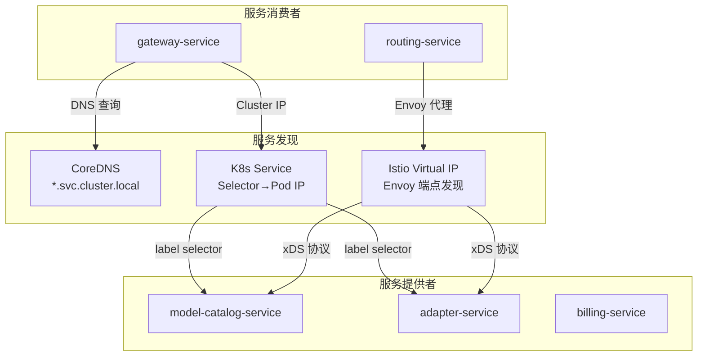

# 服务注册发现与治理

**文档版本：** V1.0  
**更新日期：** 2026年05月25日  
**关联文档：** `06-产品运维/部署拓扑文档.md`、`10-服务治理/06-服务网格治理.md`

---

## 1. 服务发现架构

MaaS 平台采用**双层服务发现**机制：

| 层 | 技术 | 作用域 | 职责 |
|----|------|--------|------|
| **L1：K8s Service** | CoreDNS + K8s Service | 集群内基础通信 | DNS 解析、Round-Robin 负载均衡、Pod IP 动态映射 |
| **L2：Istio Service Mesh** | Istio + Envoy Sidecar | 服务间精细治理 | 流量管理、mTLS、灰度、熔断、可观测 |



## 2. 服务命名规范

### 2.1 K8s Service 命名

```
{service-name}-{variant}
```

| 服务 | K8s Service 名 | gRPC Target |
|------|---------------|-------------|
| gateway-service | `gateway-service` | —（对外暴露） |
| routing-service | `routing-service` | `routing-service:9010` |
| model-catalog-service | `model-catalog-service` | `model-catalog-service:9030` |
| adapter-service | `adapter-service` | `adapter-service:9002` |
| billing-service | `billing-service` | `billing-service:9040` |
| llmops-trace-service | `llmops-trace-service` | `llmops-trace-service:9050` |
| auth-service | `auth-service` | `auth-service:9060` |
| compliance-service | `compliance-service` | `compliance-service:9070` |
| notification-service | `notification-service` | `notification-service:9080` |
| prompt-eval-service | `prompt-eval-service` | `prompt-eval-service:9090` |

### 2.2 Port 规范

| 端口范围 | 用途 |
|---------|------|
| 8xxx | HTTP/REST API |
| 9xxx | gRPC 内部服务间通信 |
| 9xxx + 70 | Prometheus Metrics |
| 9xxx + 80 | Health Check |

示例（routing-service）：
- HTTP API: `8081`
- gRPC: `9010`
- Metrics: `9080`
- Health: `9090`

## 3. 健康检查

### 3.1 探针标准

所有服务必须实现三个 K8s 探针：

```yaml
livenessProbe:
  httpGet:
    path: /healthz        # 进程是否存活
    port: 8080
  initialDelaySeconds: 30
  periodSeconds: 15

readinessProbe:
  httpGet:
    path: /readyz         # 是否就绪接收流量
    port: 8080
  periodSeconds: 5

startupProbe:            # 启动慢的服务（如 adapter 加载 embedding 模型）
  httpGet:
    path: /startupz
    port: 8080
  initialDelaySeconds: 10
  periodSeconds: 5
  failureThreshold: 30   # 最多等 150s
```

### 3.2 探针语义

| 端点 | 失败时 K8s 操作 | 服务应检查 |
|------|----------------|-----------|
| `/healthz` | 重启 Pod | 进程是否死锁、goroutine 泄漏 |
| `/readyz` | 摘除 Service Endpoint | 依赖是否就绪（Redis/DB/Kafka） |
| `/startupz` | 标记 Pod 未就绪 | 初始化是否完成 |

### 3.3 gRPC Health Protocol

内部 gRPC 服务必须实现 `grpc.health.v1.Health` 协议：

```protobuf
service Health {
  rpc Check(HealthCheckRequest) returns (HealthCheckResponse);
  rpc Watch(HealthCheckRequest) returns (stream HealthCheckResponse);
}

message HealthCheckResponse {
  enum ServingStatus {
    UNKNOWN = 0;
    SERVING = 1;
    NOT_SERVING = 2;
    SERVICE_UNKNOWN = 3;
  }
  ServingStatus status = 1;
}
```

Istio 通过此协议进行 Envoy 端点健康检查。

## 4. 优雅启停

### 4.1 启动序列

```
1. 加载配置（本地 YAML → 配置中心 → 环境变量覆盖）
2. 初始化 Logger / Metrics / Tracer      ← 先于一切
3. 连接外部依赖（Redis / DB / Kafka）
4. 初始化业务组件（如 LiteLLM Router）
5. 预加载 / 预热（如有必要）
6. 启动 HTTP / gRPC 服务
7. /startupz → OK                        ← K8s 开始检查
8. /readyz → OK                          ← K8s 允许流量进入
```

### 4.2 关闭序列

```go
// 伪代码：各服务共有的 shutdown 模式
@asynccontextmanager
async def lifespan(app: FastAPI):
    await initialize()
    yield
    # === 关闭开始 ===
    logger.info("shutdown initiated")

    # 1. 停止接受新请求
    server.shutdown()

    # 2. 等待 in-flight 请求完成（最多 30s）
    await drain_inflight_requests(timeout=30)

    # 3. 刷新内存中待写数据
    await cache_writer.flush()
    await kafka_producer.flush()

    # 4. 关闭外部连接
    await redis.close()
    await db.close()

    # 5. 关闭业务组件
    await router.close()

    logger.info("shutdown complete")
```

### 4.3 K8s 配置

```yaml
spec:
  terminationGracePeriodSeconds: 60    # 给优雅关闭的总时间
  containers:
    - name: my-service
      lifecycle:
        preStop:
          exec:
            command: ["/bin/sh", "-c", "kill -SIGTERM 1; sleep 45"]
```

## 5. 实例管理

### 5.1 副本数与扩缩

| 服务 | 最小副本 | 最大副本 | 扩缩指标 |
|------|---------|---------|---------|
| gateway-service | 3 | 20 | CPU + 连接数 |
| routing-service | 3 | 15 | CPU + QPS |
| model-catalog-service | 2 | 10 | CPU + 缓存命中率 |
| adapter-service | 3 | 20 | CPU + 活跃流数 |
| billing-service | 2 | 10 | Kafka Lag |
| llmops-trace-service | 2 | 8 | Kafka Lag |
| prompt-eval-service | 1 | 5 | 队列深度 |
| auth-service | 2 | 8 | CPU + QPS |
| compliance-service | 2 | 6 | CPU + 队列深度 |
| notification-service | 2 | 6 | Kafka Lag |

### 5.2 Pod 反亲和

```yaml
affinity:
  podAntiAffinity:
    preferredDuringSchedulingIgnoredDuringExecution:
      - weight: 100
        podAffinityTerm:
          labelSelector:
            matchLabels:
              app: routing-service
          topologyKey: kubernetes.io/hostname
```

### 5.3 PDB (Pod Disruption Budget)

```yaml
apiVersion: policy/v1
kind: PodDisruptionBudget
metadata:
  name: routing-service-pdb
spec:
  minAvailable: 2
  selector:
    matchLabels:
      app: routing-service
```

## 6. gRPC 服务治理

### 6.1 连接管理

```go
// Go 服务：gRPC 连接配置
var grpcOptions = []grpc.DialOption{
    grpc.WithInsecure(),
    grpc.WithDefaultCallOptions(
        grpc.MaxCallRecvMsgSize(10 * 1024 * 1024),
        grpc.WaitForReady(true),      // 连接不可用时等待而不是报错
    ),
    grpc.WithKeepaliveParams(keepalive.ClientParameters{
        Time:                30 * time.Second,
        Timeout:             10 * time.Second,
        PermitWithoutStream: true,
    }),
}
```

### 6.2 重试策略

```go
// gRPC 重试（由 routing-service 调用 adapter-service 时使用）
var retryPolicy = `{
    "methodConfig": [{
        "name": [{"service": "adapter.AdapterService"}],
        "retryPolicy": {
            "maxAttempts": 3,
            "initialBackoff": "0.1s",
            "maxBackoff": "1s",
            "backoffMultiplier": 2,
            "retryableStatusCodes": ["UNAVAILABLE", "DEADLINE_EXCEEDED"]
        }
    }]
}`
```

## 7. 治理检查清单

服务上线前必须逐项确认：

| 检查项 | 要求 |
|--------|------|
| K8s Service 定义 | Service 名、端口、Selector 正确 |
| 探针 | /healthz /readyz /startupz 三个端点可用 |
| 优雅关闭 | SIGTERM 后在 60s 内完成 drain |
| gRPC Health | 实现了 `grpc.health.v1.Health` |
| PDB | 核心服务配置了 `minAvailable` |
| HPA | 配置了扩缩指标和阈值 |
| 资源限制 | requests 和 limits 已设置 |
| PodAntiAffinity | 关键服务避免同节点部署 |
