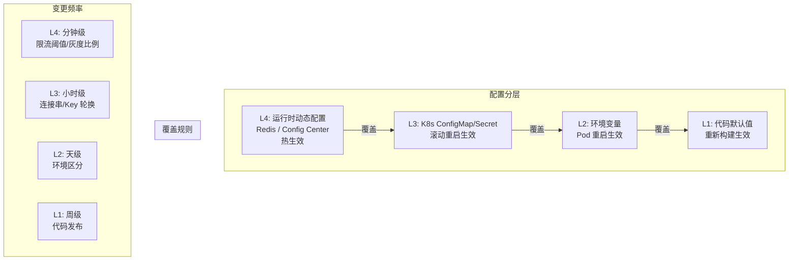

# 配置中心与动态配置

**文档版本：** V1.0  
**更新日期：** 2026年05月25日  
**关联文档：** `05-开发设计/01-后端设计/技术架构设计文档.md`、`10-服务治理/05-发布与灰度治理.md`

---

## 1. 配置分层架构

MaaS 平台的配置分为四个层次，高优先级覆盖低优先级：

| 层 | 名称 | 存储位置 | 变更方式 | 生效方式 | 适用场景 |
|----|------|---------|---------|---------|---------|
| L4 | **运行时动态配置** | Redis / Config Center | API / UI | 热生效，不重启 | 限流阈值、路由策略、灰度比例 |
| L3 | **K8s ConfigMap/Secret** | K8s etcd | kubectl apply | 滚动重启 | 数据库连接串、依赖地址 |
| L2 | **环境变量** | Deployment env | 重新部署 | Pod 重启 | 环境标识、日志级别 |
| L1 | **代码默认值** | 代码常量/config.go | 代码发布 | 重新构建 | 默认超时、默认端口 |



## 2. 配置分类

### 2.1 按变更频率

| 分类 | 变更频率 | 存储层 | 示例 |
|------|---------|--------|------|
| 静态配置 | 周/月 | L1/L2 | 服务端口、日志格式 |
| 环境配置 | 天 | L2/L3 | DB 连接串、供应商 API Key |
| 动态配置 | 分钟/小时 | L4 | 限流阈值、灰度比例、路由规则 |
| 敏感配置 | — | L3 Secret | 加密 Key、Token、证书 |

### 2.2 按作用域

| 作用域 | 说明 | 示例 |
|--------|------|------|
| 全局 | 所有服务、所有环境 | 日志格式、Trace 采样率 |
| 服务级 | 单个服务所有实例 | 该服务的连接池大小 |
| 实例级 | 单实例差异 | 无（应避免） |
| 租户级 | 特定租户 | 该租户的限流上限 |
| 环境级 | dev/staging/prod | DB 地址、日志级别 |

## 3. 运行时动态配置

### 3.1 配置存储

使用 Redis Hash 存储：

```
# Key 结构
config:{service_name}:{config_key}

# 示例
config:gateway-service:rate_limit_default → "1000"
config:routing-service:canary_percentage  → "5"
config:adapter-service:key_pool_refresh   → "30"
```

对于配置中心场景（多配置批量管理），可引入类似 Nacos/Etcd 的配置中心，但在 MaaS 初期规模下，**Redis + JSON 配置对象**足够：

```json
// Redis Key: config:gateway-service:v1
{
  "rate_limits": {
    "default_rpm": 1000,
    "default_tpm": 50000,
    "burst_multiplier": 1.5
  },
  "timeouts": {
    "default_ms": 30000,
    "stream_ms": 300000
  },
  "middleware": {
    "body_limit_mb": 10,
    "max_header_size_kb": 8
  }
}
```

### 3.2 热更新机制

```go
// Go 服务通用热更新模式
type DynamicConfig struct {
    mu         sync.RWMutex
    config     *ServiceConfig
    redis      *redis.Client
    key        string     // e.g. "config:gateway-service:v1"
}

func (dc *DynamicConfig) Start(ctx context.Context) {
    // 初始加载
    dc.reload()
    // 定时刷新（30s 轮询 + Redis Pub/Sub 实时通知）
    go dc.watch(ctx)
}

func (dc *DynamicConfig) watch(ctx context.Context) {
    pubsub := dc.redis.Subscribe(ctx, "config:changed")
    ticker := time.NewTicker(30 * time.Second)
    for {
        select {
        case <-ctx.Done():
            return
        case <-ticker.C:
            dc.reload()
        case msg := <-pubsub.Channel():
            if strings.HasPrefix(msg.Payload, dc.key) {
                dc.reload()
            }
        }
    }
}

func (dc *DynamicConfig) reload() {
    data, err := dc.redis.Get(context.Background(), dc.key).Bytes()
    if err != nil {
        return
    }
    var cfg ServiceConfig
    if json.Unmarshal(data, &cfg) == nil {
        dc.mu.Lock()
        dc.config = &cfg
        dc.mu.Unlock()
    }
}

func (dc *DynamicConfig) Get() *ServiceConfig {
    dc.mu.RLock()
    defer dc.mu.RUnlock()
    return dc.config
}
```

### 3.3 配置变更通知

通过 Redis Pub/Sub 实现实时通知：

```go
// 发布端（配置中心 API）
redis.Publish(ctx, "config:changed", "config:routing-service:v1")

// 订阅端（各服务）
pubsub := redis.Subscribe(ctx, "config:changed")
```

## 4. Secret 管理

### 4.1 敏感配置分类

| 类型 | 存储方式 | 轮换策略 |
|------|---------|---------|
| 供应商 API Key | K8s Secret | 支持热轮换（adapter-service 监听变更） |
| 数据库密码 | K8s Secret + Vault（私有化） | 季度轮换 |
| JWT 签名 Key | K8s Secret | 月轮换，双 Key 过渡 |
| TLS 证书 | K8s Secret + cert-manager | 自动续期 |
| Redis/Kafka 密码 | K8s Secret | 季度轮换 |

### 4.2 禁止行为

- ❌ 代码中硬编码 Secret
- ❌ ConfigMap 存储 Secret
- ❌ 日志中输出 Secret
- ❌ 环境变量中明文存储 Secret（生产环境）
- ❌ Secret 在 gRPC 错误消息中传播

## 5. 配置版本管理

### 5.1 版本化

每次动态配置变更生成递增版本号：

```json
{
  "version": 42,
  "updated_at": "2026-05-25T10:00:00Z",
  "updated_by": "admin",
  "config": { ... }
}
```

### 5.2 回滚

```go
// Redis 保留最近 3 个版本
config:gateway-service:v42   // 当前
config:gateway-service:v41   // 上一版
config:gateway-service:v40   // 上两版

// 回滚操作
redis.Rename(ctx, "config:gateway-service:v41", "config:gateway-service:v1")
redis.Publish(ctx, "config:changed", "config:gateway-service:v1")
```

### 5.3 配置变更审计

所有配置变更必须记录到 Kafka：

```json
{
  "event_type": "config_changed",
  "service": "routing-service",
  "config_key": "canary_percentage",
  "old_value": "0",
  "new_value": "5",
  "changed_by": "admin@maas.com",
  "changed_at": "2026-05-25T10:00:00Z",
  "version": 42
}
```

## 6. 各服务动态配置清单

| 服务 | 动态配置项 | 刷新方式 |
|------|-----------|---------|
| **gateway-service** | 限流默认值、超时、中间件开关、IP 黑/白名单 | Redis Pub/Sub |
| **routing-service** | 灰度比例、Fallback 链、权重公式参数 | Redis Pub/Sub |
| **model-catalog-service** | 缓存 TTL、同步间隔 | 定时轮询 |
| **adapter-service** | Key 池刷新间隔、熔断阈值、缓存 TTL | Redis Pub/Sub |
| **billing-service** | 价格表版本、阶梯阈值 | Kafka 事件 |
| **auth-service** | RBAC 策略、Token TTL | Redis Pub/Sub |
| **compliance-service** | PII 规则、内容策略版本 | Redis Pub/Sub |
| **notification-service** | 告警阈值、通道开关 | Redis Pub/Sub |

## 7. 配置中心选型

| 方案 | 优点 | 缺点 | 推荐场景 |
|------|------|------|---------|
| **Redis + 自定义** | 运维成本低，复用现有 Redis | 无 UI，无版本对比 | ✅ MaaS V1（推荐） |
| Nacos | 成熟，有 UI，回滚方便 | 多一套组件 | 私有化客户要求 |
| Etcd | 强一致，Watch 机制完善 | 运维复杂度高 | 大规模集群 |
| Apollo | 配置管理功能最全 | 重量级，Java 生态 | 企业客户已有部署 |
