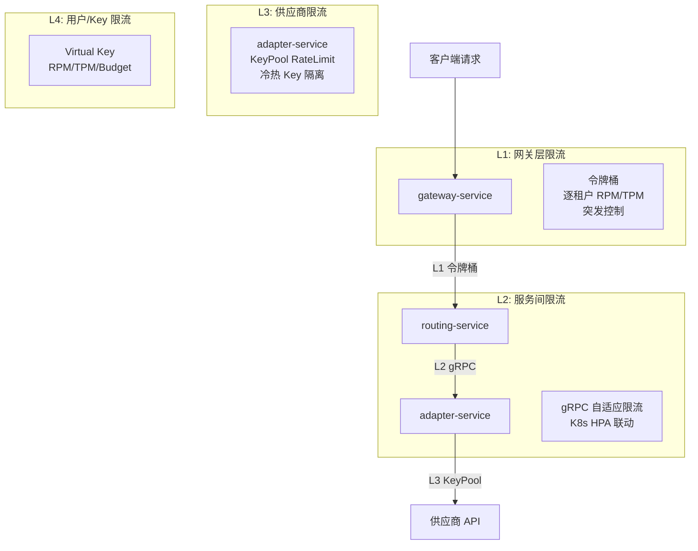

# 限流熔断与降级

**文档版本：** V1.0  
**更新日期：** 2026年05月25日  
**关联文档：** `05-开发设计/01-后端设计/微服务设计/02-routing-service详细设计.md`、`05-开发设计/01-后端设计/微服务设计/04-adapter-service详细设计.md`、`05-开发设计/01-后端设计/SLA服务等级协议.md`

---

## 1. 四层限流架构

MaaS 平台在四个层级分别实施限流，每层解决不同的限流问题：



### 1.1 L1：网关层限流（gateway-service）

使用令牌桶算法，在请求入口处控制租户维度的速率：

```go
// gateway-service 令牌桶
type TenantBucket struct {
    mu       sync.Mutex
    tokens   float64
    lastRefill time.Time
    rate     float64   // RPM / 60
    burst    float64   // 突发倍数
}

func (tb *TenantBucket) Allow() bool {
    tb.mu.Lock()
    defer tb.mu.Unlock()
    now := time.Now()
    elapsed := now.Sub(tb.lastRefill).Seconds()
    tb.tokens = math.Min(tb.tokens+elapsed*tb.rate, tb.burst)
    tb.lastRefill = now
    if tb.tokens >= 1 {
        tb.tokens--
        return true
    }
    return false
}
```

| 维度 | 限流依据 | 默认值 |
|------|---------|--------|
| 租户级别 RPM | `tenant_rate_limit.rpm` | 1000 |
| 租户级别 TPM | `tenant_rate_limit.tpm` | 50000 |
| 突发倍数 | `tenant_rate_limit.burst` | 1.5 |
| 超租户配额 | `tenant_rate_limit.emergency_rpm` | 100（高优请求） |

### 1.2 L2：服务间限流（gRPC）

Go 服务间使用 gRPC 内置自适应限流（基于客户端侧负载感知）：

```go
// gRPC 客户端限流（Channels / 自适应算法）
import "google.golang.org/grpc/experimental"

var conn *grpc.ClientConn
conn, _ = grpc.Dial(
    "routing-service:9010",
    grpc.WithDefaultCallOptions(
        grpc.MaxCallRecvMsgSize(10*1024*1024),
    ),
    // 自适应限流：客户端根据历史成功率拒绝请求
    grpc.WithTimeout(5*time.Second),
)
```

Python adapter-service 侧使用 asyncio semaphore 控制并发上限：

```python
# adapter-service 并发控制
from asyncio import Semaphore

class ConcurrencyLimiter:
    def __init__(self, max_concurrent: int = 500):
        self.sem = Semaphore(max_concurrent)

    async def execute(self, func, *args, **kwargs):
        async with self.sem:
            return await func(*args, **kwargs)
```

### 1.3 L3：供应商限流（adapter-service KeyPool）

KeyPool 管理多个供应商 Key，在检测到 429 时冷却当前 Key 并切换到其他 Key：

```python
# adapter-service KeyPool 限流（详见微服务设计）
class KeyPool:
    RATE_LIMIT_COOLDOWN = 60  # 冷却 60s

    async def get_key(self, vendor_backend_id: str) -> str:
        keys = await self._fetch_available(vendor_backend_id)
        for key in keys:
            if not await self._is_ratelimited(key):
                return key.api_key
        raise NoAvailableKeyError("all keys rate limited")

    async def on_rate_limit(self, api_key: str):
        await self.redis.setex(
            f"keypool:ratelimited:{self._hash(api_key)}",
            self.RATE_LIMIT_COOLDOWN,
            "1",
        )
```

### 1.4 L4：用户/Key 限流

在 Virtual Key 层面控制的预算和速率限制，由 auth-service 校验，gateway-service 执行。

## 2. 熔断器

### 2.1 熔断器状态机

MaaS 使用标准的三个状态 + 半开状态熔断器：

```
         +--------+
         | CLOSED |  ← 正常，请求通过
         +--------+
              |
        失败率 > 阈值
              |
              v
         +--------+
         |  OPEN  |  ← 熔断，请求直接失败
         +--------+
              |
        超时恢复期
              |
              v
         +----------+
         | HALF_OPEN |  ← 允许少量试探请求
         +----------+
         /          \
      成功         失败
        |            |
        v            v
    +--------+   +--------+
    | CLOSED |   |  OPEN  |
    +--------+   +--------+
```

### 2.2 熔断器配置

| 参数 | 默认值 | 说明 |
|------|--------|------|
| `failure_threshold` | 0.5 | 窗口内 50% 失败触发 |
| `window_seconds` | 30 | 滑动窗口大小 |
| `recovery_seconds` | 60 | OPEN → HALF_OPEN 的等待时间 |
| `half_open_max_requests` | 3 | 半开状态最多允许试探请求数 |

### 2.3 熔断级别

| 级别 | 熔断对象 | 实现位置 | 效果 |
|------|---------|---------|------|
| **供应商级** | 某个供应商的某个 VendorBackend | adapter-service CircuitBreaker | 跳过该后端，尝试其他 Key 或 Fallback |
| **服务间级** | 下游服务调用 | gRPC 客户端拦截器 | 快速失败，避免级联超时 |
| **实例级** | 特定 Pod | Istio 熔断 | 从负载均衡池中摘除 |

```go
// Go 服务间熔断器（使用 google sre breaker 或 go-resilience）
import "github.com/sony/gobreaker"

var cb *gobreaker.CircuitBreaker

func init() {
    cb = gobreaker.NewCircuitBreaker(gobreaker.Settings{
        Name:        "adapter-service-grpc",
        MaxRequests: 3,          // HALF_OPEN 状态最大请求数
        Interval:    30 * time.Second,
        Timeout:     60 * time.Second,  // OPEN → HALF_OPEN 等待时间
        ReadyToTrip: func(counts gobreaker.Counts) bool {
            failureRatio := float64(counts.TotalFailures) / float64(counts.Requests)
            return counts.Requests >= 10 && failureRatio >= 0.5
        },
    })
}

// 熔断包装的 gRPC 调用
func callWithBreaker(req func() (*Response, error)) (*Response, error) {
    result, err := cb.Execute(func() (interface{}, error) {
        return req()
    })
    if err != nil {
        return nil, err
    }
    return result.(*Response), nil
}
```

## 3. 五级降级

MaaS 的降级策略从轻度到重度分为五级，由 routing-service 的 Fallback 链控制：

| 级别 | 名称 | 动作 | 延迟影响 | 成本影响 | 触发条件 |
|------|------|------|---------|---------|---------|
| **L1** | 同 Key 重试 | 指数退避重试（max=3） | +1~5s | 相同 | 429/5xx/Timeout |
| **L2** | Key 轮换 | 切换到同供应商的其他 Key | +0ms（预切换） | 相同 | 429 不消退 |
| **L3** | 同模型 Failover | 切换到同一模型的其他部署 | +0ms（负载均衡） | 相同 | 供应商整体限流 |
| **L4** | 异模型 Fallback | 切换到其他供应商的同级模型 | +0ms | 可能不同 | 主 deploy 全量失败 |
| **L5** | 缓存响应 | 返回上次缓存的响应（如有） | +0ms | 无需成本 | 所有供应商均不可用 |

```python
# 五级降链的伪代码实现
class FallbackChain:
    LEVELS = [L1_Retry, L2_KeyRotation, L3_SameModel, L4_DiffModel, L5_Cache]

    async def execute(self, request):
        for level in self.LEVELS:
            try:
                return await level.execute(request)
            except UnrecoverableError:
                raise  # 不可恢复错误直接向上抛
            except Exception as e:
                logger.warning("Fallback L%d failed: %s", level.id, e)
                continue  # 进入下一级
        raise AllFallbacksExhausted("no fallback available")
```

## 4. 舱壁隔离（Bulkhead）

为避免一个慢供应商拖垮整个 adapter-service 进程，对每个供应商分配独立协程池：

```python
# adapter-service 舱壁隔离
class VendorBulkhead:
    def __init__(self):
        # 每个 vendor_backend 独立信号量
        self._semaphores: dict[str, asyncio.Semaphore] = {}

    async def acquire(self, backend_id: str, max_concurrent: int = 10):
        if backend_id not in self._semaphores:
            self._semaphores[backend_id] = asyncio.Semaphore(max_concurrent)
        await self._semaphores[backend_id].acquire()

    def release(self, backend_id: str):
        self._semaphores[backend_id].release()
```

## 5. 观测指标

所有限流、熔断和降级动作必须暴露 Prometheus Metrics：

| 指标名 | 类型 | Label | 说明 |
|--------|------|-------|------|
| `maas_rate_limit_denied_total` | Counter | tenant, limit_type | 被限流的请求数 |
| `maas_circuit_breaker_state` | Gauge | backend_id | 熔断器状态（0=CLOSED, 1=OPEN, 2=HALF_OPEN） |
| `maas_circuit_breaker_tripped_total` | Counter | backend_id | 熔断器触发次数 |
| `maas_fallback_level` | Histogram | service, level | 实际触发的降级级别 |
| `maas_fallback_total` | Counter | service, level, from_backend, to_backend | 降级次数统计 |
| `maas_key_pool_exhausted_total` | Counter | backend_id | Key 池耗尽次数 |
| `maas_bulkhead_rejected_total` | Counter | backend_id | 舱壁隔离拒绝次数 |

## 6. 配置推荐

```yaml
# 全局默认限流熔断配置
rate_limits:
  tenant_default_rpm: 1000
  tenant_default_tpm: 50000
  burst_multiplier: 1.5

circuit_breaker:
  failure_threshold: 0.5
  window_seconds: 30
  recovery_seconds: 60
  half_open_max_requests: 3

fallback:
  max_retries: 3
  retry_base_delay_ms: 500
  retry_max_delay_ms: 10000
  enable_key_rotation: true
  enable_cache_fallback: true

bulkhead:
  vendor_default_max_concurrent: 10
  vendor_default_queue_size: 50
```
