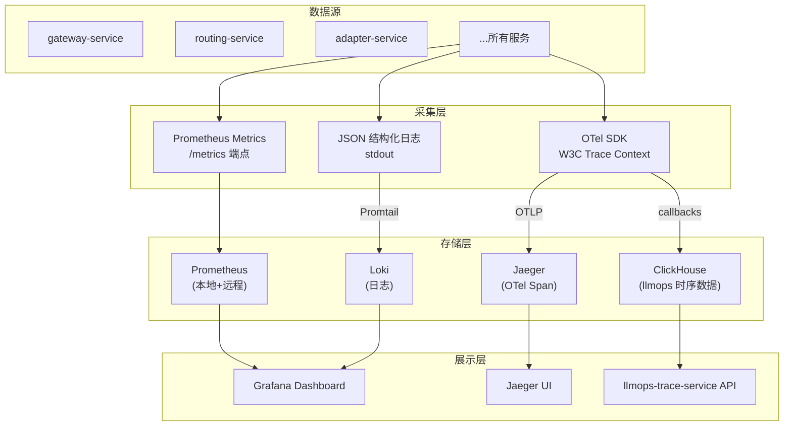

# 链路追踪与观测治理

**文档版本：** V1.0  
**更新日期：** 2026年05月25日  
**关联文档：** `06-产品运维/运维手册(Runbook).md`、`05-开发设计/01-后端设计/微服务设计/06-llmops-trace-service详细设计.md`、`05-开发设计/01-后端设计/SLA服务等级协议.md`

---

## 1. 观测体系总览

MaaS 平台的观测由**三大支柱**构成，所有服务必须完整实现三者的基础版本：

| 支柱 | 技术栈 | 数据存储 | 主要用途 |
|------|--------|---------|---------|
| **Metrics** | Prometheus + Grafana | Prometheus TSDB（本地 + 远程） | 告警、仪表盘、容量规划 |
| **Tracing** | OpenTelemetry + Jaeger | ClickHouse（llmops-trace-service） | 请求链路分析、性能瓶颈定位 |
| **Logging** | 结构化 JSON 日志 + Loki/ELK | Loki（推荐）/ Elasticsearch | 调试、审计、异常排查 |



## 2. Metrics 规范

### 2.1 命名规范

遵循 Prometheus 命名约定：

```
{namespace}_{component}_{name}_{unit}

maas_gateway_requests_total
maas_routing_latency_ms
maas_adapter_vendor_latency_ms
```

| 部分 | 规范 | 示例 |
|------|------|------|
| namespace | `maas` | 所有指标统一前缀 |
| component | 服务短名 | `gateway`, `routing`, `adapter`, `billing` |
| name | 指标名 | `requests`, `latency`, `errors` |
| unit | 单位 | `total`, `ms`, `bytes`, `ratio` |

### 2.2 所有服务必须实现的指标

```python
# 通用指标（每个服务强制实现）
import prometheus_client as prom

# === RED 指标 ===
requests_total = prom.Counter(
    "maas_requests_total",
    "Total request count",
    ["service", "method", "status", "tenant_id"],
)

latency_seconds = prom.Histogram(
    "maas_latency_seconds",
    "Request latency in seconds",
    ["service", "method"],
    buckets=(.005, .01, .025, .05, .1, .25, .5, 1, 2.5, 5, 10),
)

errors_total = prom.Counter(
    "maas_errors_total",
    "Total error count",
    ["service", "method", "error_code"],
)

# === 利用率指标 ===
inflight_requests = prom.Gauge(
    "maas_inflight_requests",
    "Current number of in-flight requests",
    ["service"],
)

# === 依赖指标 ===
dependency_up = prom.Gauge(
    "maas_dependency_up",
    "Dependency health status (1=up, 0=down)",
    ["service", "dependency"],
)
```

### 2.3 服务特有指标

| 服务 | 指标名 | 类型 | 说明 |
|------|--------|------|------|
| gateway | `maas_gateway_requests_total` | Counter | 入口请求量，按 protocol/tenant 分 |
| gateway | `maas_gateway_middleware_latency_ms` | Histogram | 中间件链延迟 |
| routing | `maas_routing_score` | Histogram | 候选模型评分分布 |
| routing | `maas_routing_fallback_level` | GaugeVec | 当前降级级别 |
| adapter | `maas_adapter_vendor_latency_ms` | Histogram | 供应商 API 延迟 |
| adapter | `maas_adapter_cache_hit_ratio` | Gauge | 缓存命中率 |
| billing | `maas_billing_kafka_lag` | Gauge | Kafka 消费延迟 |
| adapter | `maas_adapter_key_pool_size` | Gauge | Key 池大小 |
| adapter | `maas_adapter_circuit_breaker_state` | Gauge | 熔断器状态 |

## 3. Tracing 规范

### 3.1 W3C Trace Context

所有服务间调用必须传播 **W3C Trace Context**：

```http
# HTTP 传播
traceparent: 00-0af7651916cd43dd8448eb211c80319c-b7ad6b7169203331-01
tracestate: maas_tenant_id=tenant-001,maas_request_id=req-xyz

# gRPC 传播（通过 metadata）
grpc-metadata-traceparent: 00-0af7651916cd43dd8448eb211c80319c-b7ad6b7169203331-01
```

### 3.2 Span 规范

| Span 属性 | 必填 | 说明 |
|-----------|------|------|
| `service.name` | 是 | 服务名 |
| `maas.request_id` | 是 | MaaS 请求 ID |
| `maas.tenant_id` | 是 | 租户 ID |
| `maas.trace_type` | 是 | `chat`, `stream`, `embedding`, `image` |
| `maas.model` | 是 | 请求时的逻辑模型名 |
| `maas.vendor_model` | 否 | 实际调用的供应商模型名 |
| `maas.backend_id` | 否 | 实际命中的 VendorBackend ID |
| `maas.cache_hit` | 否 | 是否缓存命中 |
| `maas.fallback_level` | 否 | 触发降级级别 |

### 3.3 采样策略

| 策略 | 适用范围 | 采样率 | 说明 |
|------|---------|--------|------|
| 固定采样 | 生产环境默认 | 10% | 平衡成本与可观测性 |
| 头部采样 | 核心服务 | 100% | gateway-service / routing-service 全采 |
| 尾部采样 | 错误追踪 | 100% error | 错误请求自动全量采样 |
| 租户级采样 | 高价值租户 | 可配置 | 按租户设置采样率 |

```go
// 尾部采样器：错误请求强制全链路采样
type ErrorTailSampler struct {
    fallbackSampler samplers.Sampler  // 降级请求全采样
    errorSampler    samplers.Sampler  // 错误请求全采样
    baseSampler     samplers.Sampler  // 普通请求 10% 采样
}

func (s *ErrorTailSampler) ShouldSample(parameters samplers.SamplingParameters) samplers.SamplingResult {
    // 如果该服务标记为 high_priority，全量采样
    if parameters.Attributes["maas.trace_type"] == "stream" {
        return samplers.SamplingResult{Decision: samplers.RecordAndSample}
    }
    return s.baseSampler.ShouldSample(parameters)
}
```

## 4. 日志规范

### 4.1 格式

所有服务必须输出 JSON 结构化日志，禁止自由格式文本日志：

```json
{
  "timestamp": "2026-05-25T10:00:00.123Z",
  "level": "INFO",
  "service": "routing-service",
  "trace_id": "0af7651916cd43dd8448eb211c80319c",
  "span_id": "b7ad6b7169203331",
  "request_id": "req-xyz-001",
  "tenant_id": "tenant-001",
  "message": "route selected",
  "fields": {
    "model": "gpt-4o",
    "backend_id": "vb_openai_gpt4o_001",
    "score": 0.92,
    "latency_ms": 45
  }
}
```

### 4.2 日志级别使用规范

| 级别 | 使用场景 | 示例 |
|------|---------|------|
| **ERROR** | 请求处理失败，需要人工介入 | 供应商不可用、Key 池耗尽、DB 连不上 |
| **WARN** | 请求处理降级，不需要立刻处理 | Fallback 被触发、缓存写入失败、慢查询 |
| **INFO** | 请求的生命周期事件 | 请求开始/结束、路由决策、配置变更 |
| **DEBUG** | 调试细节，只在开发环境开启 | 请求参数明细、每一步的延迟分解 |

### 4.3 禁止日志行为

- ❌ 明文输出 API Key 或 Token
- ❌ 输出完整的请求/响应体（除非 DEBUG + 显式开启）
- ❌ 在循环中打日志
- ❌ 用 `fmt.Println` / `print` 替代结构化日志

## 5. 告警规则

### 5.1 核心告警

| 告警名 | 表达式 | 持续时间 | 严重度 | 说明 |
|--------|--------|---------|--------|------|
| `HighErrorRate` | `rate(maas_errors_total[5m]) > 0.05` | 5m | P0 | 错误率 > 5% |
| `HighLatency` | `p99(maas_latency_seconds[5m]) > 2` | 5m | P1 | P99 延迟 > 2s |
| `CircuitBreakerOpen` | `maas_circuit_breaker_state == 1` | 立即 | P0 | 熔断器触发 |
| `KeyPoolExhausted` | `rate(maas_key_exhausted_total[5m]) > 0` | 1m | P1 | Key 池耗尽 |
| `CacheHitRatioDrop` | `maas_cache_hit_ratio < 0.3` | 10m | P2 | 缓存命中率低 |
| `KafkaLagHigh` | `maas_kafka_lag > 10000` | 5m | P2 | 消费积压 |
| `FallbackStorm` | `rate(maas_fallback_total[5m]) > 100` | 5m | P0 | 大规模降级 |
| `DependencyDown` | `maas_dependency_up == 0` | 1m | P0 | 依赖服务不可用 |

### 5.2 告警通知

| 严重度 | 通知渠道 | 响应时间 | 处理人 |
|--------|---------|---------|--------|
| P0 | 电话 + 钉钉/企微 + Slack | 15min | 值班工程师 |
| P1 | 钉钉/企微 + Slack | 30min | 服务 Owner |
| P2 | Slack | 4h | 服务 Owner |

## 6. 观测 SLA

| 观测能力 | SLA | 说明 |
|---------|-----|------|
| Metrics 采集间隔 | ≤ 15s | Prometheus scrape interval |
| 指标保留期（本地） | 15 天 | Prometheus 本地存储 |
| 指标保留期（远程） | 6 月 | 远程存储 |
| Trace 采样点可见 | ≤ 1min | 从请求到 Jaeger UI 出现 |
| Trace 保留期 | 7 天 | 原始 Span 数据 |
| 日志索引延迟 | ≤ 1min | 从 stdout 到可搜索 |
| 日志保留期 | 30 天 | 全文索引保留 |
| 告警触发到通知 | ≤ 1min | Prometheus → Alertmanager → 通知 |
