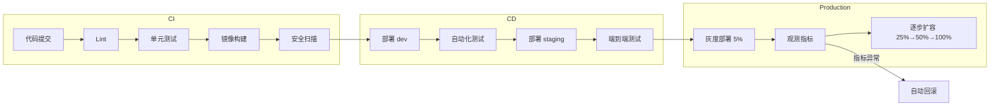
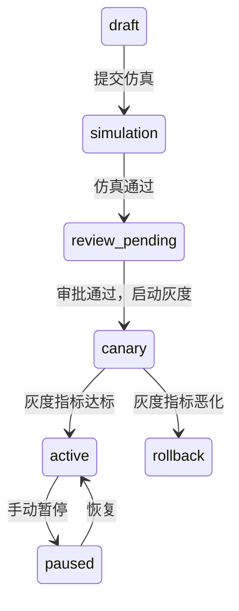

# 发布与灰度治理

**文档版本：** V1.0  
**更新日期：** 2026年05月25日  
**关联文档：** `05-开发设计/01-后端设计/微服务设计/02-routing-service详细设计.md`、`05-开发设计/01-后端设计/技术架构设计文档.md`、`06-产品运维/运维手册(Runbook).md`

---

## 1. 发布类型

MaaS 平台涉及三类发布，各自的管理策略不同：

| 发布类型 | 范围 | 变更频率 | 风险 | 审批要求 |
|---------|------|---------|------|---------|
| **服务发布** | 单个微服务的代码变更 | 天级 | 中 | Code Review + 自动化测试 |
| **配置发布** | 动态配置变更（限流/路由） | 小时级 | 低-中 | 自动审批（低风险）/ 人工（高风险） |
| **模型发布** | 供应商模型上/下/切换 | 周级 | 中-高 | 策略仿真 + 灰度验证 |

## 2. 服务发布流水线

### 2.1 CI/CD 流程



### 2.2 各阶段门禁

| 阶段 | 门禁条件 | 失败处理 |
|------|---------|---------|
| Lint | 无 Lint 错误 | ❌ 禁止合并 PR |
| 单元测试 | 覆盖率 ≥ 80%，全部通过 | ❌ 禁止进入构建 |
| 安全扫描 | 无 Critical/High CVE | ❌ 阻塞发布 |
| dev 部署 | 冒烟测试通过 | ❌ 禁止进入 staging |
| staging E2E | 全链路 E2E 通过 | ❌ 禁止进入生产 |
| 灰度 | 错误率 ≤ 基线 × 1.2，P95 ≤ 基线 × 1.1 | 🔄 自动回滚 |
| 全量 | 灰度指标稳定 ≥ 30min | ✅ 自动提升 |

## 3. 灰度发布策略

### 3.1 灰度模型

MaaS 支持两种灰度方式：

| 方式 | 技术 | 适用场景 | 回滚速度 |
|------|------|---------|---------|
| **K8s 金丝雀** | 新版本 1~N 个 Pod 与旧版本共存 | 服务代码变更 | 快速（修改 Deployment 比例） |
| **Istio 流量路由** | 按 Header/权重分流 | 路由策略、Feature Flag | 即时（Envoy 配置热更新） |

### 3.2 K8s 金丝雀发布

```yaml
# 分步扩缩的金丝雀发布
# Step 1: 创建 canary Deployment（1 Pod）
apiVersion: apps/v1
kind: Deployment
metadata:
  name: routing-service-canary
  labels:
    app: routing-service
    version: v2.1.0
    track: canary
spec:
  replicas: 1
  ...

# Step 2: Service 通过 label selector 同时覆盖 stable + canary
# 此时 canary 约占 1/4 = 25% 流量
---
apiVersion: v1
kind: Service
metadata:
  name: routing-service
spec:
  selector:
    app: routing-service
    # 没有指定 track，所以命中所有版本
```

### 3.3 Istio 灰度路由

```yaml
apiVersion: networking.istio.io/v1beta1
kind: VirtualService
metadata:
  name: routing-service
spec:
  hosts:
    - routing-service
  http:
    - match:
        - headers:
            x-maas-tenant:
              exact: tenant-001
      route:
        - destination:
            host: routing-service
            subset: v2  # 灰度流量
    - route:
        - destination:
            host: routing-service
            subset: v1
          weight: 90
        - destination:
            host: routing-service
            subset: v2
          weight: 10
---
apiVersion: networking.istio.io/v1beta1
kind: DestinationRule
metadata:
  name: routing-service
spec:
  host: routing-service
  subsets:
    - name: v1
      labels:
        version: v2.0.0
    - name: v2
      labels:
        version: v2.1.0
```

### 3.4 灰度观测指标

灰度期间必须监控以下指标，任一异常即触发自动回滚：

| 指标 | 回滚阈值 | 检测窗口 |
|------|---------|---------|
| 错误率 | 超过基线 × 1.2 | 5min |
| P95 延迟 | 超过基线 × 1.1 | 5min |
| 限流触发率 | 超过基线 × 1.5 | 5min |
| Fallback 触发率 | 超过基线 × 1.3 | 5min |
| 熔断器状态 | 非 CLOSED | 立即 |
| 业务成功率（如路由结果正常） | < 99% | 5min |

## 4. 路由策略灰度

routing-service 的策略本身也支持灰度发布（见微服务设计）：

### 4.1 策略灰度配置



```json
{
  "strategy_id": "strat-001",
  "canary": {
    "percentage": 5,
    "tenant_ids": ["tenant-001"],
    "monitor_duration_min": 30,
    "rollback_on": {
      "error_rate_increase": 1.2,
      "latency_increase": 1.1
    }
  }
}
```

## 5. 回滚策略

### 5.1 服务回滚

```bash
# Git 回滚
git revert <commit-hash>

# K8s 回滚到上一个版本
kubectl rollout undo deployment/routing-service

# ArgoCD 回滚
argocd app rollback routing-service --prune
```

### 5.2 配置回滚

```bash
# 配置回滚：切换 Redis Key
redis RENAME config:routing-service:v41 config:routing-service:v1
redis PUBLISH config:changed config:routing-service:v1
```

### 5.3 策略回滚

```
routing-service 自动检测灰度指标异常 → 自动回滚策略到上一个 approved 版本
→ 发送事件到 Kafka: maas.strategy.events (event_type: strategy_auto_rollback)
→ notification-service 发送告警
```

## 6. 发布权限管控

| 操作 | 角色 | 审批 |
|------|------|------|
| 提交代码 | 开发者 | PR Review |
| 合并到 main | 开发者 | 至少 1 个 Approve |
| 部署到 dev | 开发者 | 自动 |
| 部署到 staging | 开发者 | CI 通过即可 |
| 部署灰度 | 服务 Owner | 人工确认 |
| 全量发布 | 服务 Owner + 架构师 | 灰度指标达标 |
| 紧急回滚 | 值班工程师 | 事后补审批 |
| 修改生产配置 | 服务 Owner | 自动/人工（按风险） |

## 7. 发布节奏

| 环境 | 部署频率 | 部署窗口 | 说明 |
|------|---------|---------|------|
| dev | 不限 | 不限 | 开发联调 |
| staging | 每天最多 5 次 | 09:00-18:00 | 集成测试 |
| production 灰度 | 每天最多 3 次 | 10:00-16:00 | 避免夜间发布 |
| production 全量 | 每天最多 2 次 | 10:00-14:00 | 留足观测时间 |
| 紧急修复 | 不限 | 不限 | 需值班工程师审批 |
